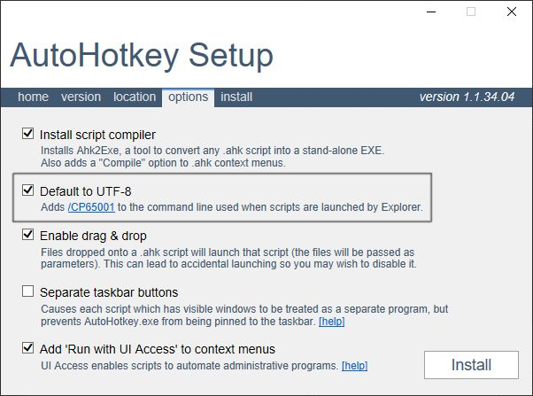

# TOC
* [概要](#概要)
* [注意喚起: ゲームでの使用について](#注意喚起-ゲームでの使用について)
* [注意書き](#注意書き)
* [開発者へのサポート](#開発者へのサポート)
* [インストール](#インストール)
* [ドキュメント](#ドキュメント)
  * [最初に](#最初に)
  * [CustomHotkeyのインターフェイス](#customhotkeyのインターフェイス)
  * [リマップ](#リマップ)
  * [トリガー](#トリガー)
  * [アクション](#アクション)
    * [SendAction](#sendaction)
    * [PasteAction](#pasteaction)
    * [RunAction](#runaction)
    * [ToolTipAction](#tooltipaction)
    * [TrayTipAction](#traytipaction)
    * [ReloadAction](#reloadaction)
    * [ExitAction](#exitaction)
    * [ExitAllAction](#exitallaction)
    * [DelayAction](#delayaction)
    * [AsyncAction](#asyncaction)
    * [MouseMoveAction](#mousemoveaction)
    * [MouseClickAction](#mouseclickaction)
    * [MouseDragAction](#mousedragaction)
    * [ImageClickAction](#imageclickaction)
    * [DropperAction](#dropperaction)
    * [ImeAction](#imeaction)
    * [CustomAction](#customaction)
    * [CustomActions](#customactions)
  * [コンビネーションアクション](#コンビネーションアクション)
    * [PressEventCombiAction](#presseventcombiaction)
    * [HoldEventCombiAction](#holdeventcombiaction)
    * [ModifierPressCombiAction](#modifierpresscombiaction)
    * [ExtraPressCombiAction](#extrapresscombiaction)
    * [KeyStrokeCombiAction](#keystrokecombiaction)
    * [CommandPaletteCombiAction](#commandpalettecombiaction)
    * [MouseGestureCombiAction](#mousegesturecombiaction)
    * [ContextMenuCombiAction](#contextmenucombiaction)
    * [ConditionCombiAction](#conditioncombiaction)
    * [TernaryCombiAction](#ternarycombiaction)
  * [コンディション](#コンディション)
    * [WindowCondition](#windowcondition)
    * [ImeCondition](#imecondition)
    * [ImageCondition](#imagecondition)
    * [MousePositionCondition](#mousepositioncondition)
    * [MouseTimeIdleCondition](#mousetimeidlecondition)
    * [CustomCondition](#customcondition)
  * [グループ化](#グループ化)
  * [テンプレート](#テンプレート)
* [共通する設定方法](#共通する設定方法)
  * [オプションのデフォルト値](#オプションのデフォルト値)
  * [座標の原点](#座標の原点)
  * [矩形](#矩形)
  * [時間](#時間)
  * [色](#色)
  * [テンプレート文字列](#テンプレート文字列)
* [上級者用ドキュメント](#上級者用ドキュメント)
  * [ユーザ定義アクション](#ユーザ定義アクション)
  * [ユーザ定義コンディション](#ユーザ定義コンディション)
  * [トリガーの解析](#トリガーの解析)

# 概要
`CustomHotkey`は拡張可能な[アクション](#アクション)と[コンディション](#コンディション)によって複雑なホットキー(または[リマップ](https://www.autohotkey.com/docs/misc/Remap.htm)のシミュレート)を簡単に定義できる[AutoHotkey](https://www.autohotkey.com)用ライブラリです。

このライブラリを使う前に[ホットキー](https://www.autohotkey.com/docs/Hotkeys.htm)について学ぶ必要があります。

## AutoHotkey v2について
現在はAutoHotkey v1のみサポートしています。ライブラリの仕様が定まってきたらv2の作成にとり掛かる予定です。

# 注意喚起: ゲームでの使用について
アンチチートシステムはAutoHotkeyを(たとえ悪用していなくとも)チートとして認識する可能性があるため、オンライン要素のあるゲームを遊ぶ前に必ず終了させることを強く推奨します。

実行中のすべてのAutoHotkeyスクリプトを終了したい場合は[ExitAllAction](#exitallaction)を使ってください。

# 開発中のバージョンについて
このライブラリは開発中です。仕様はまだ確定されておらず今後破壊的な変更を加えられる可能性があります。

開発中のバージョンは`0.x.y`の形をとり、`x`は破壊的な変更、`y`は非破壊的な変更を表します。

変更点を確認したい場合は[CHANGELOG](CHANGELOG.md)を見てください。

# 注意書き
このライブラリのいくつかの[アクション](#アクション)ではトリッキーな処理により機能を実現しています。

例えば3キー以上のホットキーを定義する[ExtraPressCombiAction](#extrapresscombiaction)は一時的にユーザの入力をブロックしたり他のホットキーの優先度を最低に変更することで実現しています。

これらのトリッキーな処理は機能を実現するために必要であるものの正常に終了しなかった場合にそれらの処理が解除されないというデメリットがあります。

そのような問題が発生しないように設計されていますが、キー入力の誤判定などこちらで制御できないバグもあるため、これらの問題を完全に解決できません。

そのため、以下の対処法を覚えておいてください。これらの対処法を覚えておけば操作不可能な状態に陥ることはありません。

基本的には次で説明される強制終了するためのホットキーを登録しておけば問題ありません。

## 1. 強制終了のホットキーを登録しておく
以下のように強制終了するホットキーを登録しておくと操作不可能な状態から回復できます。

どのキーを割り当てるかは自由ですが、[トリガー](#トリガー)の`F`オプションは必ず指定しておきましょう。

```ahk
; 補足: 右Shift(>+), 右Ctrl(>^)
new CustomHotkey(">+>^Esc|F", "{Exit|R}{A_ScriptName}を終了します").on()
; また、AutoHotkeyの再起動ができると便利でしょう
new CustomHotkey(">+>^F5|F", "{Reload|R}{A_ScriptName}を再起動します").on()
```

## 2. `Ctrl & Alt & Delete`ショートカットキーを利用する
このショートカットを実行すると`Winlogon`画面が表示されます。

この間はAutoHotkeyの処理が無効化されるため、メニューからPCの再起動やタスクマネージャなどの手段を使って操作不可能な状態から復帰できます。

また、このライブラリによるユーザ入力のブロックを強制解除する効果もあります。もし、解除されない場合は複数回このショートカットキーを実行することで解除される場合があります。

## 3. `Ctrl & Shift & Esc`ショートカットを利用する
このショートカットを実行すると`タスクマネージャー`が起動します。

タスクマネージャーがアクティブの時にはAutoHotkeyが無効になるため、操作不可能な状態から復帰できる可能性があります。復帰できた場合はタスクマネージャーでAutoHotkeyを強制終了させることもできます。

ただし、スクリプトを管理者権限で実行している場合には自動入力が無効化されないため復帰できない場合があります。

# 開発者へのサポート
このライブラリを気に入っていただけたなら[ドネーション/スポンサー](https://github.com/sponsors/zero-plusplus)でサポートしていただけると助かります。

開発は個人的な趣味で作成されておりプルリクエストは受け付けていませんが、
代わりに[Issues](https://github.com/zero-plusplus/CustomHotkey.ahk/issues)にて機能リクエストやバグ報告を受け付けています。

# インストール
1. [AutoHotkey](https://www.autohotkey.com/)のインストーラをダウンロードします。既にインストールされている方も次のオプションが設定されているかどうか確認するために再インストールすることをおすすめします

2. インストーラを実行するとウィンドウが表示されます。このとき`options`タブの中にある`Default to UTF-8`に**必ず**チェックしてインストールしてください。


3. ライブラリ本体を[ここ](https://github.com/zero-plusplus/CustomHotkey.ahk/releases)でダウンロードします

4. その後好きなフォルダにライブラリを配置し、[#Include](https://www.autohotkey.com/docs/commands/_Include.htm)ディレクティブを使ってスクリプトにインクルードします

# ドキュメント
## 最初に
CustomHotkeyは数多くの機能を持ちますが、最初に覚える必要があるのは次に説明される[CustomHotkeyのインターフェイス](#customhotkeyのインターフェイス)です。

次に[トリガー](#トリガー)と[アクション](#アクション)について学びます。

アクションについてはまず[SendAction](#sendaction)の使い方がわかればよいでしょう。すべてを理解する必要はありません。

その後、[コンディション](#コンディション)を使ったウィンドウ(アプリケーション)ごとのホットキーの定義方法を学びます。

上記基本を理解した後に、残りのアクションや[コンビネーションアクション](#コンビネーションアクション)、[テンプレート](#テンプレート)などを学んでより複雑かつ柔軟性のあるホットキーの定義方法を覚えましょう。

使い方がわからない場合は[ディスカッション](https://github.com/zero-plusplus/CustomHotkey.ahk/discussions)で質問ができます(GitHubアカウントが必要です)。

## 説明用の構文
### **シグネチャ**
関数やメソッドのシグネチャを説明するとき、TypeScriptに似た構文を使って引数や返り値の型を表現します。

```
funcOrMethodName(arg1: type1, arg2: type2 | type3) => resultType
```

このドキュメントに登場する非オブジェクト型は以下の通りです。

* string : [文字列](https://www.autohotkey.com/docs/Concepts.htm#strings)
* number : [数値](https://www.autohotkey.com/docs/Concepts.htm#numbers)
* boolean : [ブール値](https://www.autohotkey.com/docs/Concepts.htm#boolean)。つまり`true`または`false`
* time : [時間](#時間)を表す数値または文字列

以下はオブジェクト型の構文です。

```ahk
; Object
{ [key: keyType]: valueType }

; Array
[ valueType1, valueType2, valueTypeN... ]
```

`{ [key: string]: string }`ならば文字列をキーにして文字列の値を持つオブジェクトを表します。また、`[ string, number, boolean ]`ならば`array[1]`は文字列、`array[2]`は数値、`array[3]`はブール値を格納している配列を表します。


複数の型を受け入れる場合は`string | number`のように`|`で区切られます。

### **オプション文字列**
[トリガー](#トリガー)や、一部[アクション](#アクション)などでは`"T1s R"`のようなオプション文字列が指定できます。オプションには`R`などのように単体で使用するものと、`T1s`のように値を指定するものがあります。

オプションは以下の構文で表現されます。

```ahk
; <TYPE>はオプションです
OPTION<TYPE>
```

例えば`T<time>`と説明されている場合、`"T1s"`, `"T1000"`のように指定できます。

## CustomHotkeyのインターフェイス
CustomHotkeyはクラスとして提供されます。コンストラクタの第1引数には[トリガー](#トリガー)、第2引数に[アクション](#アクション)、省略可能な第3引数には[コンディション](#コンディション)をとり、インスタンスを返します。

以下の例ではメモ帳がアクティブの場合は`b`を、それ以外では`a`キーを入力します。

```ahk
hotkeyInstance := new CustomHotkey("RCtrl & 1", "a")
hotkeyInstance2 := new CustomHotkey("RCtrl & 1", "b", "ahk_exe notepad.exe")

hotkeyInstance.register()
hotkeyInstance2.register()
```

このインスタンスは以下のメソッドを持ちます。

* `register() => this` : ホットキーを登録する
* `on() => this` : ホットキーを有効化する。まだ登録されていない場合は`register`を呼び出します
* `off() => this` : ホットキーを無効化する。まだ登録されていない場合は`register`を呼び出します
* `toggle() => this` : ホットキーを有効/無効を切り替えます。まだ登録されていない場合は`register`を呼び出します
* `setState(state: boolean | -1 | "On" | "Off" | "Toggle")` : ホットキーの有効/無効の状態を設定します。`state`には以下の値を設定します。まだ登録されていない場合は`register`を呼び出します
  * `true`, `1`, `"On"` : ホットキーを有効にします
  * `false`, `0`, `"Off"` : ホットキーを有効にします
  * `-1`, `"Toggle"` : ホットキーの有効/無効を入れ替えます
* `setEnableBuffer(enabled: boolean) => this` : [#MaxThreadsPerHotkey](https://www.autohotkey.com/docs/commands/_MaxThreadsPerHotkey.htm)で設定されているスレッド数の制限を超えた場合の動作を設定します。`true`の場合はスレッド数の制限数以下になるまで実行を待機し、`false`を指定した場合は実行をキャンセルします
* `setMaxThreads(max: number) => this` : 同時に実行(疑似マルチスレッド)できるスレッド数を設定します
* `setPriority(priority: number) => this` : [ホットキースレッドの優先順位](https://www.autohotkey.com/docs/misc/Threads.htm)を設定します
* `setInputLevel(level: number) => this` : [入力レベル](https://www.autohotkey.com/docs/commands/_InputLevel.htm)の優先順位を設定します
* `setFreeze() => this` : ライブラリからこのホットキーの状態を変更しなくなります。また、`setPriority`メソッドを使って優先度を最も高く設定します。一部のアクションは実行中ホットキーを無効化するため、強制終了などの無効化されてはいけない重要なホットキーに対して使います
* `setOptions(options: string) => this` : `"B1 T1"`のような[ホットキーコマンド](https://www.autohotkey.com/docs/commands/Hotkey.htm)の形式でオプションを変更します

`on`メソッドは`register`メソッドの代わりに使うことができます。また、これらのメソッドはインスタンス自身を返すため、以下のように1行でホットキーを登録できます。

```ahk
hotkeyInstance := new CustomHotkey("RCtrl & 1", "^{a}").on()
```

## リマップ
単純にキーを別のキーに置き換える[リマップ](https://www.autohotkey.com/docs/misc/Remap.htm)を登録したい場合は`CustomHotkey.Remap`クラスを使います。このクラスは`CustomHotkey`と同じインターフェイスを持ちます。

第1引数に変更したいキー名、第2引数に変更後のキー名を指定します。省略可能な第3引数には[コンディション](#コンディション)を指定します。

キー名については[ここ](https://www.autohotkey.com/docs/KeyList.htm)を見てください。

以下の特殊なキー名は機能しません。

* `AltTab`
* `ShiftAltTab`
* `AltTabMenu`
* `AltTabAndMenu`
* `AltTabMenuDismiss`

```ahk
new CustomHotkey.Remap("LCtrl", "Shift").on()
new CustomHotkey.Remap("LShift", "Ctrl").on()
new CustomHotkey.Remap("RShift", "MButton").on()
new CustomHotkey.Remap("RCtrl", "a", "ahk_exe notepad.exe").on()
```

## トリガー
ホットキーを実行するためのキー(`a`, `^+a`)またはコンビネーション(`RCtrl & a`)のことをここではトリガーと呼びます。

トリガーは[Hotkey](https://www.autohotkey.com/docs/commands/Hotkey.htm)コマンドの`KeyName`引数で有効な文字列である必要があります。詳しくは[こちら](https://www.autohotkey.com/docs/Hotkeys.htm)を見て下さい。

### **ホットキーオプション**
トリガーの後に`"|"`をつけて以下のホットキーオプションを追加で指定できます。複数指定する場合は`"B1 T1"`のように空白で区切ってください。

* `B<1 | 0>` : `setEnableBuffer`メソッドにブール値を設定します
* `F<1 | 0>` : `setFreeze`メソッドにブール値を設定します
* `T<number>` : `setMaxThreads`メソッドに数値を設定します
* `P<number>` : `setPriority`メソッドに数値を設定します
* `I<number>` : `setInputLevel`メソッドに数値を設定します

以下の例はどれも同じ意味を持ちます。

```ahk
new CustomHotkey("RCtrl & 1|B0 T5 I1", "{a}").on()
```
```ahk
new CustomHotkey("RCtrl & 1", "{a}")
  .setOptions("B0 T5 I1")
  .on()
```
```ahk
new CustomHotkey("RCtrl & 1", "{a}")
  .setEnableBuffer(false)
  .setMaxThreads(5)
  .setInputLevel(1)
  .on()
```

### **カスタムラベル**
AutoHotkeyでは`RCtrl`などの[キーラベル](https://www.autohotkey.com/docs/KeyList.htm)が設定されていますが、`変換`キーなどの日本独自のキーにはラベルが用意されていません。

これらは`"vk1c & a"`や`"sc079 & a"`のように仮想キーまたはスキャンコードを使ってホットキーを登録する必要があります。しかし、どのキーが指定されているか判別しにくい上、キーに割り当てられた仮想キーやスキャンコードを調べる手間と知識が必要なため非常に不便です。

このライブラリではこの問題を解決するためにカスタムラベルが用意されています。これは指定したラベルを仮想キーまたはスキャンコードに変換する機能です。

ただし、OSの言語設定が日本語である場合は以下のラベルが自動的に設定されるため、このクラスの扱い方を知る必要は基本的にありません。

* `"変換"`
* `"無変換"`
* `"半角"`
* `"全角"` : `"半角"`とキーコードは違いますが同じ意味を持ちます。これらを使ってIMEのオンオフを設定できません。設定したい場合は[ImeAction](#imeaction)を使ってください
* `":"`
* `"_"` : 右下のバックスラッシュ(RShiftの左にあるキーのこと)

また、カスタムラベルとは関係ありませんが文字列の仕様上`";"`キーをホットキーとして使う場合は``"`;"``のようにエスケープする必要があることを覚えておくとよいでしょう。

---

このクラスは以下のメソッドを持ちます。

* `add` : このメソッドは以下の2つのシグネチャを持ちます
  * `add(customLabel: string, keyCode: string) => this` : 指定したカスタムラベルに仮想キーまたはスキャンコードを紐づけます
  * `add(customLabelMap: { [key: string]: string }) => this` : 複数のカスタムラベルを設定します。カスタムラベルをキーに持ち、値に紐づける仮想キーまたはスキャンコードを持つオブジェクトを指定します
* `remove(labelOrKeyCode) => this` : 指定したカスタムラベルを削除します
* `clear() => this` : 登録されているすべてのカスタムラベルを削除します
* `getLabel(keyCode: string) => string` : 仮想キーまたはスキャンコードに紐づけられているラベルを取得します
* `getKeyCode(customLabel) => string` : カスタムラベルに紐づけられている仮想キーまたはスキャンコードを取得します
* `replace(trigger: string) => string` : トリガーに含まれるカスタムラベルを紐づけられた仮想キーまたはスキャンコードに置き換えます
* `revert(trigger: string) => string` : トリガーに含まれる仮想キーまたはスキャンコードを紐づけられていたカスタムラベルに置き換えます

このクラスは双方向性マップのように振る舞い、格納されているカスタムラベルとそれに紐づけられる仮想キーまたはスキャンコードは一意であることが保証されます。

一意が保証されるとはつまり、以下のように別名を登録できないことを意味します。次の例では`"変換"`は`"Convert"`によって上書きされます。

```ahk
CustomHotkey.CustomLabel.add("変換", "vk1c")
CustomHotkey.CustomLabel.add("Convert", "vk1c")

new CustomHotkey("Convert", items).on()
; 以下はエラーになります
new CustomHotkey("変換", items).on()
```

以下はカスタムラベルを設定する場合の例です。

```ahk
; xに実際のコードを設定します
CustomHotkey.CustomLabel.add("カスタムラベル1", "vkxx")
CustomHotkey.CustomLabel.add({ "カスタムラベル1": "vkxx", "カスタムラベル2": "scxxx" })
```

## アクション
トリガーを入力したときに実行される処理のことを**アクション**と呼びます。

また、キー入力やマウスなどのその時の状態によって実行するアクションを切り替えるようなアクションを**コンビネーションアクション**と呼びます。

ユーザは自由にアクションを定義できます。詳しくは[ユーザ定義アクション](#ユーザ定義アクション)を見てください。

CustomHotkeyのコンストラクタの第2引数に渡すデータによって定義されるアクションが変わります。このデータのことをここでは**アクションデータ**と呼びます。

この項では単純なアクションについて学びます。

### SendAction
指定されたキーを入力する最も基本的なアクションです。キー送信中は`Esc`キーを押すことでいつでもキャンセルできます。もし、[トリガー](#トリガー)に`Esc`キーが含まれる場合はキーを一度離してから再度押しなおす必要があります。

文字列または以下のフィールドを持つオブジェクトを渡すことで定義できます。`send`フィールドは必須です。

* `send` : 送信するキー。基本的に[Send](https://www.autohotkey.com/docs/commands/Send.htm)コマンドに渡す引数と同じなので、詳しくはそちらを見てください
* `mode` : 入力モード。以下の文字列を指定します。既定値は`"Event"`です
  * `"Event"` : SendEventコマンドを使ってキーを送信します
  * `"Input"` : SendInputコマンドを使ってキーを送信します
  * `"Play"` : SendPlayコマンドを使ってキーを送信します
  * `"InputThenPlay"` : `"Input"`と同じですが、SendInputが利用できない場合はSendPlayコマンドを使ってキーを送信します
* `ime` : キー送信時のIMEの状態を変更します。以下の指定方法があります
  * `1`(または`true`)を指定するとIMEをオンにし、`0`(または`false`)ならばオフの状態でキーを送信します
  * [時間](#時間)を表す文字列または上記で指定できる数値以外の数値を指定した場合はその値が正(オン)か負(オフ)かによってIMEの状態を変更します。そして指定された時間が経過するとIMEの状態を変更前に復元します
* `sendLevel` : [送信レベル](https://www.autohotkey.com/docs/commands/SendLevel.htm)を表す`1`-`100`までの数値
* `delay` : 各キー入力後に入る遅延[時間](#時間)。省略時は[A_KeyDelay](https://www.autohotkey.com/docs/Variables.htm#KeyDelay)と同じです。`mode`に`"Input"`が指定されている場合は無視されます
* `pressDuration` : 各キーの押下[時間](#時間)。省略時は[A_KeyDuration](https://www.autohotkey.com/docs/Variables.htm#KeyDelay)と同じです。`mode`に`"Input"`が指定されている場合は無視されます
* `limitLength` : 送信するキーの最大長を表す数値を指定します。実際に入力されるキーでカウントされます。例えば`"{a}{b 3}"`とした場合の長さは`4`です。`-1`を設定した場合は無制限です。既定値は`50`です
* `allowMultiline` : `true`の場合は複数行に渡るキー入力を許可します。ただし、`Enter`キーは常に許可されます。既定値は`false`です

文字列を渡した場合は、`send`フィールドを持つオブジェクトを渡した場合と基本的に同じですが以下の点が異なります。

* `"{Input}{a}"`のように波括弧で囲った文字列を接頭辞とすることで`mode`フィールドを設定できます
* `"{Input|R L10}"`のように以下のオプションを渡すことで`options`の各フィールドに値を設定できます。複数指定する場合は空白で区切る必要があります
  * `M` : `allowMultiline`に`true`を設定します
  * `I<0|1>` : `ime`に指定した数値を指定します
  * `S<number>` : `sendLevel`に指定した数値を指定します
  * `D<number>` : `delay`に指定した数値を指定します
  * `P<number>` : `pressDuration`に指定した数値を指定します
  * `L<number>` : `limitLength`に指定した数値を設定します

つまり、以下は同じアクションが定義される。

```ahk
new CustomHotkey("RCtrl & 1", "{Input}{a}").on()
```
```ahk
new CustomHotkey("RCtrl & 1", { send: "{a}", mode: "Input" }).on()
```

[Send](https://www.autohotkey.com/docs/commands/Send.htm)コマンドで利用できる[キー名](https://www.autohotkey.com/docs/commands/Send.htm#keynames)に加えて、以下の特殊なキー名が用意されています。

* `{SuffixKey}` : トリガーの非修飾キーに置き換えられます。例えば`RCtrl & 1`ならば`{1}`に`+!^a`ならば`{a}`に置き換えられます
* `{Clipboard}` : クリップボードの内容に置き換わります。直前に`{Raw}`または`{Text}`を指定することをお勧めします。クリップボードの内容次第で大量のキーが出力される場合があるため注意して使って下さい。キー送信時は`Esc`キーでいつでも中断できることを覚えておいて下さい
* `{SelectedText}` : 選択されたテキストに置き換わります。`{Clipboard}`と同様の問題があるためそちらも見てください

```ahk
new CustomHotkey("RCtrl & 1", "+{SuffixKey}").on()
```

IMEの状態を変更してキーを送信したい場合は以下のように`I`オプションを利用します。

```ahk
new CustomHotkey("RCtrl & 1", "{Input|I1}on").on()
new CustomHotkey("RCtrl & 2", "{Input|I0}off").on()
```

キーを送信した後にIMEの状態を復元したい場合は`I`オプションに`0`または`1`以外の値を指定します。キー送信が終了する時間は毎回異なるため、各自調整する必要があります。

以下はIMEの状態をオンまたはオフにしてキーを送信し、1秒後に状態を復元する例です。

```ahk
new CustomHotkey("RCtrl & 1", "{Input|I1}on").on()
new CustomHotkey("RCtrl & 2", "{Input|I0}off").on()
```

### PasteAction
指定した文字列をクリップボードを使用して出力するアクションです。

[SendAction](#sendaction)と比べて高速に文字列を出力できます。しかし、外部のアプリケーションでクリップボードを使用している場合は稀に競合が発生し、指定した文字列と異なる文字列が出力される場合があることに注意してください。

`{Paste}`から始まる文字列または以下のフィールドを持つオブジェクトを指定することで定義できます。`paste`フィールドは必須です。

* `paste` : クリップボードを使って出力する文字列
* `replace` : `true`を指定すると`paste`を[テンプレート文字列](#テンプレート文字列)として扱います
* `restoreClipboard` : アクション終了後にクリップボードを復元するかどうかを表すブール値または復元までの遅延[時間](#時間)。`-150ms`のように負の時間を指定した場合は疑似的な非同期処理を使ってクリップボードを復元します。しかし、文字列でない内容を正しく復元できません。また、指定する時間が短すぎるとアクションが正しく動作しないことにも注意してください。既定値は`"150ms"`です

文字列を渡した場合は`{Paste|R}`のように以下のオプションを指定できます。

* `R` : `replace`に`true`を設定します
* `C<boolean | time>` : `restoreClipboard`にブール値または[時間](#時間)を設定します

```ahk
; 文字を出力する
new CustomHotkey("RCtrl & 1", "{Paste}abc").on()

; 選択している文字列を括弧で囲う
new CustomHotkey("RCtrl & 2", "{Paste|R}({{SelectedText}})").on()

; 今日の日付を出力する
new CustomHotkey("RCtrl & 3", "{Paste|R}{A_YYYY}/{A_MM}/{A_DD}").on()
```

### RunAction
指定したファイルやURLを実行するアクションです。

`{Run}`から始まる文字列または以下のフィールドを持つオブジェクトを指定することで定義できます。`run`フィールドは必須です。

* `run` : 実行するファイルのパスまたはURL。あるいはそれらを返す呼び出し可能オブジェクト
* `args` : プログラムへ渡す引数またはURLパラメータ。文字列及び呼び出し可能オブジェクトからなる配列を指定します
* `rawArgsMode` : 後述の引数の加工処理を無効化します。ただし、`replace`及び`limitArgLength`の設定による加工は無効化されません。既定値は`false`です
* `replace` : `run`及び`args`で指定する文字列を[テンプレート文字列](#テンプレート文字列)として扱います
* `workingDir` : `run`に相対パスが指定された場合のベースとなるディレクトリ(フォルダ)。既定値は[A_WorkingDir](https://www.autohotkey.com/docs/Variables.htm#WorkingDir)です
* `wait` : 実行したプログラムが終了するまで待機するかどうかを表すブール値
* `verb` : プログラムをどのように実行するかどうかを制御する[システム動詞](https://www.autohotkey.com/docs/commands/Run.htm#verbs)。以下の文字列を指定します。既定値は`"open"`です
  * `"open"` : (既定値)ファイルを開きます
  * `"properties"` : プロパティウィンドウを開く
  * `"find"` : エクスプローラーで検索します
  * `"explore"` : エクスプローラーで開きます
  * `"edit"` : 関連するテキストエディタで開きます。`edit`にアクションが割り当てられていない場合は何もしません
  * `"print"` : 印刷アプリケーションで開きます
  * `"*RunAs"` : 管理者権限で起動します
* `launchMode` : 起動モード。以下の文字列を指定します。ただし、一部のアプリケーションでは効果がありません。また、大文字小文字は区別しません
  * `"Max"` : 起動時にウィンドウを最大化します
  * `"Min"` : 起動時にウィンドウを最小化します
  * `"Hide"` : ウィンドウを非表示にして起動します

`run`が`"http://"`または`"https://"`で始まる場合はURLモードとして扱われます。このモードは、クエリの値として認識できる場合は`args`をパーセントエンコードで変換します。具体的には、直前の引数が`"&search="`のように`&`または`?`で始まり、`=`または`/`で終わる場合です。

それ以外はファイル呼び出しモードとなり、`args`の各文字列をダブルクォートで囲います。ただし、`/`や`-`から始まるようなフラグとして認識できる場合は囲われません。

この処理を無効化したい場合は`rawArgsMode`に`true`を設定してください。

```ahk
new CustomHotkey("RCtrl & 1", { run: "notepad", args: [ A_LineFile ] }).on()
new CustomHotkey("RCtrl & 2", { run: "https://www.google.com/search", replace: true, args: [ "?q=", "{{SelectedText}}" ] }).on()
```

`run`および`args`の値をアクションが実行された時に設定したい場合は呼び出し可能オブジェクトを指定します。このオブジェクトはアクション実行時に呼び出され、その返り値が値となります。

以下は呼び出しオブジェクトを利用した例。

```ahk
; ウィンドウタイトルに含まれる拡張子によって開くURLを変更する
new CustomHotkey("RCtrl & 1", { run: Func("GetDocumentUrl") }).on()
GetDocumentUrl() {
  WinGetTitle, title, A
  if (title ~= "\.ahk") {
    return "https://www.autohotkey.com/docs/AutoHotkey.htm"
  }
  if (title ~= "\.(ahk2|ah2)") {
    return "https://lexikos.github.io/v2/docs/AutoHotkey.htm"
  }
  return "https://www.google.com"
}
```

文字列を渡した場合は`{Run|R Mmin}`のように以下のオプションを指定できます。

* `R` : `replace`に`true`を設定します
* `W` : `wait`に`true`を設定します
* `M<"min" | "max" | "hide">` : `launchMode`に文字列を設定します
* `L<number>` : `limitArgLength`に数値を設定します

```ahk
new CustomHotkey("RCtrl & 1", "{Run|R Mmax}notepad {'" . A_LineFile . "':Q}").on()
new CustomHotkey("RCtrl & 2", "{Run|R}https://www.google.com/search?q={{SelectedText}}").on()
```

### ToolTipAction
ツールチップを表示させるアクションです。

`{ToolTip}`から始まる文字列または以下のフィールドを持つオブジェクトを指定することで定義できます。`tooltip`フィールドは必須です。

* `tooltip` : ツールチップに表示する文字列。既存のツールチップを非表示にしたい場合は空文字または`false`を指定します
* `replace` : `true`を指定すると`tooltip`を[テンプレート文字列](#テンプレート文字列)として扱います
* `id` : ツールチップのIDを表す`1`-`20`までの数値。すでに同じIDのツールチップが存在する場合は内容が上書きされます。省略された場合は使用されていないIDが設定されます
* `displayTime` : ツールチップの表示時間。負の数値を指定した場合はツールチップの非表示処理を非同期的に行います。また、`0`を指定した場合は非表示処理を無効化します。デフォルトは`1s`です
* `x` : ツールチップのx座標を表す数値。既定値は`0`です
* `y` : ツールチップのy座標を表す数値。既定値は`0`です
* `origin` : `x`および`y`の[座標の原点](#座標の原点)

```ahk
new CustomHotkey("RCtrl & 1", { tooltip: "このメッセージは3秒間表示される", displayTime: "3s" }).on()

; ツールチップの常時表示と非表示
new CustomHotkey("RCtrl & 2", { tooltip: "このメッセージは常に表示される", id: 19 }).on()
new CustomHotkey("RCtrl & 3", { tooltip: "", id: 19 }).on()
```

文字列を渡した場合は`{ToolTip|R T1s}`のように以下のオプションを指定できます。

* `R` : `replace`に`true`を設定します
* `I<number>` : `id`に数値を設定します
* `T<time>` : `displayTime`に[時間](#時間)を設定します
* `X<number>` : `x`に数値を設定します
* `Y<number>` : `y`に数値を設定します
* `O<string>` : `origin`に文字列を設定します

```ahk
new CustomHotkey("RCtrl & 1", "{ToolTip|T3s}このメッセージは3秒間表示される").on()
```

### TrayTipAction
トレイチップ(バルーンチップとも呼ばれます)を表示するアクションです。

`{TrayTip}`から始まる文字列または以下のフィールドを持つオブジェクトを指定することで定義できます。`traytip`フィールドは必須です。

* `traytip` : トレイチップのメッセージとして表示する文字列
* `replace` : `true`を指定すると`traytip`を[テンプレート文字列](#テンプレート文字列)として扱います
* `title` : トレイチップのタイトルとして表示する文字列
* `icon` : トレイチップのアイコン。以下の文字列を指定します。省略時はアイコンを表示しません
  * `"info"` : インフォメーションアイコンを表示する
  * `"warn"` : 警告アイコンに表示する
  * `"error"` : エラーアイコンを表示する
* `silent` : `true`を指定すると表示時の音を鳴らさないようにします。既定値は`false`です。

文字列を渡した場合は`{ToolTip|R Iwarn}`のように以下のオプションを指定できます。
* `R` : `replace`に`true`を設定します
* `S` : `silent`に`true`を設定します
* `I<string>` : `icon`に文字列を設定します
* `T<string>` : `title`に文字列を設定します

```ahk
new CustomHotkey("RCtrl & 1", "{TrayTip|TInfo Iinfo}情報アイコン付きのトレイチップを表示").on()
```

### ReloadAction
現在のスクリプトを再起動させるアクションです。[Reload](https://www.autohotkey.com/docs/commands/Reload.htm)コマンドと基本的に同じですが、再起動前にメッセージを表示できます。

`{Reload}`から始まる文字列または以下のフィールドを持つオブジェクトを指定することで定義できます。`reload`フィールドは必須です。

* `reload` : スクリプト再起動前に表示される文字列
* `replace` : `true`を指定すると`reload`を[テンプレート文字列](#テンプレート文字列)として扱います
* `tip` : メッセージを表示するツールチップの設定。以下のフィールドを持つオブジェクトを指定します
  * `id` : ツールチップのIDを表す`1`-`20`までの数値。すでに同じIDのツールチップが存在する場合は内容が上書きされます。省略された場合は使用されていないIDが設定されます
  * `x` : ツールチップのx座標
  * `y` : ツールチップのy座標
  * `origin` : `tip.x`及び`tip.y`座標の原点。指定方法については[座標の原点](#座標の原点)
  * `displayTime` : メッセージを表示する[時間](#時間)。既定値は`"1s"`です

文字列を渡した場合は`{Reload|T1s}`のように以下のオプションを指定できます。

* `R` : `reload`に`true`を設定します
* `X<number>` : `tip.x`に数値を指定します
* `Y<number>` : `tip.y`に数値を指定します
* `O<string>` : `tip.origin`に文字列を指定します
* `T<time>` : `tip.displayTime`に[時間](#時間)を設定します

以下の例は同じ意味を持ちます。

```ahk
new CustomHotkey("RCtrl & 1", "{Reload|T0.5s}スクリプトを再起動します").on()
```
```ahk
new CustomHotkey("RCtrl & 1", { reload: "スクリプトを再起動します", tip: { displayTime: "0.5s" } }).on()
```

### ExitAction
現在のスクリプトを終了するアクションです。[ExitApp](https://www.autohotkey.com/docs/commands/ExitApp.htm)コマンドと基本的に同じですが終了メッセージを表示できます。

`{Exit}`から始まる文字列または以下のフィールドを持つオブジェクトを指定することで定義できます。`exit`フィールドは必須です。

* `exit` : スクリプト終了前に表示される文字列
* `replace` : `true`を指定すると`exit`を[テンプレート文字列](#テンプレート文字列)として扱います
* `tip` : メッセージを表示するツールチップの設定。以下のフィールドを持つオブジェクトを指定します
  * `id` : ツールチップのIDを表す`1`-`20`までの数値。すでに同じIDのツールチップが存在する場合は内容が上書きされます。省略された場合は使用されていないIDが設定されます
  * `x` : ツールチップのx座標
  * `y` : ツールチップのy座標
  * `origin` : `tip.x`及び`tip.y`座標の原点。指定方法については[座標の原点](#座標の原点)
  * `displayTime` : メッセージの表示する[時間](#時間)

文字列を渡した場合は`{Exit|T1s}`のように以下のオプションを指定できます。

* `R` : `reload`に`true`を設定します
* `X<number>` : `tip.x`に数値を指定します
* `Y<number>` : `tip.y`に数値を指定します
* `O<string>` : `tip.origin`に文字列を指定します
* `T<time>` : `tip.displayTime`に[時間](#時間)を設定します

以下の例は同じ意味を持ちます。

```ahk
new CustomHotkey("RCtrl & 1", "{Exit|T0.5s}スクリプトを終了します").on()
```
```ahk
new CustomHotkey("RCtrl & 1", { exit: "スクリプトを終了します", tip: { displayTime: "0.5s" } }).on()
```

### ExitAllAction
すべてのAutoHotkeyスクリプトを終了するアクションです。実行中のスクリプト以外だけを終了させることもできます。

`{ExitAll}`から始まる文字列または以下のフィールドを持つオブジェクトを指定することで定義できます。`exitAll`フィールドは必須です。

* `exitAll` : スクリプト終了前に表示される文字列
* `replace` : `true`を指定すると`exitAll`を[テンプレート文字列](#テンプレート文字列)として扱います
* `tip` : メッセージを表示するツールチップの設定。以下のフィールドを持つオブジェクトを指定します
  * `id` : ツールチップのIDを表す`1`-`20`までの数値。すでに同じIDのツールチップが存在する場合は内容が上書きされます。省略された場合は使用されていないIDが設定されます
  * `x` : ツールチップのx座標
  * `y` : ツールチップのy座標
  * `origin` : `tip.x`及び`tip.y`座標の原点。指定方法については[座標の原点](#座標の原点)
  * `displayTime` : メッセージの表示する[時間](#時間)
* `replace` : `true`を指定すると`exit`を[テンプレート文字列](#テンプレート文字列)として扱います
* `excludeSelf` : 終了対象から自身を除きます

文字列を渡した場合は`{ExitAll|T1s}`のように以下のオプションを指定できます。
* `R` : `reload`に`true`を設定します
* `E` : `excludeSelf`に`true`を設定します
* `X<number>` : `tip.x`に数値を指定します
* `Y<number>` : `tip.y`に数値を指定します
* `O<string>` : `tip.origin`に文字列を指定します
* `T<time>` : `tip.displayTime`に[時間](#時間)を設定します

以下は同じ意味を持ちます。

```ahk
new CustomHotkey("RCtrl & 1", "{ExitAll|T0.5s}すべてのスクリプトを終了します").on()
```
```ahk
new CustomHotkey("RCtrl & 1", { exitAll: "すべてのスクリプトを終了します", tip: { displayTime: "0.5s" } }).on()
```

### DelayAction
処理を遅延させるアクションです。単体では意味がなく[CustomActions](#customactions)で使用します。

`{Delay}`から始まる文字列、純粋な数値または以下のフィールドを持つオブジェクトを指定することで定義できます。`delay`フィールドは必須です。

* `delay` : 遅延させる[時間](#時間)

`{Delay}`から始まる文字列を指定した場合は、そのあとに[時間](#時間)を指定します。
純粋な数値を渡した場合の単位はミリ秒です。

以下の3つの例はトリガーを押すと1秒間処理を遅延させます。しかし、これだけでは意味がありません。

```ahk
new CustomHotkey("RCtrl & 1", { delay: "1s" }).on()
```
```ahk
new CustomHotkey("RCtrl & 1", 1000).on()
```
```ahk
new CustomHotkey("RCtrl & 1", "{Delay}1s").on()
```

以下は間違った例。純粋な数値ではなく文字列として扱われるため、代わりに[SendAction](#sendaction)として定義されます。

```ahk
new CustomHotkey("RCtrl & 1", "1000").on()
```

以下は`250`ミリ秒間隔でキーを送信する[CustomActions](#customactions)の例です。

```ahk
new CustomHotkey("RCtrl & 1", [ "a", 250, "b", 250, "c" ]).on()
```

### AsyncAction
[SetTimer](https://www.autohotkey.com/docs/commands/SetTimer.htm)を使った疑似的な非同期処理で指定したアクションを実行するアクションです。[DelayAction](#delayaction)同様に単体ではあまり意味がなく[CustomActions](#customactions)で使用します。

以下のフィールドを持つオブジェクトを指定することで定義できます。`async`フィールドは必須です。

* `async` : 非同期で実行する[アクション](#アクション)
* `delay` : 遅延させる[時間](#時間)

以下は3つのアクションを遅延をかけながら実行する例です。この例では`b`, `c`, `a`の順番でキーが送信されます。

```ahk
new CustomHotkey("RCtrl & 1", [ { async: "a", delay: 250 }
                              , { async: "b" }
                              , { async: "c", delay: 150 } ]).on()
```

### MouseMoveAction
指定した位置にマウスを移動させるアクションです。

以下のフィールドを持つオブジェクトを指定することで定義できます。

* `x` : 移動先のx座標を表す数値。既定値は`0`です
* `y` : 移動先のy座標を表す数値。既定値は`0`です
* `origin` : `x`および`y`の[座標の原点](#座標の原点)。既定値は`"mouse"`です
* `speed` : カーソル移動の速度を表す`0`(速い)-`100`(遅い)数値。省略時は[A_DefaultMouseSpeed](https://www.autohotkey.com/docs/Variables.htm#DefaultMouseSpeed)を指定した場合と同じです

```ahk
; 画面の中心にマウスを移動
new CustomHotkey("RCtrl & 1", { origin: "screen-center" }).on()

; 現在位置から右に50ピクセル移動する
new CustomHotkey("RCtrl & 2", { x: 50 }).on()
```

### MouseClickAction
指定した位置をクリックするアクションです。

以下のフィールドを持つオブジェクトを指定することで定義できます。`button`または`count`のいずれかを必ず含める必要があります。

* `button` : クリックに使うマウスのボタン名。以下の文字列を指定できる。大文字小文字は区別しません。既定値は`"LButton"`です
  * `"LButton"`, `"Left"`, `"L"` : 左ボタン
  * `"RButton"`, `"Right"`, `"R"` : 右ボタン
  * `"MButton"`, `"Middle"`, `"M"` : 中ボタン
  * `"XButton1"`, `"X1"` : 拡張1ボタン。通常手前側に配置されています
  * `"XButton2"`, `"X2"` : 拡張2ボタン。通常奥側に配置されています
  * 上記に加えて、`"LButton Up"`のように空白を挟んで以下の接尾辞を追加で指定できます。大文字小文字は区別しません
    * `"Up"`, `"U"` : マウスボタンを解放します
    * `"Down"`, `"D"` : マウスボタンを押しっぱなしにします
* `mode` : クリックの送信モード。以下の文字列を指定します。デフォルトは`"Event"`です
  * `"Event"` : [SendEvent](https://www.autohotkey.com/docs/commands/Send.htm)コマンドを使ってクリックします
  * `"Input"` : [SendInput](https://www.autohotkey.com/docs/commands/Send.htm)コマンドを使ってクリックします
  * `"Play"` : [SendPlay](https://www.autohotkey.com/docs/commands/Send.htm)コマンドを使ってクリックします
  * `"InputThenPlay"` : `"Input"`と同じですが、SendInputが利用できない場合はSendPlayコマンドを使ってクリックします
* `count` : クリックする回数。既定値は`1`です
* `x` : クリック位置のx座標を表す数値。既定値は`0`です
* `y` : クリック位置のy座標を表す数値。既定値は`0`です
* `origin` : `x`および`y`の[座標の原点](#座標の原点)
* `speed` : カーソル移動の速度を表す`0`(速い)-`100`(遅い)までの数値。省略時は[A_DefaultMouseSpeed](https://www.autohotkey.com/docs/Variables.htm#DefaultMouseSpeed)を指定した場合と同じです
* `restore` : `true`を指定した場合アクション終了後マウスの位置を`speed`が`0`の状態で復元します。復元時のマウスの速度を指定したい場合は`-1`から`-100`までの数値を指定します

以下は画面の中心をダブルクリックする例です。

```ahk
new CustomHotkey("RCtrl & 1", { button: "LButton", count: 2, origin: "screen-center" }).on()
```

### MouseDragAction
指定した位置から位置へドラッグするアクションです。

以下のフィールドを持つオブジェクトを指定することで定義できます。`to`フィールドは必須です。

* `button` : ドラッグに使うマウスのボタン名。以下の文字列を指定できる。大文字小文字は区別しません
  * `"LButton"`, `"Left"`, `"L"` : 左ボタン
  * `"RButton"`, `"Right"`, `"R"` : 右ボタン
  * `"MButton"`, `"Middle"`, `"M"` : 中ボタン
  * `"XButton1"`, `"X1"` : 拡張1ボタン
  * `"XButton2"`, `"X2"` : 拡張2ボタン
* `mode` : ドラッグの送信モード。以下の文字列を指定します。デフォルトは`"Event"`です
  * `"Event"` : [SendEvent](https://www.autohotkey.com/docs/commands/Send.htm)コマンドを使ってクリックします
  * `"Input"` : [SendInput](https://www.autohotkey.com/docs/commands/Send.htm)コマンドを使ってクリックします
  * `"Play"` : [SendPlay](https://www.autohotkey.com/docs/commands/Send.htm)コマンドを使ってクリックします
  * `"InputThenPlay"` : `"Input"`と同じですが、SendInputが利用できない場合はSendPlayコマンドを使ってクリックします
* `from` : ドラッグの開始位置を表す以下のフィールドを持つオブジェクト。省略した場合は現在のマウスの位置です
  * `x` : ドラッグの開始位置のx座標を表す数値。省略された場合は現在位置のx座標
  * `y` : ドラッグの開始位置のy座標を表す数値。省略された場合は現在位置のy座標
  * `origin` : `from.x`および`from.y`の[座標の原点](#座標の原点)。既定値は`"mouse"`です
* `to` : ドラッグの終了位置を表す以下のフィールドを持つオブジェクト
  * `x` : ドラッグの終了位置のx座標を表す数値。省略された場合は現在位置のx座標です
  * `y` : ドラッグの終了位置のy座標を表す数値。省略された場合は現在位置のy座標です
  * `origin` : `to.x`および`to.y`の[座標の原点](#座標の原点)。既定値は`"mouse"`です
* `speed` : カーソル移動の速度を表す`0`(速い)-`100`(遅い)数値。省略時は[A_DefaultMouseSpeed](https://www.autohotkey.com/docs/Variables.htm#DefaultMouseSpeed)を指定した場合と同じです
* `restore` : `true`を指定した場合アクション終了後マウスの位置を`speed`が`0`の状態で復元します。復元時のマウスの速度を指定したい場合は`-1`から`-100`までの数値を指定します


以下は現在位置から画面の中心に向けてドラッグする例です。

```ahk
new CustomHotkey("RCtrl & 1", { to: { origin: "screen-center" } }).on()
```

### ImageClickAction
指定された画像と一致する場所をクリックするアクションです。一致しない場合は何もしません。

以下のフィールドを持つオブジェクトを指定することで定義できます。`image`フィールドは必須です。

* `image` : クリックする画像のパスとフラグ。相対パスの場合は[A_WorkingDir](https://www.autohotkey.com/docs/Variables.htm#WorkingDir)を基準とします。指定方法は[ImageSearch](https://www.autohotkey.com/docs/commands/ImageSearch.htm)の`ImageFile`引数と同じです。また、以下のフィールドを持つオブジェクトも指定できます
  * `path` : 画像のパス。相対パスの場合は[A_WorkingDir](https://www.autohotkey.com/docs/Variables.htm#WorkingDir)を基準とします。
  * `pathType` : `path`の扱いを変更する。以下の文字列を指定します。大文字小文字は区別しません。省略した場合はファイルパスとして扱います
    * `"bitmap"` : [ビットマップハンドル](https://www.autohotkey.com/docs/misc/ImageHandles.htm)として扱います
    * `"icon"` : [アイコンハンドル](https://www.autohotkey.com/docs/misc/ImageHandles.htm)として扱います
  * `imageNumber` : 画像番号。dllなどの`path`で指定されたファイルに複数の画像が含まれている場合に指定します
  * `variation` : 色の比較時の許容量を表す`0`-`255`の数値。`0`を指定した場合は完全一致した場合にのみマッチします。逆に`255`を指定した場合はすべての色にマッチします。これは劣化した画像にマッチさせる場合に使います
  * `trans`, `transparent` : 透過色とする[色](#色)
  * `resize` : リサイズするかどうかを表すブール値または以下のフィールドを持つオブジェクトを指定します。既定値は`true`です
    * `width` : 読み込む際の画像の横幅。`0`を指定した場合はリサイズされない。`-1`を指定した場合は比率を維持したままリサイズされます
    * `heigth` : 読み込む際の画像の縦幅。`0`を指定した場合はリサイズされない。`-1`を指定した場合は比率を維持したままリサイズされます
* `targetRect` : 検索範囲とする[矩形](#矩形)。既定値は`"window"`です
* `button` : クリックに使うマウスのボタン名。以下の文字列を指定できる。大文字小文字は区別しません。既定値は`"LButton"`です
  * `"LButton"`, `"Left"`, `"L"` : 左ボタン
  * `"RButton"`, `"Right"`, `"R"` : 右ボタン
  * `"MButton"`, `"Middle"`, `"M"` : 中ボタン
  * `"XButton1"`, `"X1"` : 拡張1ボタン
  * `"XButton2"`, `"X2"` : 拡張2ボタン
  * 上記に加えて、`"LButton up"`のように空白を挟んで以下の接尾辞を追加で指定できます。大文字小文字は区別しません
    * `"Up"`, `"U"` : マウスボタンを解放します
    * `"Down"`, `"D"` : マウスボタンを押しっぱなしにします
* `mode` : ドラッグの送信モード。以下の文字列を指定します。デフォルトは`"Event"`です
  * `"Event"` : [SendEvent](https://www.autohotkey.com/docs/commands/Send.htm)コマンドを使ってクリックします
  * `"Input"` : [SendInput](https://www.autohotkey.com/docs/commands/Send.htm)コマンドを使ってクリックします
  * `"Play"` : [SendPlay](https://www.autohotkey.com/docs/commands/Send.htm)コマンドを使ってクリックします
  * `"InputThenPlay"` : `"Input"`と同じですが、SendInputが利用できない場合はSendPlayコマンドを使ってクリックします
* `count` : クリックする回数。既定値は`1`です
* `offset` : 発見した画像からのオフセット。クリック位置を補正するために使います。以下のフィールドを持つオブジェクトを指定します。
  * `x` : 発見した画像からのx座標のオフセット
  * `y` : 発見した画像からのy座標のオフセット
* `speed` : カーソル移動の速度を表す`0`(速い)-`100`(遅い)数値。省略時は[A_DefaultMouseSpeed](https://www.autohotkey.com/docs/Variables.htm#DefaultMouseSpeed)を指定した場合と同じです
* `restore` : `true`を指定した場合アクション終了後マウスの位置を`speed`が`0`の状態で復元します。復元時のマウスの速度を指定したい場合は`-1`-`-100`までの数値を指定します

以下は画像をクリックし、マウス位置を元に戻す例です。

```ahk
; 以下の例を実行する場合はパスを各自設定する必要があります
new CustomHotkey("RCtrl & 1", { image: "path/to/image", speed: 0, restore: true }).on()
```

以下の例のように[CustomActions](#customactions)でこのアクションを使用した場合は画像が見つからない場合は後続のアクションを中断します。

```ahk
; 以下の例を実行する場合はパスを各自設定する必要があります
; 画像を右に100ピクセルドラッグする
new CustomHotkey("RCtrl & 1", [ { button: "LButton Down", image: { path: "path/to/image" }, speed: 0 }
                              , { x: 100 }
                              , { button: "LButton Up"} ] ).on()
```

### DropperAction
トリガーの非修飾キー(`RCtrl & 1`の`1`)を押している間にマウス下の情報(色、座標など)をツールチップで表示し、トリガーを離したときにその情報をクリップボードにコピーするアクションです。

以下のフィールドを持つオブジェクトを指定することで定義できます。`dropper`フィールドは必須です。

* `dropper` : 情報を取得するための方法。以下の文字列または呼び出し可能オブジェクトを指定します
  * `"color"` : マウス下の色コードを取得します
  * `"coord"`, `"coordinate"` : マウス下の座標を取得します
  * `"window"` : マウス下のウィンドウ情報(タイトルやクラスなど)を取得します
* `tip` : 情報を表示するツールチップの設定。以下のフィールドを持つオブジェクトを指定します。通常このフィールドを指定する必要はありません
  * `id` : ツールチップのIDを表す`1`-`20`までの数値。すでに同じIDのツールチップが存在する場合は内容が上書きされます。省略された場合は使用されていないIDが設定されます
  * `x` : ツールチップのx座標
  * `y` : ツールチップのy座標
  * `origin` : `tip.x`及び`tip.y`座標の原点。指定方法については[座標の原点](#座標の原点)を見てください
  * `delay` : ツールチップを表示するまでの遅延[時間](#時間)。既定値は`100ms`です。
* `options` : `dropper`に渡すオプション

このアクションを[KeyStrokeCombiAction](#keystrokecombiaction)から呼び出した場合は、非修飾キーの代わりに呼び出した時のキー(以下の例ならば`q`, `w`, `e`)を押している間アクションが実行されます。

```ahk
new CustomHotkey("RCtrl & 1", [ { key: "q", desc: "color", action: { dropper: "color" } }
                              , { key: "w", desc: "coordinates", action: { dropper: "coordinates" } }
                              , { key: "e", desc: "window", action: { dropper: "window" } } ]).on()
```

#### **color**
`dropper`に`"color"`を指定した場合は、マウス下の色情報を取得対象とします。

`options`は文字列または以下のフィールドを持つオブジェクトです。文字列を渡した場合は`template`を指定したことと同じ意味を持ちます。

* `template` : 取得した情報を表示するための[テンプレート文字列](#テンプレート文字列)。以下の変数を指定できます。既定値は`"#{R:X}{G:X}{B:X}"`
  * `R` : 赤色を表す数値
  * `G` : 緑色を表す数値
  * `B` : 青色を表す数値
* `method` : 色の取得方法。以下の文字列を指定できます。既定値は`"Default"`です。大文字小文字は区別されません
  * `"Default"` : 通常の方法で取得します
  * `"Alt"` : 通常とは別の方法で取得します。取得速度が少し低下するが`"Default"`では取得できない場合でも色を取得できる場合があります
  * `"Slow"` : より複雑な方法で色を取得します。ただし、`"Alt"`よりも取得速度が低下します

```ahk
new CustomHotkey("RCtrl & 1", { dropper: "color" }).on()
new CustomHotkey("RCtrl & 2", { dropper: "color", options: { template: "R: {R}, G: {G}, B: {B}", method: "Slow" } }).on()
```

#### **coordinates**
`dropper`に`"coordinates"`または`"coord"`を指定した場合は、マウス下の座標情報を取得対象とします。

`options`は文字列または以下のフィールドを持つオブジェクトです。文字列を渡した場合は`template`を指定したことと同じ意味を持ちます。

* `template` : 取得した情報を表示するための[テンプレート文字列](#テンプレート文字列)。以下の変数を指定できます。既定値は`"{x}, {y}"`
  * `x` : マウスのx座標を表す数値
  * `y` : マウスのy座標を表す数値
* `origin` : `x`および`y`の[座標の原点](#座標の原点)。既定値は`"mouse"`です

```ahk
new CustomHotkey("RCtrl & 1", { dropper: "coordinates" }).on()
new CustomHotkey("RCtrl & 2", { dropper: "coordinates", options: "x: {x}`ny: {y}" }).on()
new CustomHotkey("RCtrl & 3", { dropper: "coordinates", options: { origin: "window" } }).on()
```

#### **window**
`dropper`に`"window"`を指定した場合は、マウス下のウィンドウの情報を取得対象とします。

`options`は以下のフィールドを持つオブジェクトです。文字列を渡した場合は`template`を指定したことと同じ意味を持ちます。

* `template` : 取得した情報を表示するための[テンプレート文字列](#テンプレート文字列)。以下の変数を指定できます
  * `title` : マウス下のタイトル
  * `class` : マウス下のウィンドウクラス
  * `ahk_class` : 上記と同じですが接頭辞`"ahk_class "`が付きます
  * `exe` : マウス下のウィンドウのプロセス名
  * `ahk_exe` : 上記と同じですが接頭辞`"ahk_exe "`が付きます
  * `path` : マウス下のウィンドウのプロセスパス
  * `id`, `hwnd` : マウス下のウィンドウハンドル
  * `ahk_id` : 上記と同じですが接頭辞`"ahk_id "`が付きます
  * `pid` : マウス下のウィンドウのプロセス名
  * `ahk_pid` : 上記と同じですが接頭辞`"ahk_pid "`が付きます
  * `controlName` : マウス下のコントロール名
  * `controlId`, `controlHwnd` : マウス下のコントロールハンドル

```ahk
new CustomHotkey("RCtrl & 1", { dropper: "window" }).on()
new CustomHotkey("RCtrl & 2", { dropper: "window", options: "{ahk_id}" }).on()
```

#### **ユーザ定義**
`dropper`に呼び出し可能オブジェクトを指定した場合は、情報の取得対象をカスタムできます。

第1引数にはスクリーンの左上を原点としたマウスの座標である`x`または`y`のフィールドを持つオブジェクトが渡される。

第2引数には`options`で渡されたデータが渡されます。

```ahk
new CustomHotkey("RCtrl & 1", { dropper: Func("CustomTarget"), options: { template: "{}, {}" } }).on()
CustomTarget(position, options) {
  return Format(options.template, position.x, position.y)
}
```

### ImeAction
IMEの状態を変更するアクションです。

第2引数に以下のフィールドを持つオブジェクトを指定することで定義できます。

* `ime` : 設定するIMEの状態。`true`の場合はオン、`false`の場合はオフです

```ahk
new CustomHotkey("RCtrl & 1", { ime: false }).on()
new CustomHotkey("RCtrl & 2", { ime: true }).on()
```

### CustomAction
関数スタイルのユーザ定義アクションです。クラススタイルで定義したい場合は[ユーザ定義アクション](#ユーザ定義アクション)を見てください。

呼び出し可能オブジェクト(関数、メソッド、[BoundFunc](https://www.autohotkey.com/docs/objects/Functor.htm#BoundFunc)など)を指定することで定義できます。

以下はアクティブウィンドウを最大化するアクションを定義する例です。

```ahk
new CustomHotkey("RCtrl & 1", Func("MoveActiveWindow").bind(0, 0, A_ScreenWidth, A_ScreenHeight)).on()
MoveActiveWindow(x := "", y := "", width := "", height := "") {
  WinMove, A, , %x%, %y%, %width%, %height%
}
```

すべてのアクションは呼び出し可能オブジェクトであるため、以下のように直接指定できます。

```ahk
; 以下は同じアクションが定義される
new CustomHotkey("RCtrl & 1", "^{a}").on()
new CustomHotkey("RCtrl & 2", new CustomHotkey.SendAction("^{a}")).on()
```

### CustomActions
連続して指定されたアクションを実行するアクションです。

アクションデータからなる配列を指定すると定義できます。

```ahk
; 遅延しながらキーを送信する
new CustomHotkey("RCtrl & 1", [ "a", 250, "b", 250, "c" ]).on()

; アクションを組み合わせてMouseDragActionを再現する
new CustomHotkey("RCtrl & 2", [ { button: "LButton down" }
                              , { x: 200, y: 200 }
                              , { button: "LButton up" } ]).on()
```

呼び出し可能オブジェクトを指定した場合は第1引数には最後に空文字以外の値を返したアクションの返り値が渡され、第2引数は`ActionDone`オブジェクトが渡されます。`ActionDone`オブジェクトを返り値に渡すと以降のアクションを中断できます。

## コンビネーションアクション
上記で説明されたアクションではホットキーに対して1つのアクションしか割り当てられませんでした。

次に説明されるコンビネーションアクションを使うとより多くのアクションを割り当てることができるようになります。

また、コンビネーションアクションにコンビネーションアクションを定義できるため、より複雑にアクションを割り当てることができます。

### PressEventCombiAction
トリガーの非修飾キー(`RCtrl & 1`の場合の`1`)の入力方法によってアクションを割り当てるコンビネーションアクションです。

以下のフィールドを持つオブジェクトを渡すことで定義できます。

* `single` : トリガーを入力したときに実行されるアクション
* `long` : トリガーを入力して非修飾キーを長押した場合に実行されるアクション。`long|T150ms`のように以下のオプション文字列を指定できます
  * `T<time>` 。次で説明される`timeout_long`に[時間](#時間)を設定します
* `double` : トリガーに続けて非修飾キー追加入力(2度押し)したときに実行されるアクション。`double|T150ms`のように以下のオプション文字列を指定できます
  * `T<time>` : 次で説明される`timeout_double`に[時間](#時間)を設定します
  * `N` : 次で説明される`nodelay`に`true`を設定します

また、以下のフィールドを追加できます。

* `targetKey` : イベントの対象とするキーを上書きします。既定値はトリガーの非修飾キー。通常指定する必要はありません
* `timeout_long`: 長押しとして認識する[時間](#時間)
* `timeout_double`: 2度押しとして認識する[時間](#時間)
* `nodelay` : `true`を指定した場合は2度押しを判定するまでの遅延処理を無効化します。つまり、2度押ししたかどうかに関わらず`single`に割り当てられたアクションが実行されます

```ahk
new CustomHotkey("RCtrl & 1", { single: "{ToolTip}1度押し"
                              , long: "{ToolTip}長押し"
                              , double: "{ToolTip}2度押し" }).on()
```

以下の例のように`double`が`single`のアクションを上書きするような場合は`nodelay`が便利です。この例では`double`フィールドに`N`オプションを使うことで`nodelay`を設定しています。

```ahk
new CustomHotkey("RCtrl & 1", { single: [ "{ToolTip}IME OFF", { ime: false } ]
                              , "double|T1s N": [ "{ToolTip}IME ON", { ime: true } ] }).on()
```

以下のようにこのアクションを組み合わせることで5度押しかつ長押しのように複雑な定義も可能です。

```ahk
new CustomHotkey("RCtrl & 1", { single: "{ToolTip}単押し"
                              , long: "{ToolTip}長押し"
                              , double: { single: "{ToolTip}2度押し"
                                        , long: "{ToolTip}2度押し+長押し"
                                        , double: { single: "{ToolTip}3度押し"
                                                  , long: "{ToolTip}3度押し+長押し"
                                                  , double: { single: "{ToolTip}4度押し"
                                                            , long: "{ToolTip}4度押し+長押し"
                                                            , double: { single: "{ToolTip}5度押し"
                                                                      , long: "{ToolTip}5度押し+長押し" } } } } }).on()
```

実際にはここまで複雑な定義は視認性が悪くなるため、簡易設定できるように以下のフィールドが用意されています。

* `triple` : 3度押し時のアクション
* `quadruple` : 4度押し時のアクション
* `quintuple` : 5度押し時のアクション

```ahk
new CustomHotkey("RCtrl & 1", { single: "{ToolTip}単押し"
                              , long: "{ToolTip}長押し"
                              , double: "{ToolTip}2度押し"
                              , triple: "{ToolTip}3度押し"
                              , quadruple: "{ToolTip}4度押し"
                              , quintuple: "{ToolTip}5度押し"}).on()
```

注意点として、以下のようにコンビネーションキーによって仮想的に修飾キーとなっているキー(以下の例では`Up`)に対しては長押しを検出できないためアクションが実行されません。また1度押し及び2度押しはキーが押した時ではなく、離される時にアクションが実行されます。

```ahk
new CustomHotkey("Up & Down", "").on()
new CustomHotkey("Up", { single: "{ToolTip}単押し"
                       , long: "{ToolTip}長押し" ; このアクションは実行されない
                       , double: "{ToolTip}2度押し" }).on()
```

### HoldEventCombiAction
[PressEventCombiAction](#presseventcombiaction)と同様にトリガーの非修飾キー(`RCtrl & 1`の場合の`1`)の入力方法によってアクションを割り当てるコンビネーションアクションです。

以下のフィールドを持つオブジェクトを指定することで定義できます。`hold`フィールドは必須です。

* `tap` : トリガーを入力し、指定時間内に非修飾キーを離したときに実行されるアクション。`tap|T80ms`のように以下のオプション文字列を指定できます
  * `T<time>` : 次で説明される`timeout_tap`に[時間](#時間)を設定します
  * `N` : 次で説明される`nodelay`に`true`を設定します
* `hold` : 非修飾キーを押している間に実行されるアクション。`hold|R10ms`のように以下のオプション文字列をしていできます
  * `R<time>` : アクションのリピート間隔。指定されない場合は1度だけアクションが実行されます
* `release` : 非修飾キーを離した場合に実行されるアクション。`hold`のアクションが1度でも実行された場合にのみ実行されます

また、以下のフィールドを追加できます。

* `targetKey` : イベントの対象とするキーを上書きします。既定値はトリガーの非修飾キー。通常指定する必要はありません
* `timeout_tap`: タップ入力として認識する[時間](#時間)
* `nodelay` : `true`を指定した場合は`timeout_tap`の設定と関係なく`hold`に割り当てられたアクションが実行される前に必ず`tap`のアクションを実行します

```ahk
new CustomHotkey("RCtrl & 1", { hold: { button: "LButton down" }
                              , release: { button: "LButton up" } }).on()
new CustomHotkey("RCtrl & 2", { tap: "{ToolTip}タップ"
                              , "hold|R50ms": "{ToolTip}ホールド"
                              , release: "{ToolTip}リリース" }).on()
```

### ModifierPressCombiAction
トリガー入力時に指定された修飾キーが入力されているかどうかでアクションを切り替えるコンビネーションアクションです。

これは修飾キー以外のコンビネーションキーをトリガーにしている場合に便利で、`+^!変換 & 1`のような通常の構文では許可されていないホットキーを疑似的に定義できます。

以下のフィールドを持つオブジェクトを指定することで定義できます。

* `trigger` : トリガーのみを入力した場合のアクション
* [修飾キー名](https://www.autohotkey.com/docs/KeyList.htm#modifier)またはその配列 : トリガーに加えて、その修飾キーが押されて場合に実行されるアクション。修飾キーが配列として指定されている場合はそのキーすべてが押されている場合に実行されます


```ahk
new CustomHotkey("変換 & 1", { trigger: "{ToolTip}トリガー"
                            , shift: "{ToolTip}トリガー+shift"
                            , [ "shift", "ctrl" ]: "{ToolTip}トリガー+shift+ctrl" }).on()
```

### ExtraPressCombiAction
トリガーを押しながら指定したキーを追加入力したかどうかでアクションを切り替えるコンビネーションアクションです。通常の構文で許可されていない`"変換 & 無変換 & c"`のような3キー以上の組み合わせのホットキーを定義できます。

以下のフィールドを持つオブジェクト指定することで定義できます。

* [キー名](https://www.autohotkey.com/docs/KeyList.htm#modifier) : トリガーに加えて指定したキーを入力した時に実行するアクション。`a|R10ms`のように以下のオプション文字列も指定できます
  * `R<time>` : 個別に`keyRepeat`に[時間](#時間)を設定します
* `release` : トリガーの非修飾キー(`+!b`または`a & b`ならば`b`のこと)を離したときのアクション。トリガー自身にもアクションを割り当てたいときに使います
* `keyRepeat` : 疑似的なキーリピートの間隔を表すデフォルトの[時間](#時間)、`0`または`false`を指定した場合はキーリピートを無効化します。既定値は`15ms`です。

以下は3キーのホットキー定義の例です。

```ahk
new CustomHotkey("変換 & 無変換", { q: "^{c}" , w: "^{v}", "e|R10ms": "^{z}" }).on()
```

このアクションは組み合わせることで4キー以上のホットキーを定義できます。以下の例の場合は`変換` -> `無変換` -> `q` -> `w`の順で入力する必要があります。

```ahk
new CustomHotkey("変換 & 無変換", { q: { w: { "e|R10ms": "^{z}" } } }).on()
```

このアクションの便利なところは同じキーを何度も再利用できることです。

例えば以下の例では`w`、`s`、`a`、`d`キーを上下左右のキーとして役割を与えています。
このようにキーに意味を持たせることでホットキーの数が増えても覚えやすくなります。

そして、このアクションを使うことでこれらのキーを何度も再利用できます。
テキストエディタでは行の入れ替えなどの上下左右に関連させやすいショートカットキーを多く持つため相性が良いでしょう。

```ahk
; カーソルの位置操作
new CustomHotkey("変換 & w", "{Blind}{Up}").on()
new CustomHotkey("変換 & s", "{Blind}{Down}").on()
new CustomHotkey("変換 & a", "{Blind}{Left}").on()
new CustomHotkey("変換 & d", "{Blind}{Right}").on()

; ウィンドウの位置操作
new CustomHotkey("無変換 & w", "#{Up}").on()
new CustomHotkey("無変換 & s", "#{Down}").on()
new CustomHotkey("無変換 & a", "#{Left}").on()
new CustomHotkey("無変換 & d", "#{Right}").on()

; マウスの位置操作
new CustomHotkey("変換 & 無変換", { keyRepeat: "1ms"
                                 , w: { y: -10, speed: 0 }
                                 , s: { y: 10, speed: 0 }
                                 , a: { x: -10, speed: 0 }
                                 , d: { x: 10, speed: 0 } }).on()

; マウスホイールによるスクロール操作
new CustomHotkey("無変換 & 変換", { w: "{Blind}{WheelUp}"
                                 , s: "{Blind}{WheelDown}"
                                 , a: "{Blind}{WheelLeft}"
                                 , d: "{Blind}{WheelRight}" }).on()
```

### KeyStrokeCombiAction
トリガーを押すとキー入力を受け付け、入力に対してアクションを切り替えるコンビネーションアクションです。

このアクションは指定されたキーが押されるか`Escape`、`Backspace`、`Delete`のいずれかのキャンセルキーを押すまでは継続されます。

以下のフィールドを持つオブジェクトを指定すると定義できます。`items`フィールドは必須です。

* `tip` : ヒントを表示するツールチップの設定。以下のフィールドを持つオブジェクトを指定します
  * `x` : ツールチップを表示する位置のx座標。省略時は`0`です
  * `y` : ツールチップを表示する位置のy座標。省略時は`0`です
  * `origin` : `tip.x`および`tip.y`の[座標の原点](#座標の原点)
  * `id` : ツールチップIDを表す`1`-`20`までの数値を指定します。省略された場合は重複しないよう自動的に割り当てられます。ただし、外部でツールチップが使用されている場合は適切に割り当てられない場合があります。IDが重複した場合は以前のツールチップを上書きして表示されます
  * `limitDescriptionLength` : アクションの説明の最大文字数。既定値は`100`です
* `items` : 以下のフィールドを持つオブジェクトを指定します
  * `key` : キー名、仮想キー、スキャンコードのいずれかを表す文字列。`"$"`、`"F$"`を指定した場合は後述される通り自動でキーが割り当てられます
  * `description`, `desc` : `action`の説明
  * `action` : `key`を入力したときに実行されるアクション

`items`に渡す配列を直接指定できます。つまり、以下の2つのホットキーは同じ意味を持ちます。

```ahk
items := [ { key: "a", description: "ツールチップにAを表示", action: "{ToolTip}A" } ]

new CustomHotkey("RCtrl & 1", items).on()
new CustomHotkey("RCtrl & 2", { items: items }).on()
```

`key`に`"$"`を指定した場合、既定では`1`-`0`、`q`-`p`、`a`-`l`、`z`-`m`の順番にキーが設定されます。

また、`"F$"`を指定することで`F1`-`F24`までのキーが順番に設定されます。

```ahk
new CustomHotkey("RCtrl & 1", [ { key: "$", desc: "1", action: "{ToolTip}1" }
                              , { key: "$", desc: "2", action: "{ToolTip}2" }
                              , { key: "$", desc: "3", action: "{ToolTip}3" }
                              , { key: "F$", desc: "F1", action: "{ToolTip}F1" }
                              , { key: "F$", desc: "F2", action: "{ToolTip}F2" }
                              , { key: "F$", desc: "F3", action: "{ToolTip}F3" } ]).on()
```

この自動割り当てのキーは以下のフィールドを追加指定することで変更可能です。

* `autokeys` : `"$"` が指定された場合に置換されるキーの配列
* `autoFunctionKeys` : `"F$"` が指定された場合に置換されるキーの配列

```ahk
new CustomHotkey("RCtrl & 1", { autoKeys: [ "a", "b", "c"]
                              , autoFunctionKeys: [ "F1", "F5", "F9" ]
                              , items: [ { key: "$", action: "{ToolTip}a" }
                                       , { key: "$", action: "{ToolTip}b" }
                                       , { key: "$", action: "{ToolTip}c" }
                                       , { key: "F$", action: "{ToolTip}F1" }
                                       , { key: "F$", action: "{ToolTip}F5" }
                                       , { key: "F$", action: "{ToolTip}F9" } ] }).on()
```

このアクションを組み合わせることで[ホットストリング](https://www.autohotkey.com/docs/Hotstrings.htm)のようなアクション定義定できます。

```ahk
new CustomHotkey("RCtrl & 1", [ { key: "b"
                                , desc: "by"
                                , action: [ { key: "t"
                                            , desc: "the"
                                            , action: [ { key: "w"
                                                        , desc: "way"
                                                        , action: "{ToolTip}by the way" } ] } ] } ]).on()
```

上記例のように、このアクションを組み合わせた場合はキャンセルキーを押すことで直前のアクションが再実行されます。

つまり`b`キーを押した後`Escape`を押すと再度`b`キーの入力が受け付けられます。

完全に終了したい場合は`Ctrl`を押しながらキャンセルキーを押します。

### CommandPaletteCombiAction
登録されたコマンドを検索・実行するVSCodeの[コマンドパレット](https://code.visualstudio.com/docs/getstarted/userinterface#_command-palette)のようなコンビネーションアクションです。

ツールチップでUIを作成しているため以下の制限が存在します。

* 内容の更新時にちらつきが発生する
* IMEは使用できないため、検索文字列にはキーボードで直接入力できる文字に制限されます

以下のフィールドを持つオブジェクトを指定することで定義できます。`items`フィールドは必須です。

* `tip` : UIに使用するツールチップの設定。以下のフィールドを持つオブジェクトを指定します
  * `x` : ツールチップのx座標。省略時は`0`です
  * `y` : ツールチップのy座標。省略時は`0`です
  * `origin` : `tip.x`および`tip.y`の[座標の原点](#座標の原点)
  * `id` : ツールチップIDを表す`1`-`20`までの数値を指定します。省略された場合は重複しないよう自動的に割り当てられます。ただし、外部でツールチップが使用されている場合は適切に割り当てられない場合があります。IDが重複した場合は以前のツールチップを上書きして表示されます
  * `maxRows` : 一度に表示されるコマンドの最大数。既定値は`20`です
  * `limitDescriptionLength` : `description`の最大文字数。`0`を指定した場合は説明を表示しません。既定値は`100`です
* `input` : ユーザ入力の初期値
* `limitInputLength` : ユーザ入力の制限数。既定値は`100`です
* `caretPosition` : 入力の初期位置(1-base)。省略時は`input`の文字数に1を足した数です
* `caretChar` : キャレットを表す文字を指定します。既定値は`"|"`です
* `fontType` : コマンドがマッチした場合としなかった場合の英数字のフォントを変更します。数値または文字列を指定します
  * `1`, `"serif"`, `"default"` : 例. `aA0`, `𝐚𝐀𝟎`
  * `2`, `"serif-italic"` : 例. `𝑎𝐴0`, `𝒂𝑨𝟎`
  * `3`, `"sans-serif"` : 例. `aA𝟢`, `𝐚𝐀𝟬`
  * `4`, `"sans-serif-italic"` : 例. `𝘢𝘈𝟢`, `𝙖𝘼𝟬`
* `cursorPosition` : カーソルの初期位置(1-base)。既定値は`1`です
* `matcher` : コマンドのマッチングに使用されるアルゴリズム。省略時はあいまい検索でマッチングします。詳しくは[あいまい検索](#あいまい検索)及び[カスタム検索](#カスタム検索)を見てください
* `items` : 以下のフィールドを持つオブジェクトからなる配列または呼び出しオブジェクト。制限はありませんが処理速度の関係上、配列の長さは`1000`程度に抑えることを推奨します
  * `command` : コマンド名。キーボードで直接入力できる文字列である必要があります
  * `icon` : `command`の前に表示される文字。絵文字を使うことでコマンドの種類などを表現できます
  * `description`, `desc` : コマンドの説明
  * `action` : コマンドを実行したときの[アクション](#アクション)

入力モード中は以下のホットキーが利用できます。(補足: `^`は`Ctrl`、`!`は`Alt`を表します)
* `Up` : カーソルを上の項目に移動させます。現在のカーソルが最初の項目にある場合は最後の項目に移動させます
* `^Up` : カーソルを最初の項目に移動させます
* `Down` : カーソルを下の項目に移動させます。現在のカーソルが最後の項目にある場合は最初の項目に移動させます
* `^Down` : カーソルを最後の項目に移動させます
* `PgUp` : カーソルを1ページ分上の項目に移動させます
* `PgDn` : カーソルを1ページ分下の項目に移動させます
* `Left` : キャレットを左に移動させ、リストを更新します
* `Home`, `^Left` : キャレットを最初の位置に移動させ、リストを更新します
* `Right` : キャレットを右に移動させ、リストを更新します
* `End`, `^Right` : キャレットを最後の位置に移動させ、リストを更新します
* `Enter`, `Tab` : アクションを実行します
* `Escape` : 入力の全削除。入力がなければアクションを終了します。また、アクションが連鎖していてかつ、対応するアクションが存在した場合は状態を復元したうえでアクションを再実行します
* `^Escape` : アクションを完全に終了します
* `Bacspace` : キャレットの前にある文字を削除します
* `^Bacspace` : キャレットの前にある文字をすべて削除します
* `Delete` : キャレットの後にある文字を削除します
* `^Delete` : キャレットの後にある文字をすべて削除します
* `Alt` : 説明を省略せず表示します

```ahk
new CustomHotkey("RCtrl & 1", { items: [ { command: "copy"
                                         , description: "選択テキストをコピー"
                                         , action: "^c" }
                                       , { command: "cut"
                                         , description: "選択テキストをカット"
                                         , action: "^x" }
                                       , { command: "paste"
                                         , description: "ペースト"
                                         , action: "^v" } ] }).on()
```

`items`に渡す配列を直接指定できます。つまり、以下の2つのホットキーは同じ意味を持ちます。

```ahk
items := [ { command: "a", action: "a" } ]

new CustomHotkey("RCtrl & 1", { items: items }).on()
new CustomHotkey("RCtrl & 2", items).on()
```

`items`フィールドに呼び出し可能オブジェクトを渡すことでコマンドの作成を遅延させることができます。

また、[ModifierPressCombiAction](#modifierpresscombiaction)を使うことで`Enter`または`Tab`を押したときの修飾キーの状態によって実行するアクションを切り替えることができます。

これらの仕組みを利用して以下のようにファイルエクスプローラーのようなアクションを定義できます。

```ahk
new CustomHotkey("RCtrl & 1", { tip: { limitDescriptionLength: 0 }, items: Func("Explorer").bind("C:") }).on()
Explorer(root) {
  list := []
  Loop Files, %root%\*, FD
  {
    try {
      FileGetAttrib, attribute, %A_LoopFileLongPath%
      if (InStr(attribute, "H") || InStr(attribute, "S")) {
        continue
      }
      if (InStr(attribute, "D")) {
        list.push({ command: A_LoopFileName
                  , icon: "📂"
                  , desc: A_LoopFileLongPath
                  , action: { trigger: { tip: { limitDescriptionLength: 0 }
                                       , items: Func("Explorer").bind(A_LoopFileLongPath) }
                            , ctrl: "{ToolTip}" . A_LoopFileLongPath } })
      }
      else {
        list.push({ command: A_LoopFileName
                  , icon: "📄"
                  , desc: A_LoopFileLongPath
                  , action: "{ToolTip}" . A_LoopFileLongPath })
      }
    }
  }
  return list
}
```

以下はVSCodeのように接頭辞によってコマンドの種類を分ける例です。

```ahk
new CustomHotkey("RCtrl & 1", { input: ">", items: Func("Commands") }).on()
new CustomHotkey("RCtrl & 2", { input: "@", items: Func("Commands") }).on()
new CustomHotkey("RCtrl & 3", { input: "?", items: Func("Commands") }).on()
Commands() {
  return [ { command: ">group-a", action: "{ToolTip}a" }
         , { command: "@group-b", action: "{ToolTip}b" }
         , { command: "?group-c", action: "{ToolTip}c" } ]
}
```

### **あいまい検索**
既定値ではあいまい検索によってコマンドを検索します。この検索アルゴリズムは次のような特徴を持ちます。

#### **マッチングアルゴリズム**
あいまい検索ではマッチした文字数に応じてスコアが与えられ、与えられたスコアが高いコマンドほど上位に表示されます。

通常先頭から順にマッチングしていきますが、各単語の先頭にマッチする場合はそちらを優先します。次で説明されるようにこのマッチにはボーナスが与えられるため、少ない入力で目的のコマンドを検索できます。単語の先頭とは以下のことを指します。

* `command`の先頭
* 直前の文字が小文字かつマッチする文字が大文字
* 直前の文字が``!"#$%&'()*+,-./:;<=>?@[]^_`{``のいずれかの記号かつマッチする文字がアルファベット

この単語の先頭マッチングは連続でマッチしている場合は無効化されます。例えばコマンドが`FoobarBar`で入力が`foob`の場合は`Bar`の`B`にはマッチしません。強制的に単語の先頭にマッチさせたい場合は大文字を使ってください。先の例で言えば入力を`fooB`とすることで`Bar`の`B`にマッチします。

#### **マッチングボーナス**
マッチした時に以下の条件を満たした場合はスコアにボーナスが与えられます。

* `command`の先頭にマッチした
* 単語の先頭にマッチした
* 連続でマッチした
* マッチした文字の大文字小文字が一致した
* ユーザ入力と`command`が完全に一致した。大文字小文字は区別されません。上記ボーナスが加算された後にさらにボーナスが与えられます

#### **マッチングハイライト**
マッチした文字が英数字及び`.-_/\`のいずれかの記号である場合は以下のようにハイライトされます。

* `ABC123.-_/\`
* `𝐀𝐁𝐂𝟏𝟐𝟑۔⁃‗⌿⍀`

### **カスタム検索**
`matcher`に以下の呼び出し可能オブジェクトを持つオブジェクトを指定することで検索アルゴリズムを変更できます。

* `score(a: any, b: any, options: any) => number` : `a`と`b`の類似性を計算する呼び出し可能オブジェクト。返す数値が高ければ高いほど類似性が高いことを表します。`options`には`matcherOptions`が渡されます
* `parse(a: any, b: any, options: any) => Array<[ string, boolean ]>` : 一致した個所をハイライトするための情報を計算する呼び出し可能オブジェクト。比較した部分文字列と一致したかどうかを表すブール値を組に持つ配列の配列を返します。`options`には`matcherOptions`が渡されます

以下は先頭一致検索の実装例です。

```ahk
items := []
items.push({ command: "foo", action: "{ToolTip}foo"})
items.push({ command: "foobar", action: "{ToolTip}foobar"})
new CustomHotkey("RCtrl & 1", { matcher: ForwardMatcher, items: items }).on()
new CustomHotkey("RCtrl & 2", { matcher: ForwardMatcher, matcherOptions: { caseSensitive: true }, items: items }).on()

class ForwardMatcher {
  score(a, b, options) {
    if (b == "") {
      return 1
    }
    if (this._startsWith(a, b, options.caseSensitive)) {
      return StrLen(b)
    }
    return 0
  }
  parse(a, b, options) {
    segments := []

    if (b == "") {
      segments.push([ a, false ])
      return segments
    }
    if (this._startsWith(a, b, options.caseSensitive)) {
      segments.push([ SubStr(a, 1, StrLen(b)), true ])
      segments.push([ SubStr(a, StrLen(b) + 1), false ])
      return segments
    }
    return segments
  }
  /**
   * `str`が`prefix`で始まるかどうかを判定します。
   */
  _startsWith(str, prefix, caseSensitive := false) {
    str_prefix := SubStr(str, 1, StrLen(prefix))
    return InStr(str_prefix, prefix, caseSensitive)
  }
}
```

### MouseGestureCombiAction
指定されたマウスカーソルの移動やボタン入力によってアクションを割り当てるコンビネーションアクションです。

トリガーの非修飾キー(`RCtrl & a`の`a`)を押し続けている間マウスの操作を受け付け、離すとアクションが中断されます。

アクション実行中は画面一杯に透明なウィンドウを表示してマウスクリックを無効化しています。何らかの理由でアクションが終了しない場合は`Alt & Tab`を押して別のウィンドウに切り替えたり、`^+Esc`でタスクマネージャを起動するなどしてAutoHotkeyを終了してください。

以下のフィールドを持つオブジェクトを指定することで定義できます。`items`フィールドは必須です。

* `tip` : ヒントを表示するツールチップの設定。以下のフィールドを持つオブジェクトを指定します
  * `x` : ツールチップのx座標を表す数値。省略時は`0`です
  * `y` : ツールチップのy座標を表す数値。省略時は`0`です
  * `origin` : `x`および`y`の[座標の原点](#座標の原点)。既定値は`"caret-bottom-right"`です
  * `id` : ツールチップIDを表す`1`-`20`までの数値を指定します。省略された場合は重複しないよう自動的に割り当てられます。ただし、外部でツールチップが使用されている場合は適切に割り当てられない場合があります。IDが重複した場合は以前のツールチップを上書きして表示されます
* `style` : マウスの軌跡の色などのスタイルを変更します。以下のフィールドを持つオブジェクトを指定します
  * `color` : マウスの軌跡の[色](#色)。既定値は`"lime"`です
  * `width` : マウスの軌跡の幅。既定値は`6`です
* `threshold` : マウス移動の判定とする閾値(単位:ピクセル)。既定値は`50`です
* `items` : 以下のフィールドを持つオブジェクトを指定します。
  * `gestures` : マウス操作を表す文字列の配列。以下の文字列を指定します。省略表現や別名が用意されています
    * `"LButton"`, `"Left"`, `"L"` : マウスの左クリック
    * `"RButton"`, `"Right"`, `"R"` : マウスの右クリック
    * `"MButton"`, `"Middle"`, `"M"` : マウスの中ボタン
    * `"XButton1"`, `"X1"` : マウスの第1拡張ボタン
    * `"XButton2"`, `"X2"` : マウスの第2拡張ボタン
    * `"MoveUp"`, `"MU"`, `"↑"`, `"🡡"`, `"🡩"`, `"🡱"`, `"🡹"`, `"🢁"` : マウスを上方向に移動
    * `"MoveDown"`, `"MD"`, `"↓"`, `"🡣"`, `"🡫"`, `"🡳"`, `"🡻"`, `"🢃"` : マウスを下方向に移動
    * `"MoveLeft"`, `"ML"`, `"←"`, `"🡠"`, `"🡨"`, `"🡰"`, `"🡸"`, `"🢀"` : マウスを左方向に移動
    * `"MoveRight"`, `"MR"`, `"→"`, `"🡢"`, `"🡪"`, `"🡲"`, `"🡺"`, `"🢂"` : マウスを右方向に移動
    * `"MoveUpLeft"`, `"MUL"`, `"↖"`, `"🡤"`, `"🡬"`, `"🡴"`, `"🡼"`, `"🢄"` : マウスを左上方向に移動
    * `"MoveUpRight"`, `"MUR"`, `"↗"`, `"🡥"`, `"🡭"`, `"🡵"`, `"🡽"`, `"🢅"` : マウスを右上方向に移動
    * `"MoveDownLeft"`, `"MDL"`, `"↙"`, `"🡧"`, `"🡯"`, `"🡷"`, `"🡿"`, `"🢇"` : マウスを左下方向に移動
    * `"MoveDownRight"`, `"MDR"`, `"↘"`, `"🡦"`, `"🡮"`, `"🡶"`, `"🡾"`, `"🢆"` : マウスを右下方向に移動
  * `description`, `desc` : `action`の説明
  * `action` : 指定されたマウス操作をしたときに実行するアクション

以下はマウスカーソルの移動やボタン入力によってアクションを割り当てる例です。

```ahk
new CustomHotkey("RButton", { items: [ { gestures: [ "MoveUp", "MoveRight", "MoveDown", "MoveLeft" ]
                                       , description: "↑→↓←"
                                       , action: "{ToolTip}↑→↓←" }
                                     , { gestures: [ "MoveUp", "MoveDown" ]
                                       , description: "↑↓"
                                       , action: "{ToolTip}↑↓" } ] }).on()
new CustomHotkey("RCtrl & Up", { items: [ { gestures: [ "LButton", "RButton", "MButton", "XButton1", "XButton2" ]
                                          , description: "LButton"
                                          , action: "{ToolTip}すべてのマウスボタンを押した" } ] }).on()
```

`items`に渡す配列を直接指定できます。つまり、以下の2つのホットキーは同じ意味を持ちます。

```ahk
items := [ { gestures: [ "MoveUp" ], action: "{ToolTip}MoveUp" }]

new CustomHotkey("RCtrl & Up", { items: items }).on()
new CustomHotkey("RCtrl & Down", items).on()
```

### ContextMenuCombiAction
独自のコンテキストメニューを表示するコンビネーションアクションです。

以下のフィールドを持つオブジェクトを指定することで定義できます。`items`フィールドは必須です。

* `x` : コンテキストメニューのx座標を表す数値。既定値は`0`です
* `y` : コンテキストメニューのy座標を表す数値。既定値は`0`です
* `origin` : `x`および`y`の[座標の原点](#座標の原点)
* `items` : 以下のフィールドを持つオブジェクトまたは`"-"`または`"="`を含む文字列の配列。文字列を指定した場合は区切り線が追加されます
  * `label` : 項目名
  * `condition` : 項目を表示する[コンディション](#コンディション)
  * `action` : 項目クリック時の[アクション](#アクション)。`ContextMenuCombiAction`を渡すとサブメニューを定義できます

以下は2つの項目を持つコンテキストメニューを作成する例です。

```ahk
new CustomHotkey("RCtrl & 1", { items: [ { label: "a", action: "{ToolTip|T1s}a" }
                                       , { label: "b", action: "{ToolTip|T1s}b" } ] }).on()
```

`items`に渡す配列を直接指定できます。つまり、以下の2つのホットキーは同じ意味を持ちます。

```ahk
items := [ { label: "a", action: "{ToolTip}a" } ]

new CustomHotkey("RCtrl & 1", { items: items }).on()
new CustomHotkey("RCtrl & 2", items).on()
```

サブメニューを作成したい場合は`action`に`ContextMenuCombiAction`またはそのアクションデータを渡します。

```ahk
submenu := [ { label: "子項目", action: "{ToolTip}子項目" } ]
new CustomHotkey("RCtrl & 1", [ { label: "親項目"
                                , action: submenu } ]).on()
```

また、区切り線を追加したい場合は`items`の要素に`-`または`=`を含む文字列を追加します。それ以外の文字は無視されるためコメントとして使うこともできます。

```ahk
new CustomHotkey("RCtrl & 1", [ { label: "a", action: [ { label: "b", action: "{ToolTip}b" } ] }
                              , "---コメント---"
                              , { label: "c", action: "{ToolTip}c" }
                              , "===コメント==="
                              , { label: "d", action: "{ToolTip}d" } ]).on()
```

`action`に呼び出し可能オブジェクトを渡した場合は以下の引数が渡されます。

1. `itemName: string` : 項目名
2. `itemPos: number` : 項目番号
3. `menuName: string` : メニュー名。メニュー名は`CustomHotkey.ContextMenuCombiAction:<action-address>`の形式の文字列です

```ahk
new CustomHotkey("RCtrl & 1", [ { label: "カスタム項目", action: Func("CustomMenuItem") } ]).on()
CustomMenuItem(itemName, itemPos, menuName) {
  MsgBox,
  (LTrim
    メニュー名: %menuName%
    項目名: %itemName%
    項目番号: %itemPos%
  )
}
```

[コンディション](#コンディション)にマッチする場合のみ項目を表示したい場合は`condition`を利用します。

以下はブラウザで特定のサイトを見ている場合に専用の項目を表示する例です。

```ahk
items := []
items.push({ label: "この項目は常に表示される"
           , action: "{ToolTip}この項目は常に表示される" })
items.push({ condition: "{Active|Mbackward}AutoHotkey - Google Chrome"
           , label: "AutoHotkey公式ドキュメント"
           , action: "{ToolTip}AutoHotkey公式ドキュメント" })
items.push({ condition: "{Active|Mbackward}YouTube - Google Chrome"
           , label: "Youtube"
           , action: "{ToolTip}Youtube" })
new CustomHotkey("RCtrl & 1", items).on()
```

### ConditionCombiAction
[コンディション](#コンディション)の結果によってアクションを切り替えるコンビネーションアクションです。

CustomHotkeyコンストラクタの第3引数にコンディションを渡して[コンテキスト依存ホットキー](https://www.autohotkey.com/docs/Hotkeys.htm#Context)を定義する場合とほぼ同じ意味を持ちますが以下の利点を持ちます。

* [ImageCondition](#imagecondition)などの負荷が高いコンディションを最低限の負荷で設定できます。コンテキスト依存ホットキーの場合はトリガー入力時に割り当てられたすべてのコンディションをマッチするまで評価するため、負荷の高いコンディションを登録すると評価に時間がかかりアクションの実行が遅くなる可能性があります
* コンテキスト依存ホットキーに対して追加のコンディションを定義できます
* 記述スタイルが違うため、コンテキスト依存ホットキーの定義と比べて視認性が高くなる場合があります

以下のフィールドを持つオブジェクトを指定することで定義できます。`items`フィールドは必須です。

* `defaultAction` : 条件がマッチしなかった場合に実行される[アクション](#アクション)
* `items` : 以下のフィールドを持つオブジェクトからなる配列。インデックスが若い要素ほど優先順位が高くなります
  * `condition` : `action`を実行するかどうかを決める[コンディション](#コンディション)。`false`を指定した場合は`defaultAction`として扱われます
  * `action` : 実行する[アクション](#アクション)

以下の2つの例は同じ意味を持ちますが、実装上の違いによりパフォーマンスに違いが生じる可能性はあります。

```ahk
new CustomHotkey("RCtrl & 1", "{ToolTip}default").on()
new CustomHotkey("RCtrl & 1", "{ToolTip}notepad", "ahk_exe notepad.exe").on()
new CustomHotkey("RCtrl & 1", "{ToolTip}chrome", "ahk_exe chrome.exe").on()
```
```ahk
new CustomHotkey("RCtrl & 1", [ { condition: false, action: "{ToolTip}default" }
                              , { condition: "ahk_exe notepad.exe", action: "{ToolTip}notepad" }
                              , { condition: "ahk_exe chrome.exe", action: "{ToolTip}chrome" } ]).on()
```

`items`に渡す配列を直接指定できます。つまり、以下の2つのホットキーは同じ意味を持ちます。

```ahk
items := [ { condition: "ahk_exe notepad.exe", action: "{ToolTip}notepad" } ]

new CustomHotkey("RCtrl & 1", { items: items }).on()
new CustomHotkey("RCtrl & 2", items).on()
```

以下は選択しているテキストをWeb検索する例です。この例では編集中のファイルの拡張子により検索サイトを変更しています。この例は編集中のファイルパスがウィンドウタイトルに表示されるエディタでのみ有効です。

```ahk
new CustomHotkey("RCtrl & 1", [ { condition: false, action: "{Run|R}https://www.google.com/search?q={{SelectedText}:P}" }
                              , { condition: { matchMode: "regex", active: { title: "\.(js|ts)" } }, action: "{Run|R}https://developer.mozilla.org/ja/search?q={{SelectedText}:P}" }
                              , { condition: { matchMode: "regex", active: { title: "\.(ahk|ahk2|ah2)" } }, action: "{Run|R}https://www.autohotkey.com/search?q={{SelectedText}:P}" } ]).on()
```

### TernaryCombiAction
[コンディション](#コンディション)がマッチした場合とマッチしなかった場合の2つのアクションを切り替える[ConditionCombiAction](#conditioncombiaction)に似たコンビネーションアクションです。

以下のフィールドを持つオブジェクトを指定することで定義できます。`condition`フィールドは必須です。

* `condition` : [コンディション](#コンディション)
* `action` : `condition`が`true`を返す場合に実行される[アクション](#アクション)
* `altAction` : `condition`が`false`を返す場合に実行される[アクション](#アクション)

以下は編集中のファイルの拡張子によって代入演算子の記号を送信する例です。この例は編集中のファイルパスがウィンドウタイトルに表示されるエディタでのみ有効です。

```ahk
new CustomHotkey("RCtrl & 1", { condition: { matchMode: "regex", active: { title: "\.(ahk|ahk2|ah2)\b" } }
                              , action: "{Paste} := "
                              , altAction: "{Paste} = " }).on()
```

## コンディション
ホットキーのアクションが実行される条件のことをここでは**コンディション**と呼びます。

コンディションを使うことで特定条件下でのみ有効となる[コンテキスト依存ホットキー](https://www.autohotkey.com/docs/Hotkeys.htm#Context)を定義できます。

CustomHotkeyコンストラクタの第3引数に渡すデータにより次で説明されるコンディションが定義されます。

このデータのことをここでは**コンディションデータ**と呼びます。

### WindowCondition
対象のウィンドウがアクティブまたは存在するかどうかによってホットキーを有効/無効化するコンディションです。

渡すコンディションデータによって次のようにマッチング処理が変わります。

#### **WinActiveによるマッチング**
`{Active}`から始まる文字列または以下のフィールドを持つオブジェクトを指定した場合は[WinActive](https://www.autohotkey.com/docs/commands/WinActive.htm)を使ってマッチングします。`active`フィールドは必須です。

* `active` : マッチングするウィンドウ情報。以下のデータが指定できます
  * `number` : ウィンドウハンドルとして扱われる純粋な数値。これはWinActiveの第1引数に接頭辞`ahk_id`をつけて渡した場合と同じです
  * `string` : `{Active}`から始まる文字列。渡した文字列はウィンドウタイトルとして扱われます。これはWinActiveの第1引数に渡した場合と同じです。また、`"{Active|Mregex D}"`のように以下のオプションを指定できます。オプションを指定しない場合は`{Active}`を省略できます
    * `I` : 後述される`ignoreCase`に`true`を設定します
    * `M<string>` : 後述される`matchMode`に文字列を設定します
    * `D<string>` : 後述される`detectHidden`に`true`または文字列を設定します
  * 以下のフィールドを持つオブジェクト
    * `title` : マッチしたいウィンドウのタイトル
    * `id`, `hwnd` : マッチしたいウィンドウハンドル
    * `class` : マッチしたいウィンドウクラス
    * `pid` : マッチしたいプロセスID
    * `exe` : マッチしたいプロセス名またはプロセスのパス
    * `group` : マッチしたいウィンドウグループ
    * `text` : マッチしたいウィンドウ内のテキスト。これはWinActiveの第2引数に渡されます
    * `excludeTitle` : マッチから除外したいウィンドウのタイトル。これはWinActiveの第3引数に渡されます
    * `excludeText` : マッチから除外したいウィンドウのテキスト。これはWinActiveの第4引数に渡されます
* `matchMode` : 比較方法。以下の数値、文字列またはオブジェクトが指定できます。省略した場合は[A_TitleMatchMode](https://www.autohotkey.com/docs/Variables.htm#TitleMatchMode)と同じです
  * `1`, `"forward"` : 前方一致でマッチします
  * `2`, `"partial"` : 部分一致でマッチします
  * `3`, `"exact"` : 完全一致でマッチします
  * `4`, `"backward"` : 後方一致でマッチします
  * `5`, `"regex"` : 正規表現を使ってマッチします
  * 以下のフィールドを持つオブジェクト
    * `title` : タイトルのマッチモード。上記で説明された数値または文字列を指定します
    * `text` : `text`および`excludeText`の検出方法。以下の文字列を指定します
      * `"fast"` : 通常の方法でコントロール内のテキストを取得します
      * `"slow"` : 速度が低下する代わりに`"fast"`よりも多くのコントロール内のテキストを取得します
* `ignoreCase` : 大文字小文字を区別せず比較します
* `detectHidden` : `true`の場合は隠されたウィンドウ及びテキストを検出します。既定値は`false`です。どちらかを設定したい場合は以下の文字列を指定します
  * `"window"` : 非表示のウィンドウを検出します
  * `"text"` : 非表示のウィンドウテキストを検出します

`active`フィールドだけを指定する場合はその値を直接指定できます。以下の5つの例はすべて同じ意味を持ちます。

```ahk
new CustomHotkey("RCtrl & 1", "{ToolTip}メモ帳はアクティブです", { active: "ahk_exe notepad.exe" }).on()
```
```ahk
new CustomHotkey("RCtrl & 1", "{ToolTip}メモ帳はアクティブです", { active: { exe: "notepad.exe" } }).on()
```
```ahk
new CustomHotkey("RCtrl & 1", "{ToolTip}メモ帳はアクティブです", "ahk_exe notepad.exe").on()
```
```ahk
new CustomHotkey("RCtrl & 1", "{ToolTip}メモ帳はアクティブです", "{Active}ahk_exe notepad.exe").on()
```
```ahk
new CustomHotkey("RCtrl & 1", "{ToolTip}メモ帳はアクティブです", [ "ahk_exe notepad.exe" ]).on()
```

純粋な数値を指定した場合はウィンドウハンドルとして扱われます。以下はGuiにホットキーを割り当てる例です。

```ahk
Gui, +LastFound
Gui Add, Edit, , Example
Gui Show
guiHwnd := (WinExist() + 0) ; 純粋な数値に変換

new CustomHotkey("RCtrl & 1", "a", guiHwnd).on()
; 以下は上記と同じ意味を持ちます
new CustomHotkey("RCtrl & 2", "a", "ahk_id " guiHwnd).on()
```

#### **WinExistによるマッチング**
`{Exist}`から始まる文字列または以下のフィールドを持つオブジェクトを指定した場合は[WinExist](https://www.autohotkey.com/docs/commands/WinExist.htm)を使ってマッチングします。`exist`フィールドは必須です。

* `exist` : マッチングするウィンドウ情報。以下のデータが指定できます
  * `number` : ウィンドウハンドルとして扱われる純粋な数値。これはWinExistの第1引数に接頭辞`ahk_id`をつけて渡した場合と同じです
  * `string` : `{Exist}`から始まる文字列。渡した文字列はウィンドウタイトルとして扱われます。これはWinExistの第1引数に渡した場合と同じです。また、`"{Exist|Mregex D}"`のように以下のオプションを指定できます
    * `I` : 後述される`ignoreCase`に`true`を設定します
    * `M<string>` : 後述される`matchMode`に文字列を設定します
    * `D<string>` : 後述される`detectHidden`に`true`または文字列を設定します
  * 以下のフィールドを持つオブジェクト
    * `title` : マッチしたいウィンドウのタイトル
    * `id`, `hwnd` : マッチしたいウィンドウハンドル
    * `class` : マッチしたいウィンドウクラス
    * `pid` : マッチしたいプロセスID
    * `exe` : マッチしたいプロセス名またはプロセスのパス
    * `group` : マッチしたいウィンドウグループ
    * `text` : マッチしたいウィンドウ内のテキスト。これはWinExistの第2引数に渡されます
    * `excludeTitle` : マッチから除外したいウィンドウのタイトル。これはWinExistの第3引数に渡されます
    * `excludeText` : マッチから除外したいウィンドウのテキスト。これはWinExistの第4引数に渡されます
* `matchMode` : 比較方法。以下の数値、文字列またはオブジェクトが指定できます。省略した場合は[A_TitleMatchMode](https://www.autohotkey.com/docs/Variables.htm#TitleMatchMode)と同じです
  * `1`, `"forward"` : 前方一致でマッチします
  * `2`, `"partial"` : 部分一致でマッチします
  * `3`, `"exact"` : 完全一致でマッチします
  * `4`, `"backward"` : 後方一致でマッチします
  * `5`, `"regex"` : 正規表現を使ってマッチします
  * 以下のフィールドを持つオブジェクト
    * `title` : タイトルのマッチモード。上記で説明された数値または文字列を指定します
    * `text` : `text`および`excludeText`の検出方法。以下の文字列を指定します
      * `"fast"` : 通常の方法でコントロール内のテキストを取得します
      * `"slow"` : 速度が低下する代わりに`"fast"`よりも多くのコントロール内のテキストを取得します
* `ignoreCase` : 大文字小文字を区別せず比較します
* `detectHidden` : `true`の場合は隠されたウィンドウ及びテキストを検出します。既定値は`false`です。どちらかを設定したい場合は以下の文字列を指定します
  * `"window"` : 非表示のウィンドウを検出します
  * `"text"` : 非表示のウィンドウテキストを検出します

以下の4つの例は同じ意味を持ちます。

```ahk
new CustomHotkey("RCtrl & 1", "{ToolTip}メモ帳は起動中です", { exist: "ahk_exe notepad.exe" }).on()
```
```ahk
new CustomHotkey("RCtrl & 1", "{ToolTip}メモ帳は起動中です", { exist: { exe: "notepad.exe" } }).on()
```
```ahk
new CustomHotkey("RCtrl & 1", "{ToolTip}メモ帳は起動中です", { exist: [ "ahk_exe notepad.exe" ] }).on()
```
```ahk
new CustomHotkey("RCtrl & 1", "{ToolTip}メモ帳は起動中です", "{Exist}ahk_exe notepad.exe").on()
```

純粋な数値を指定した場合はウィンドウハンドルとして扱われます。以下はGuiにホットキーを割り当てる例です。

```ahk
Gui, +LastFound
Gui Add, Edit, , Example
Gui Show
guiHwnd := (WinExist() + 0) ; 純粋な数値に変換

new CustomHotkey("RCtrl & 1", "a", { exist: guiHwnd }).on()
; 以下は上記と同じ意味を持ちます
new CustomHotkey("RCtrl & 2", "a", { exist: "ahk_id " guiHwnd }).on()
```

### ImeCondition
IMEの状態によってホットキーを有効/無効化させるコンディションです。

以下のフィールドを持つオブジェクトを指定することで定義できます。

* `ime` : `true`の場合はIMEがオンの時に、`false`の場合はオフの時にホットキーを有効化させます

```ahk
new CustomHotkey("RCtrl & 1", "a", { ime: true }).on()
new CustomHotkey("RCtrl & 1", "b", { ime: false }).on()
```

### ImageCondition
指定した画像が見つかった場合にホットキーを有効化させるコンディションです。

以下のフィールドを持つオブジェクトを指定することで定義できます。多くは[ImageClickAction](#imageclickaction)と共通しています。`image`フィールドは必須です。

* `image` : クリックする画像のパスとフラグ。相対パスの場合は[A_WorkingDir](https://www.autohotkey.com/docs/Variables.htm#WorkingDir)を基準とします。指定方法は[ImageSearch](https://www.autohotkey.com/docs/commands/ImageSearch.htm)の`ImageFile`引数と同じです。または以下のフィールドを持つオブジェクトも指定できます
  * `path` : 画像のパス。相対パスの場合は[A_WorkingDir](https://www.autohotkey.com/docs/Variables.htm#WorkingDir)を基準とします
  * `pathType` : `path`の扱いを変更する。以下の文字列を指定します。大文字小文字は区別しません。省略した場合はファイルパスとして扱います
    * `"bitmap"` : [ビットマップハンドル](https://www.autohotkey.com/docs/misc/ImageHandles.htm)として扱います
    * `"icon"` : [アイコンハンドル](https://www.autohotkey.com/docs/misc/ImageHandles.htm)として扱います
  * `imageNumber` : 画像番号。dllなどの`path`で指定されたファイルに複数の画像が含まれている場合に指定します
  * `variation` : 色の比較時の許容量を表す`0`-`255`の数値。`0`を指定した場合は完全一致した場合にのみマッチします。逆に`255`を指定した場合はすべての色にマッチします。これは劣化した画像にマッチさせる場合に使います
  * `trans`, `transparent` : 透過色とする[色](#色)
  * `resize` : リサイズするかどうかを表すブール値または以下のフィールドを持つオブジェクトを指定します。既定値は`true`です
    * `width` : 読み込む際の画像の横幅。`0`を指定した場合はリサイズされない。`-1`を指定した場合は比率を維持したままリサイズされます
    * `heigth` : 読み込む際の画像の縦幅。`0`を指定した場合はリサイズされない。`-1`を指定した場合は比率を維持したままリサイズされます
* `targetRect` : 検索範囲とする[矩形](#矩形)。既定値は`"window"`です

以下は画像が見つかった場合と見つからなかった場合でアクションを切り替える例です。

```ahk
; 以下の例を実行する場合は`image`に画像パスを指定して下さい
condition := { image: "path/to/image.png", targetRect: "window" }
new CustomHotkey("RCtrl & 1", "{ToolTip}Image found", condition).on()
new CustomHotkey("RCtrl & 1", "{ToolTip}Image not found").on()
```

### MousePositionCondition
トリガー入力時にマウスが指定された位置にある場合にホットキーを有効化させるコンディションです。一般的にモニタの隅をクリックした場合に実行されるホットエッジ、ホットコーナーを実装するために使用します。

以下のフィールドを持つオブジェクトを指定することで定義できます。`mousepos`フィールドは必須です。

* `mousepos` : [矩形](#矩形)または`"window-top-left-corner"`のように以下の接頭辞および接尾辞を組み合わせた文字列を指定します
  1. 以下の接頭辞を指定します。省略された場合は`"monitor"`を指定した場合と同じです
    * `"monitor"`, `"screen"` : アクティブモニタを対象にします。以下の文字列を追加で指定することで対象のモニタを変更できます
      * `-<number>` : 指定した番号のモニタを対象にします。例: `"screen-1"`
      * `-primary` : プライマリモニタを対象にします。例: `"screen-primary"`
    * `"window"` : アクティブウィンドウを対象にします
  2. 以下の接尾辞を指定します
    * `"-top-left-corner"`, `"-top-left"` : 対象の左上隅を表す[矩形](#矩形)が設定されます
    * `"-top-right-corner"`, `"-top-right"` : 対象の右上隅を表す[矩形](#矩形)が設定されます
    * `"-bottom-left-corner"`, `"-bottom-left"` : 対象の左下隅を表す[矩形](#矩形)が設定されます
    * `"-bottom-right-corner"`, `"-bottom-right"` : 対象の右下隅を表す[矩形](#矩形)が設定されます
    * `"-top-edge"`, `"-top"` : 対象の上隅を表す[矩形](#矩形)が設定されます
    * `"-left-edge"`, `"-left"` : 対象の左隅を表す[矩形](#矩形)が設定されます
    * `"-right-edge"`, `"-right"` : 対象の右隅を表す[矩形](#矩形)が設定されます
    * `"-bottom-edge"`, `"-bottom"` : 対象の下隅を表す[矩形](#矩形)が設定されます

以下は`mousepos`に文字列を指定した場合に設定される矩形の図解です。隅を表す矩形のサイズを変更したい場合は`CustomHotkey.MousePositionCondition.edgeSize`に数値を指定します(単位はピクセル)。既定値は`5`です。

```
        `top-left`         `top`         `top-right`
     `top-left-corner`   `top-edge`   `top-right-corner`
            ┌↓┬───────────────↓───────────────┬↓┐
            ├─┼───────────────────────────────┼─┤
            │ │                               │ │
   `left`   │ │            `screen`           │ │   `right`
`left-edge` → │            `monitor`          │ ← `right-edge`
            │ │            `window`           │ │
            │ │                               │ │
            ├─┼───────────────────────────────┼─┤
            └↑┴───────────────↑───────────────┴↑┘
       `bottom-left`       `bottom`      `bottom-right`
   `bottom-left-corner` `bottom-edge` `bottom-right-corner`
```

以下はプライマリモニタの右隅をクリックするとスタートメニューを開く例です。

```ahk
new CustomHotkey("LButton", "{LWin}", { mousepos: "screen-primary-right-edge" }).on()
```

### MouseTimeIdleCondition
マウス操作をしてから指定時間内のみホットキーを有効化させるコンディションです。

以下のフィールドを持つオブジェクトを指定することで定義できます。`mouseTimeIdle`フィールドは必須です。

* `mouseTimeIdle` : マウス操作後にホットキーを有効化させる[時間](#時間)

以下はマウス操作後1秒の間、Ctrlを押さずにWindowsの既定ショートカットキーを実行する例です。

```ahk
new CustomHotkey("c", "^{c}", { mouseTimeIdle: "1s" }).on()
new CustomHotkey("v", "^{v}", { mouseTimeIdle: "1s" }).on()
new CustomHotkey("a", "^{a}", { mouseTimeIdle: "1s" }).on()
```

### CustomCondition
関数スタイルのユーザ定義コンディションです。クラススタイルで定義したい場合は[こちら](#ユーザ定義コンディション)を見てください。

呼び出し可能オブジェクト(関数、メソッド、[BoundFunc](https://www.autohotkey.com/docs/objects/Functor.htm#BoundFunc)など)を指定することで定義できます。

以下はマウスカーソルが画面の左半分または右半分に位置するかどうかによってアクションを切り替える例です。

```ahk
new CustomHotkey("RCtrl & 1", "{ToolTip|T3s}マウスカーソルは画面の右側にあります").on()
new CustomHotkey("RCtrl & 1", "{ToolTip|T3s}マウスカーソルは画面の左側にあります", Func("CustomCondition")).on()
CustomCondition() {
  MouseGetPos, x
  return x < (A_ScreenWidth / 2)
}
```

指定された呼び出し可能オブジェクトの第1引数には以下の動的プロパティを持つオブジェクトが渡されます。

* `title` : ウィンドウタイトルを取得します
* `class` : ウィンドウクラスを取得します
* `ahk_class` : 上記と同じですが、`"ahk_class "`が先頭につきます
* `id` : ウィンドウハンドルを取得します
* `ahk_id` : 上記と同じですが、`"ahk_id "`が先頭につきます
* `pid` : プロセスIDを取得します
* `ahk_pid` : 上記と同じですが、`"ahk_pid "`が先頭につきます
* `exe` : プロセス名を取得します
* `ahk_exe` : 上記と同じですが、`"ahk_exe "`が先頭につきます
* `path` : プロセスパスを取得します
* `text` : ウィンドウ内のテキストを取得します

```ahk
new CustomHotkey("RCtrl & 1", "{ToolTip}メモ帳がアクティブです", Func("CustomCondition")).on()
CustomCondition(winInfo) {
  return winInfo.exe == "notepad.exe"
}
```

すべてのコンディションは呼び出し可能オブジェクトであるため、以下のように直接指定できます。

```ahk
new CustomHotkey("RCtrl & 1", "{ToolTip}メモ帳がアクティブです", new CustomHotkey.WindowCondition("ahk_exe notepad.exe")).on()
new CustomHotkey("RCtrl & 1", "{ToolTip}VSCodeがアクティブです", new CustomHotkey.WindowCondition("ahk_exe Code.exe")).on()
```

### AndCondition
複数のコンディションがすべてマッチした場合にホットキーを有効化させるコンディションです。

以下のフィールドを持つオブジェクトを指定することで定義できます。`and`フィールドは必須です。

* `and` : マッチしたいコンディションからなる配列

以下はGoogle ChromeでYouTubeを開いているときだけホットキーを有効化させる例です。

```ahk
conditions := [ "ahk_exe chrome.exe"
              , "{Active|Mbackward}YouTube - Google Chrome" ]
new CustomHotkey("RCtrl & 1", "{ToolTip}YouTube", { and: conditions }).on()
```

### OrCondition
複数のコンディションのいずれかがマッチした場合にホットキーを有効化させるコンディションです。

以下のフィールドを持つオブジェクトを指定することで定義できます。`or`フィールドは必須です。

* `or` : マッチしたいコンディションからなる配列

以下はいくつかのブラウザでホットキーを有効化させる例です。

```ahk
conditions := [ "ahk_exe chrome.exe"
              , "ahk_exe msedge.exe"
              , "ahk_exe firefox.exe" ]
new CustomHotkey("RCtrl & 1", "{ToolTip}Browser", { or: conditions }).on()
```

## グループ化
`CustomHotkey.Group`クラスはホットキーを管理するためのクラスです。複数のホットキーをグループ化し、一度に状態を変更できます。

このクラスは[CustomHotkeyのインターフェイス](#customhotkeyのインターフェイス)に加えてホットキーを追加するための`add`メソッドを持ちます。

`add`メソッドは以下のシグネチャを持ちます。

* `add(hotkey: CustomHotkey) => this` : CustomHotkeyインスタンスをグループに追加します
* `add(trigger: string | string[], action: CustomHotkey.ActionBase, condition?: CustomHotkey.ConditionBase) => this` : CustomHotkeyインスタンスを生成してグループに追加します
* `add({ [key: string | string[]]: CustomHotkey.ActionBase }, condition?: CustomHotkey.ConditionBase) => this` : 一度に複数のホットキーを追加します。第1引数にはキーにトリガーを、値にアクションを持つオブジェクトを指定します。第2引数には任意で[コンディション](#コンディション)を指定します
* `add(group: CustomHotkey.Group) => this` : `CustomHotkey.Group`クラスのインスタンスまたはそのクラスを継承したクラスのインスタンスをグループに追加します

以下はグループにホットキーを追加して有効化する例です。

```ahk
defaultHotkeys := new CustomHotkey.Group()
defaultHotkeys.add(new CustomHotkey("RCtrl & 1", "a"))
defaultHotkeys.add("RCtrl & 2", "c")

notepadHotkeys := new CustomHotkey.Group()
notepadHotkeys.add(new CustomHotkey("RCtrl & 1", "b", "ahk_exe notepad.exe"))
notepadHotkeys.add("RCtrl & 2", "d", "ahk_exe notepad.exe")

hotkeys := new CustomHotkey.Group()
hotkeys.add(defaultHotkeys)
hotkeys.add(notepadHotkeys)
hotkeys.on()
```

`add`メソッドの第1引数にトリガーからなる配列を渡すとすべてに同じアクションを割り当てることができます。

以下は2つの例は同じ意味です。

```ahk
hotkeys := new CustomHotkey.Group()
hotkeys.add([ "RCtrl & 1", "RCtrl & 2" ], "^{v}")
hotkeys.on()
```
```ahk
hotkeys := new CustomHotkey.Group()
hotkeys.add("RCtrl & 1", "^{v}")
hotkeys.add("RCtrl & 2", "^{v}")
hotkeys.on()
```

また、オブジェクトを渡すことで一度に複数のホットキーを定義できます。

```ahk
hotkeys := new CustomHotkey.Group()
hotkeys.add({ "RCtrl & 1": "a"
            , [ "RCtrl & 2", "RCtrl & 3" ]: "b" })
hotkeys.on()

; 第2引数にはコンディションを指定できる
notepadHotkeys := new CustomHotkey.Group()
notepadHotkeys.add({ "RCtrl & 1": "c"
                   , [ "RCtrl & 2", "RCtrl & 3" ]: "d" }, "ahk_exe notepad.exe")
notepadHotkeys.on()
```

## テンプレート
`CustomHotkey.Template`クラスはクラススタイルでのホットキー定義を補助するためのクラスです。

このクラスは[CustomHotkey.Group](#グループ化)クラスを継承しているため同じインターフェイスを持ちます。ただし、`add`メソッドで[コンディション](#コンディション)を指定できません。

コンディションを指定したい場合は`condition`インスタンスフィールドまたはメソッドを定義します。

```ahk
new DefaultHotkeys().on()
class DefaultHotkeys extends CustomHotkey.Template {
  __NEW() {
    this.add("RCtrl & 1", "{ToolTip}1")
    this.add({ "RCtrl & 2": "{ToolTip}2", "RCtrl & 3": "{ToolTip}3" })
    this.add([ "RCtrl & 4", "RCtrl & 5" ], this.fullscreen)
  }
  fullscreen() {
    WinMove, A, , 0, 0, %A_ScreenWidth%, %A_ScreenHeight%
  }
}

new NotepadHotkeys().on()
class NotepadHotkeys extends CustomHotkey.Template {
  static condition := "ahk_exe notepad.exe"
  __NEW() {
    this.add("RCtrl & 1", "{ToolTip}メモ帳がアクティブです")
  }
}
```

`condition` がメソッドとして定義されている場合は[CustomCondition](#customcondition)として扱われる。

```ahk
new NotepadHotkeys().on()
class NotepadHotkeys extends CustomHotkey.Template {
  condition(winInfo) {
    return winInfo.exe == "notepad.exe"
  }
  __NEW() {
    this.add("RCtrl & 1", "{ToolTip}メモ帳がアクティブです")
  }
}
```

この他、以下のイベントが用意されており、それぞれメソッドを定義することで利用できます。

* `onExecuting() => any` : アクションが開始する前に呼び出されます。返値は`onExecuted`イベントの第1引数に渡されます
* `onExecuted(dataFromExecuting)` : アクションが終了した後に呼び出されます。第1引数には`onExecuting`イベントの返値が渡されます
* `onWindowActivate(winInfo) => any` : ウィンドウ変更時にコンディションが一致した場合に呼び出されます。渡される引数は[CustomCondition](#customcondition)と同じです。返値は`onWindowInactivate`イベントの第2引数に渡されます
* `onWindowInactivate(winInfo, dataFromActivate)` : ウィンドウ変更時にコンディションが一致しなかった場合に呼び出されます。第1引数は`onWindowActivate`と同じです。第2引数には`onWindowActivate`イベントの返値が渡されます

```ahk
new NotepadHotkeys().on()
class NotepadHotkeys extends CustomHotkey.Template {
  condition := "ahk_exe notepad.exe"
  __NEW() {
    this.add("RCtrl & 1", [ 150, "{ToolTip}1" ])
  }
  onExecuting() {
    OutputDebug アクションを実行します`n
    return A_TickCount
  }
  onExecuted(startTime_ms) {
    elapsedTime_ms := A_TickCount - startTime_ms
    OutputDebug アクションは%elapsedTime_ms%ミリ秒で終了しました`n
  }
  onWindowActivate() {
    ToolTip Notepad is activated
    return A_TickCount
  }
  onWindowInactivate(activeWindowInfo, startTime_ms) {
    elapsedTime_ms := A_TickCount - startTime_ms
    ToolTip
    OutputDebug, ウィンドウは%elapsedTime_ms%ミリ秒の間アクティブでした`n
  }
}
```

このクラスはインスタンスベースでも利用可能です。コンストラクタの第1引数には任意で[コンディション](#コンディション)を指定できます。以下は上記の例と同じ意味を持ちます。

```ahk
notepad := new CustomHotkey.Template("ahk_exe notepad.exe")
notepad.add("RCtrl & 1", [ 150, "{ToolTip}1" ])
notepad.onExecuting := Func("onExecuting")
notepad.onExecuted := Func("onExecuted")
notepad.onWindowActivate := Func("OnWindowActivate")
notepad.onWindowInactivate := Func("OnWindowInactivate")
notepad.on()

OnExecuting() {
  OutputDebug アクションを実行します`n
  return A_TickCount
}
OnExecuted(startTime_ms) {
  elapsedTime_ms := A_TickCount - startTime_ms
  OutputDebug, アクションは%elapsedTime_ms%ミリ秒で終了しました`n
}
OnWindowActivate() {
  ToolTip メモ帳がアクティブです
  return A_TickCount
}
OnWindowInactivate(activeWindowInfo, startTime_ms) {
  elapsedTime_ms := A_TickCount - startTime_ms
  ToolTip
  OutputDebug, ウィンドウは%elapsedTime_ms%ミリ秒の間アクティブでした`n
}
```

テキストエディタなどの共通した機能を持ったアプリケーションを定義する場合、トリガーを共通化してアクションだけを変更したい場合があります。その場合は以下のようにコンストラクタの引数を使用します。

```ahk
; クラスベースのアクション定義
class NotepadActions {
  static condition := "ahk_exe notepad.exe"
  static clearLine := "{End}+{Home}{Delete}"
  onWindowActivate() {
    ToolTip メモ帳がアクティブです
  }
  onWindowInactivate() {
    ToolTip
  }
}
; オブジェクトベースのアクション定義
VsCodeActions := { condition: "ahk_exe Code.exe"
                 , clearLine: "^+k"
                 , onWindowActivate: Func("OnWindowActivate")
                 , onWindowInactivate: Func("OnWindowInactivate") }
OnWindowActivate() {
  ToolTip VSCodeがアクティブです
}
OnWindowInactivate() {
  ToolTip
}

; ホットキーの登録
new EditorHotkeys(NotepadActions).on()
new EditorHotkeys(VsCodeActions).on()
class EditorHotkeys extends CustomHotkey.Template {
  __NEW(actions) {
    this.condition := actions.condition

    this.add("RCtrl & 1", actions.clearLine)

    this.onWindowActivate := actions.onWindowActivate
    this.onWindowInactivate := actions.onWindowInactivate
  }
}
```

## 共通する設定方法
### **オプションのデフォルト値**
各アクションのクラスにはアクションデータのデフォルト値を格納する`defaultOptions`という名前の静的フィールドが用意されています。このフィールドの値を変更することで各データのデフォルト値を変更できます。

以下は[SendAction](#sendaction)のデフォルト値を変更する例です。

```ahk
CustomHotkey.SendAction.defaultOptions.mode := "Input"
CustomHotkey.SendAction.defaultOptions.limitLength := 1

new CustomHotkey("RCtrl & 1", "{a}{b}{c}").on()
```

### **座標の原点**
以下の文字列を設定することで指定した地点を座標の原点として設定します。

* `"monitor"`, `"screen"` : アクティブモニタの左上を原点に設定します。`"monitor-primary"`のように以下の接尾辞を指定することで対象のモニタを変更できます
  * `-<number>` : 指定した番号のモニタを対象にします。例: `"monitor-1"`
  * `-primary` : プライマリモニタを対象にします。例: `"monitor-primary"`
* `"window"` : アクティブウィンドウの左上を原点に設定します
* `"mouse"` : マウスカーソルの左上を原点に設定します
* `"caret"` : キャレット(入力位置)の左上を原点に設定します

`"window-top-center"`のように以下の接尾辞を加えることで原点の位置を調整できます。省略時は`-top-left`を指定した場合と同じです。

* `-top-left`
* `-top-center`, `-top`
* `-top-right`
* `-middle-left`, `-left`
* `-middle-center`, `-center`
* `-middle-right`, `-right`
* `-bottom-left`
* `-bottom-center`, `-bottom`
* `-bottom-right`

原点の調整位置はそれぞれ以下のようになります。

```
                              `top`
            `top-left`     `top-center`     `top-right`
                ↓               ↓               ↓
                □───────────────□───────────────□
                |            `center`           |
                |        `middle-center`        |
    `left`      │               ↓               │      `right`
`middle-left` → □               □               □ ← `middle-right`
                │                               │
                │                               │
                │                               │
                □───────────────□───────────────□
                ↑               ↑               ↑
           `bottom-left`  `bottom-center`  `bottom-right`
                             `bottom`
```

## 矩形
いくつかのアクションでは矩形を表す以下のデータを指定できます。

* 以下の文字列
  * `"monitor"`, `"screen"` : アクティブモニタの矩形データに変換されます。以下の接尾辞を指定することで対象のモニタを変更できます
    * `-<number>` : 指定した番号のモニタを対象にします。例: `"monitor-1"`
    * `-primary` : プライマリモニタを対象にします。例: `"monitor-primary"`
  * `"window"` : アクティブウィンドウの矩形データに変換されます
* 以下のフィールドを持つオブジェクト。例: `{ x: 0, y: 0, width: 30, height: 30 }`
  * `x` : 矩形のx座標を表す数値
  * `y` : 矩形のy座標を表す数値
  * `width` : 矩形の横幅を表す数値
  * `height` : 矩形の縦幅を表す数値
  * `origin` : `x`または`y`[座標の原点](#座標の原点)。省略時は`"monitor"`です
* 以下のフィールドを持つオブジェクトからなる配列。例: `[ { x: 0, y: 0 }, { x: 30, y: 30 } ]`
  * `x` : 始点または終点のx座標を表す数値
  * `y` : 始点または終点のy座標を表す数値
  * `origin` : `x`または`y`[座標の原点](#座標の原点)。省略時は`"monitor"`です
* 以下の2または3つの要素を持つ配列の配列。例: `[ [ 0, 0 ], [ 30, 30 ] ]`
  1. 始点または終点のx座標を表す数値
  2. 始点または終点のy座標を表す数値
  3. [座標の原点](#座標の原点)。省略時は`"monitor"`です

### **時間**
いくつかのアクションでは時間を指定する機会があります。

時間は数値で指定する他、以下の接尾辞をつけることで単位を変更できます。接尾辞をつけない場合の単位はミリ秒です。

* `ms` : 単位を**ミリ秒**に変更します。省略できますが、単位を明確にしたい場合に使います
* `s` : 単位を**秒**に変更します
* `m` : 単位を**分**に変更します
* `h` : 単位を**時**に変更します。

### **色**
このライブラリでは以下のRGBを表現するデータをサポートしています。

* `"red"`などのCSSのLv1からLv4までの[カラーキーワード](https://developer.mozilla.org/en-US/docs/Web/CSS/color_value/color_keywords)
* `0xFF0000`などの16進数の色コード
* `#FF0000`などのHTML形式の色コード

### **テンプレート文字列**
いくつかのアクションではテンプレート文字列を使用して文字列に変数の値を埋め込むことができます。

書式は[Format](https://www.autohotkey.com/docs/commands/Format.htm)関数のものを拡張しており、以下の追加の書式を利用できます。

* `"{variable}"`のように変数名を指定することでその値を埋め込めます。ただし、[A_ThisFunc](https://www.autohotkey.com/docs/Variables.htm#ThisFunc)などの一部の変数は正しく機能しません。また、以下の特徴を持ちます
  * 指定した変数がオブジェクトの場合は`"{variable.field}"`のようにフィールドを指定できます
  * 指定した変数の値が関数などの呼び出し可能なオブジェクトである場合はその返り値が埋め込まれます
* 以下の専用の変数を利用できます
  * `{SelectedText}` : 現在選択しているテキストを埋め込みます
  * `{Monitor}` : プライマリモニタの境界座標を`"top,left,right,bottom"`の形式で埋め込みます。以下の特徴があります
    * `Monitor`の代わりに`MonitorWorkArea`を指定するとタスクバーなどを除外した作業エリアの境界座標を取得するようになります
    * `MonitorTop`のように`Monitor`または`MonitorWorkArea`の後に以下の文字列を指定することで境界座標の一部だけを埋め込むことができます。大文字小文字は区別されません
      * `Top` : 上側の境界座標を埋め込みます
      * `Left` : 左側の境界座標を埋め込みます
      * `Right` : 右側の境界座標を埋め込みます
      * `Bottom` : 下側の境界座標を埋め込みます
    * 末尾にモニタ番号を表す数値を指定することで特定のモニタを対象にできます。省略した場合はプライマリモニタが対象になります
  * `{80}`のように番号を指定することで[SysGet](https://www.autohotkey.com/docs/commands/SysGet.htm#Numeric)を使って情報を取得し、テンプレートに埋め込みます
* 変数を使わず一部の文字列を変換したい場合は`"A{'B':L}C"`のようにその文字列をシングルクォーテーションで囲います。この例では`"AbC"`が出力されます
* Format関数の[フォーマット指定子](https://www.autohotkey.com/docs/commands/Format.htm#FormatSpec)に加えて、以下の追加の指定子を利用できます。大文字小文字は区別されます
  * `W` : 値を`"abc abc"`のように空白区切りに変換します。`U`または`T`指定子と組み合わせることでそれぞれ各単語の大文字化(例: `"Abc Abc"`)、センテンスケース(例: `"Abc abc"`)に変換します
  * `S` : 値をスネークケースに変換します(例: `"abc_abc"`)
  * `K` : 値をケバブケースに変換します(例: `"abc-abc"`)
  * `C` : 値をキャメルケースに変換します(例: `"AbcAbc"`)。`U`または`L`指定子と組み合わせることでそれぞれアッパーキャメルケース(`"AbcAbc"`)、ローワーキャメルケース(`"abcAbc"`)に変換できます
  * `P` : 値をパーセントエンコーディングで変換します
  * `B` : パーセントエンコーディングで一部の文字をバックスラッシュでエスケープします。この指定子は`P`オプションが指定されている場合にのみ有効です
  * `Q` : 値をダブルクォーテーションで囲います
  * `q` : 値をシングルクォーテーションで囲います

以下は[PasteAction](#pasteaction)を使って選択文字列をアッパースネークケースに置き換える例です。

```ahk
new CustomHotkey("RCtrl & 1", "{Paste|R}{{SelectedText}:US}").on()
```

# 上級者用ドキュメント
## ユーザ定義アクション
このライブラリは多くのアクションを提供しますが、すべてのユーザの要求を満たすことはできないでしょう。

その場合は自分でアクションを定義し、`CustomHotkey`に登録できます。登録されたアクションは既存のアクションと同じように扱うことができます。

関数スタイルでアクションを定義したい場合は[CustomAction](#customaction)を見て下さい。

コンビネーションアクションも定義方法は同じです。このライブラリでは2つ以上のアクションを切り替えるアクションのことをコンビネーションアクションと呼んでいます。

アクションの名前は自由ですが、アクションとして扱うクラスは末尾に`Action`、コンビネーションアクションとして扱うクラスは`CombiAction`をつけることをおすすめします。

### **アクションの定義**
アクションを定義するには`CustomHotkey.ActionBase`を継承し、以下のメソッドを定義する必要があります。

* `isActionData(data: any) => boolean` : 渡された`data`がこのアクションで使用されるものかどうかを判定します。`CustomHotkey`はこのメソッドを使って自動的にアクションを選択します
* `call(params*: any[]) => any` : アクションの実行内容を定義します。引数及び返り値はオプションです

データを正規化したい場合は以下のメソッドを追加で定義します。

* `normalizeActionData(data: any) => any` : 第1引数にデータが渡され、正規化したデータを返します。省略した場合は以下で説明される`setDefaultOptions`メソッドによりデータにデフォルト値を設定します

また、データの正規化のためのユーティリティメソッドが用意されています。

* `setDefaultOptions(data: object, defaultOptions := "defaultOptions") => any` : 指定したデータにデフォルト値を設定します。通常は必要ありませんが、`defaultOptions`引数にはデータのデフォルト値を持つオブジェクトまたはその値を格納した静的フィールド名を指定します

アクション内から別のアクションを実行したい場合は`executeAction`メソッドを使います。このメソッドは第一引数にアクションのデータを渡すことで対応したアクションを実行します。

以下は指定した文字列をコマンドプロンプトで実行する例です。`CustomHotkey.Action.add`は次の項目で説明されます。

```ahk
CustomHotkey.Action.add(CommandPromptAction)
new CustomHotkey("RCtrl & 1", { command: "echo example", wait: false, pause: true }).on()

class CommandPromptAction extends CustomHotkey.ActionBase {
  static defaultOptions := { command: "", wait: true, pause: false }
  isActionData(data) {
    return IsObject(data) && ObjHasKey(data, "command")
  }
  call() {
    data := this.data

    command := data.command
    if (data.pause) {
      command .= " & pause"
    }
    this.executeAction({ run: A_ComSpec
                       , args: [ "/c", command ]
                       , wait: data.wait })
  }
}
```

### **アクションの登録**
定義したアクションは`CustomHotkey.Action.add`メソッドの第1引数に渡すことで登録できます。

```ahk
CustomHotkey.Action.add(ExampleUserDefinedAction)
```

## ユーザ定義コンディション
アクション同様にコンディションもユーザが自由に定義できます。関数スタイルで定義したい場合は[CustomCondition](#customcondition)を見てください。

コンディションとして扱うクラス名には末尾に`Condition`をつけることをおすすめします。

### **コンディションの定義**
コンディションを定義するには`CustomHotkey.ConditionBase`を継承し、以下のメソッドを定義します。

* `isConditionData(data: any) => boolean` : 渡された`data`がこのコンディションで使用されるものかどうかを判定します。`CustomHotkey`はこのメソッドを使って自動的にコンディションを選択します
* `call(params*) => boolean` : コンディションのマッチング処理を定義します。条件にマッチした場合は`true`を、そうでない場合は`false`を返す必要があります。引数はオプションです

データを正規化したい場合は以下のメソッドを追加で定義します。これらメソッドは[ユーザー定義アクション](#ユーザ定義アクション)と共通です。

* `normalizeConditionData(data: any) => any` : 第1引数にデータが渡され、正規化したデータを返します。省略した場合は以下で説明される`setDefaultOptions`メソッドによりデータにデフォルト値を設定します

また、データの正規化のためのユーティリティメソッドが用意されています。

* `setDefaultOptions(data: any, defaultOptions := "defaultOptions")` : 指定したデータにデフォルト値を設定します。通常は必要ありませんが、`defaultOptions`にはデータのデフォルト値を持つオブジェクトまたはその値を格納した静的フィールド名を指定します

以下はユーザごとに違うアクションを割り当てるユーザ定義コンディションの例です。`CustomHotkey.Condition.add`は次の項目で説明されます。

```ahk
CustomHotkey.Condition.add(UserCondition)
new CustomHotkey("RCtrl & 1", "{ToolTip}" . A_UserName . "はログインしています", { user: A_UserName }).on()
new CustomHotkey("RCtrl & 2", "{ToolTip}user_bはログインしています", { user: "user_b" }).on()
new CustomHotkey("RCtrl & 2", "{ToolTip}user_bはログインしていません").on()

class UserCondition extends CustomHotkey.ConditionBase {
  isConditionData(data) {
    return IsObject(data) && ObjHasKey(data, "user")
  }
  call() {
    return this.data.user == A_UserName
  }
}
```

### **コンディションの登録**
定義したコンディションは`CustomHotkey.Condition.add`メソッドの第1引数に渡すことで登録できます。

```ahk
CustomHotkey.Condition.add(ExampleUserDefinedCondition)
```

## トリガーの解析
トリガーの状態によってアクションやコンディションの処理を変更したい場合は`CustomHotkey.Trigger`クラスが便利です。

コンストラクタの第1引数に[トリガー](#トリガー)文字列を指定します。通常は[A_ThisHotkey](https://www.autohotkey.com/docs/Variables.htm#ThisHotkey)を指定します。

このインスタンスは以下のメンバーを持ちます。

* `raw: string` : コンストラクタで渡された文字列を返します
* `isCombination: boolean` : トリガーが`a & b`のようなコンビネーションキーかどうかを表すブール値を取得します。`+^!b`の場合は`false`を返します
* `isReleaseMode: boolean` : `a up`のようにリリース時にアクションが実行されるかどうかを表すブール値を取得します
* `modifiers: string[]` : トリガーの修飾キーの配列を取得します。`+^!a`の場合は`[ "Shift", "Ctrl", "Alt" ]`、`a & b`の場合は`[ "a" ]`が取得されます
* `key: string` : トリガーの修飾キー以外のキーを取得します。`+^!a`ならば`a`を、`a & b`ならば`b`が取得されます
* `pressing: boolean` : `key`で取得されたキーが押下中かどうかを表すブール値を取得します
* `pressingModifiers: boolean` : `modifiers`で取得されたすべてのキーが押下中かどうかを表すブール値を取得します
* `pressingAll: boolean` : トリガーのすべてのキーが押下中かどうかを表すブール値を取得します
* `equals(trigger: string | CustomHotkey.Trigger) => boolean` : 指定されたトリガーと同一かどうかを判定します
* `includes(key: string) => boolean` : 指定されたキーがトリガーに含まれるかどうかを判定します
* `release() => this` : `key`で取得されたキーを仮想的にリリースします
* `releaseModifiers() => this` : `modifiers`で取得されたすべてのキーを仮想的にリリースします
* `releaseAll() => this` : トリガーのすべてのキーを仮想的にリリースします
* `waitRelease() => void` : `key`で取得されたキーがリリースされるまで待機します
* `waitReleaseModifiers() => void` : `modifiers`で取得されたすべてのキーがリリースされるまで待機します
* `waitReleaseAll() => void` : トリガーのすべてのキーがリリースされるまで待機します

以下は`a & b`のようなコンビネーションキーを扱うときの別名です。

* `prefixKey: string` : これは`modifiers[1]`と同じですが、`+^!b`のようにコンビネーションキーではない場合は空文字を返す点が異なります
* `secodnKey: string`, `suffixKey: string` : これは`key`と同じです

```ahk
new CustomHotkey("RCtrl & 1", Func("SendKeyWithShift")).on()
new CustomHotkey("RCtrl & 2", Func("SendKeyWithShift")).on()
new CustomHotkey("RCtrl & 3", Func("DisplayTooltipWhilePressedTrigger")).on()
SendKeyWithShift() {
  trigger := new CustomHotkey.Trigger(A_ThisHotkey)

  key := trigger.key
  SendInput, +
  trigger.waitRelease()
}
DisplayTooltipWhilePressedTrigger() {
  trigger := new CustomHotkey.Trigger(A_ThisHotkey)
  ToolTip, トリガー押下中
  while (trigger.pressingAll) {
    Sleep, 50
  }
  ToolTip
}
```
