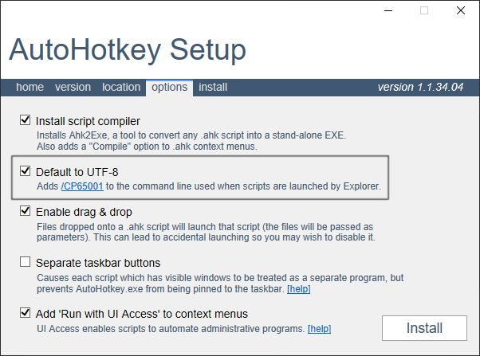

This document has been translated by [DeepL Translator](https://www.deepl.com/translator).

# TOC
* [Overview](#overview)
* [Attention: Use in Games](#attention-use-in-games)
* [Notes](#notes)
* [Support for developer](#support-for-developer)
* [Installation](#installation)
* [Docs](#docs)
  * [First](#first)
  * [Customhotkey Interface](#customhotkey-interface)
  * [Remap](#remap)
  * [Trigger](#trigger)
  * [Action](#action)
    * [SendAction](#sendaction)
    * [PasteAction](#pasteaction)
    * [RunAction](#runaction)
    * [ToolTipAction](#tooltipaction)
    * [TrayTipAction](#traytipaction)
    * [ReloadAction](#reloadaction)
    * [ExitAction](#exitaction)
    * [ExitAllAction](#exitallaction)
    * [DelayAction](#delayaction)
    * [AsyncAction](#asyncaction)
    * [MouseMoveAction](#mousemoveaction)
    * [MouseClickAction](#mouseclickaction)
    * [MouseDragAction](#mousedragaction)
    * [ImageClickAction](#imageclickaction)
    * [DropperAction](#dropperaction)
    * [ImeAction](#imeaction)
    * [CustomAction](#customaction)
    * [CustomActions](#customactions)
  * [Combination Action](#combination-action)
    * [PressEventCombiAction](#presseventcombiaction)
    * [HoldEventCombiAction](#holdeventcombiaction)
    * [ModifierPressCombiAction](#modifierpresscombiaction)
    * [ExtraPressCombiAction](#extrapresscombiaction)
    * [KeyStrokeCombiAction](#keystrokecombiaction)
    * [CommandPaletteCombiAction](#commandpalettecombiaction)
    * [MouseGestureCombiAction](#mousegesturecombiaction)
    * [ContextMenuCombiAction](#contextmenucombiaction)
    * [ConditionCombiAction](#conditioncombiaction)
    * [TernaryCombiAction](#ternarycombiaction)
  * [Condition](#condition)
    * [WindowCondition](#windowcondition)
    * [ImeCondition](#imecondition)
    * [ImageCondition](#imagecondition)
    * [MouseTimeIdleCondition](#mousetimeidlecondition)
    * [CustomCondition](#customcondition)
  * [Grouping](#grouping)
  * [Template](#template)
* [Common settings](#common-settings)
  * [Default option value](#default-option-value)
  * [Origin of coordinates](#origin-of-coordinates)
  * [Time](#time)
  * [Color](#color)
  * [Template string](#template-string)
* [Advanced Docs](#advanced-docs)
  * [User-Defined Action](#user-defined-action)
  * [User-Defined Condition](#user-defined-condition)
  * [Parsing Trigger](#parsing-trigger)

# Overview
CustomHotkey is a library for [AutoHotkey](https://www.autohotkey.com) that can define complex hotkeys (or simulate [remap](https://www.autohotkey.com/docs/misc/Remap.htm)) with extensible [Action](#action) and [Condition](#condition).

Before using this library, you need to learn about [hotkey](https://www.autohotkey.com/docs/Hotkeys.htm).

## About AutoHotkey v2
Currently, only AutoHotkey v1 is supported. I will start working on v2 when the library specification is finalized.

# Attention: Use in Games
Since anti-cheat systems may recognize AutoHotkey as a cheat (even if you are not abusing it), I strongly recommended that you always exit it before playing games with online elements.

If you want to exit all running AutoHotkey scripts, use [ExitAllAction](#exitallaction).

# About the version under development
This library is under development. The specifications are not yet finalized and may be subject to destructive changes in the future.

The version under development takes the form `0.x.y`, where `x` represents a destructive change and `y` a non-destructive change.

If you want to see the changes, please see [CHANGELOG](CHANGELOG.md).

# Notes
Some of the [Actions](#action) in this library use tricky processing to implement their features.

For example, the [ExtraPressCombiAction](#extrapresscombiaction), which defines a hotkey with three or more keys, temporarily blocks user input and changes the priority of other hotkeys to the lowest.

While these tricky processes are necessary to implement the feature, they have the disadvantage that they will not be undone if the Action is not completed successfully.

Although the system is designed to prevent such problems from occurring, these problems cannot be completely solved because there are some bugs that I cannot control, such as misjudgment of key input.

Therefore, please keep in mind the following workarounds. If you remember these solutions, you will not be stuck in an inoperable state.

Basically, all you need to do is to register a hotkey for forced termination as described next.

## 1. Register hotkey for force termination
Register a hotkey for forced termination as follows to recover from an inoperable state.

You are free to assign any key, however, be sure to specify the `F` option of [Trigger](#trigger).

```ahk
; RShift(>+), RCtrl(>^)
new CustomHotkey(">+>^Esc|F", "{Exit|R}Exit {A_ScriptName}")
; It would be useful to be able to restart the script
new CustomHotkey(">+>^F5|F", "{Reload|R}Reload {A_ScriptName}
```

## 2. Use the `Ctrl & Alt & Delete` shortcut keys
Execute this shortcut and the `Winlogon` screen will appear.

During this time, the AutoHotkey process is disabled, so you can recover from the inoperable state by restarting the PC or using the Task Manager or other means from the menu.

It also has the effect of forcibly unblocking user input by this library. If not unblocked, it may be unblicked by executing this shortcut key multiple times.

## 3. Use the `Ctrl & Shift & Esc` shortcut
Executing this shortcut will launch the `Task Manager`.

AutoHotkey is disabled when the Task Manager is active, so it may be possible to recover from the inoperable state. If you are able to recover, you can use the task manager to force AutoHotkey to terminate.

If the script is running in elevated status, it may not be possible to recover because auto-input is not disabled.

# Support for developer
If you like this library, I would appreciate it if you would support it with [donation/sponsorship](https://github.com/sponsors/zero-plusplus).

The development is created as a personal hobby, and I do not accept pull requests.
Instead, I accept feature requests and bug reports at [Issues](https://github.com/zero-plusplus/CustomHotkey.ahk/issues).

# Installation
1. Download the installer of [AutoHotkey](https://www.autohotkey.com/). Even if you have already installed it, recommend reinstalling it to make sure the following option is set

2. Run the installer and a window will appear. At this time, **MUST** check the `Default to UTF-8` in the `options` tab to install


3. Download the this library at [here](https://github.com/zero-plusplus/CustomHotkey.ahk/releases)

4. Then place the library in a folder of your choice and include it in your scripts using the [#Include](https://www.autohotkey.com/docs/commands/_Include.htm) directive

# Docs
## First
CustomHotkey has features, but the first one you need to learn is the [CustomHotkey Interface](#customhotkey-interface) described next.

Next you will learn about [Trigger](#trigger) and [Action](#action).

For Actions, enough to know how to use [SendAction](#sendaction) first. Not necessary to understand everything.

Then learn about define hotkeys for each window (application) using [Condition](#condition).

After you understand the above basics, learn how to define more complex and flexible hotkeys by learning the remaining Actions, [Combination Actions](#combination-action), [Template](#template), etc.

If you don't know how to use it, you can ask questions in [Discussion](https://github.com/zero-plusplus/CustomHotkey.ahk/discussions) (GitHub account required).

## Explanatory syntax
### **Signature**
When describing function and method signatures in this document, TypeScript-like syntax is used to express argument and return types.

```
funcOrMethodName(arg1: type1, arg2: type2 | type3) => resultType
```

The non-object types that appear in this document are as follows.
* string : A [string](https://www.autohotkey.com/docs/Concepts.htm#strings)
* number : A [number](https://www.autohotkey.com/docs/Concepts.htm#numbers)
* boolean : A [boolean](https://www.autohotkey.com/docs/Concepts.htm#boolean). i.e. `true` or `false`
* time : A number or string representing [time](#time)

The following is the syntax for object types.

```ahk
; Object
{ [key: keyType]: valueType }

; Array
[ valueType1, valueType2, valueTypeN... ]
```

If `{ [key: string]: string }`, it represents an object with a string key and a string value. And if `[ string, number, boolean ]` then `array[1]` represents a string, `array[2]` a number, and `array[3]` a boolean.

If multiple types are accepted, they are separated by `|`, such as `string | number`.

### **Option String**
[Trigger](#trigger) and some [Actions](#action) can specify option string such as `"T1s R"`. Options are expressed in the following syntax: `R` is used by itself and `T1s` is used to specify a value.

Options are expressed in the following syntax.

```ahk
; <TYPE> is optional
OPTION<TYPE>
```

For example, if described as `T<time>`, it can be specified as `"T1s"`, `"T1000"`, and so on.

## Customhotkey Interface
CustomHotkey is provided as a class. The constructor takes [Trigger](#trigger) as its first argument, [Action](#action) as its second argument, and [Condition](#condition) as the optional third argument, and returns an instance.

In the following example, press `b` if notepad is active, otherwise enter the `a` key.

```ahk
hotkeyInstance := new CustomHotkey("RCtrl & 1", "a")
hotkeyInstance2 := new CustomHotkey("RCtrl & 1", "b", "ahk_exe notepad.exe"))

hotkeyInstance.register()
hotkeyInstance2.register()
```

This instance has the following methods.

* `register() => this` : Register a hotkey
* `on() => this` : Enable a hotkey. If not yet registered, call `register`
* `off() => this` : Disable a hotkey. If not yet registered, call `register`
* `toggle() => this` : Toggle enable/disable a hotkey. If not yet registered, call `register`
* `setState(state: boolean | -1 | "On" | "Off" | "Toggle")` : Set enable/disable state of a hotkey. Set the following values for `state`. If not yet registered, call `register`
  * `true`, `1`, `"On"` : Enable the hotkey
  * `false`, `0`, `"Off"` : Disable the hotkey
  * `-1`, `"Toggle"` : Toggle enable/disable the hotkey
* `setEnableBuffer(enabled: boolean) => this` : Set a Action to be taken when the limit on the number of threads set in [#MaxThreadsPerHotkey](https://www.autohotkey.com/docs/commands/_MaxThreadsPerHotkey.htm) is exceeded. If `true`, execution will wait until the number of threads is below the limit, and if `false`, execution will be canceled
* `setMaxThreads(max: number) => this` : Set number of threads that can run simultaneously (pseudo-multithreading)
* `setPriority(priority: number) => this` : [Hotkey Thread Priority](https://www.autohotkey.com/docs/misc/Threads.htm)
* `setInputLevel(level: number) => this` : Set a priority of [#InputLevel](https://www.autohotkey.com/docs/commands/_InputLevel.htm)
* `setFreeze() => this` : It will no longer change the state of this hotkey from the library. Also, use the `setPriority` method to set the highest priority. Some Actions disable hotkeys during execution, so use them for important hotkeys that should not be disabled, such as Force Exit
* `setOptions(options: string) => this` : Change options in the form of [hotkey command](https://www.autohotkey.com/docs/commands/Hotkey.htm) such as `"B1 T1"`

The `on` method can be used in place of the `register` method. Also, since these methods return the instance itself, you can register a hotkey with a single line as follows.

```ahk
hotkeyInstance := new CustomHotkey("RCtrl & 1", "^{a}").on()
```

## Remap
If you simply want to register a [Remap](https://www.autohotkey.com/docs/misc/Remap.htm) that replaces one key with another, use the `CustomHotkey.Remap` class. This class has the same interface as `CustomHotkey`.

The first argument is the key name you want to change, and the second argument is the key name after the change. The optional third argument is [Condition](#condition).

See [here](https://www.autohotkey.com/docs/KeyList.htm) for the key name.

The following special key names will not work.

* `AltTab`
* `ShiftAltTab`
* `AltTabMenu`
* `AltTabAndMenu`
* `AltTabMenuDismiss`

```ahk
new CustomHotkey.Remap("LCtrl", "Shift").on()
new CustomHotkey.Remap("LShift", "Ctrl").on()
new CustomHotkey.Remap("RShift", "MButton").on()
new CustomHotkey.Remap("RCtrl", "a", "ahk_exe notepad.exe").on()
```

## Trigger
The key/keys (`a`, `^+a`) or combination (`RCtrl & a`) to execute a hotkey is called a **Trigger** here.

It must be a valid string in the `KeyName` argument of the [Hotkey](https://www.autohotkey.com/docs/commands/Hotkey.htm) command. See [here](https://www.autohotkey.com/docs/Hotkeys.htm) for details.

### **Hotkey Options**
The following hotkey options can be additionally specified by appending `"|"` after the Trigger. To specify options, separate them with a space such as `"B1 T1"`.

* `B<1 | 0>` : Set `setEnableBuffer` method to a boolean value
* `F<1 | 0>` : Set `setFreeze` method to a boolean value
* `T<number>` : Set `setMaxThreads` method to a number
* `P<number>` : Set `setPriority` method to a number
* `I<number>` : Set `setInputLevel` method to a number

The following examples all have the same meaning.

```ahk
new CustomHotkey("RCtrl & 1|B0 T5 I1", "{a}").on()
```
```ahk
new CustomHotkey("RCtrl & 1", "{a}")
  .setOptions("B0 T5 I1")
  .on()
```
```ahk
new CustomHotkey("RCtrl & 1", "{a}")
  .setEnableBuffer(false)
  .setMaxThreads(5)
  .setInputLevel(1)
  .on()
```

## Action
A process that is executed when a trigger is pressed is called an **Action**.

Also, an Action that switches the Action to be executed depending on the state of the key input, mouse, etc. is called a **Combination Action**.

Actions can also be defined by the user. See [User-Defined Action](#user-defined-action) for more information.

The Action defined depends on the data passed to the second argument of CustomHotkey's constructor. This data is called an **Action Data**.

In this section simple Actions will be covered.

### SendAction
This is the most basic Action that executes the specified keystroke. You can cancel at any time during key sending by pressing the `Esc` key. If the [Trigger](#trigger) includes the `Esc` key, the key must be release once and then pressed again.

It can be defined by specifying a string or an object with the following fields. The `send` field is required.

* `send` : A keys to send. Basically the same as the argument passed to the [Send](https://www.autohotkey.com/docs/commands/Send.htm) command, so see there for details
* `mode` : Input mode. Specify the following string. Default is `"Event"`
  * `"Event"` : Send a key using SendEvent command
  * `"Input"` : Send a key using the SendInput command
  * `"Play"` : Send a key using the SendPlay command
  * `"InputThenPlay"` : Same as `"Input"`, but if SendInput is not available, SendPlay command is used to send keys
* `ime` : Change the IME state when sending keys. This may not work correctly because it has been checked only with the Japanese Microsoft IME. Can be specified in the following ways
  * `1` (or `true`) to turn on IME, `0` (or `false`) to turn off IME and send key.
  * If you specify a [time](#time) string or a number other than the numbers available above, the IME state is changed depending on whether the value is positive (on) or negative (off). After the specified time has elapsed, the IME state is restored to its previous state
* `sendLevel` : A number from `1` to `100` representing the [send level](https://www.autohotkey.com/docs/commands/SendLevel.htm)
* `delay` : Delay time when each key is pressed. If omitted, the same as [A_KeyDelay](https://www.autohotkey.com/docs/Variables.htm#KeyDelay)
* `pressDuration` : Delay [time](#time) after key pressed. If omitted, the same as [A_KeyDuration](https://www.autohotkey.com/docs/Variables.htm#KeyDelay)
* `limitLength` : A number representing the limit length of the keys to be sent. Counted by the actual key pressed. For example, if `"{a}{b 3}"` is set, the length is `4`. If `-1` is set, there is no limit. Default is `50`
* `allowMultiline` : If `true`, allows keystrokes to span lines. However, the `Enter` key is always allowed. Default is `false`

Passing a string is essentially the same as passing an object with a `send` field, with the following differences.

* Set the `mode` field by prefixing it with a string enclosed in curly brackets, such as `"{Input}{a}"`
* Set a value for each field of `options` by passing the following options suh as `"{Input|R L10}"`. If you want to specify more than one value, you must separate them with a space

  * `M` : Set the `true` to `allowMultiline`
  * `I<0|1>` : Set a number specified for `ime`
  * `S<number>` : Set a number to `sendLevel`
  * `D<number>` : Set a number to `delay`
  * `P<number>` : Set a number to `pressDuration`
  * `L<number>` : Set a number to `limitLength`

In other words, the following examples have the same meaning.

```ahk
new CustomHotkey("RCtrl & 1", "{Input}{a}").on()
```
```ahk
new CustomHotkey("RCtrl & 1", { send: "{a}", mode: "Input" }).on()
```

In addition to the [key names](https://www.autohotkey.com/docs/commands/Send.htm#keynames) available in the [Send](https://www.autohotkey.com/docs/commands/Send.htm) command, the following special key names are available

* `{SuffixKey}` : Replace with the non-modifier key of the Trigger. For example, `RCtrl & 1` will be replaced by `{1}`
* `{Clipboard}` : Replace with the clipboard content. Recommended to specify `{Raw}` or `{Text}` immediately before. Use with caution, since a large number of keys may be sent out depending on the clipboard contents. Remember that you can always interrupt a key send with the `Esc` key
* `{SelectedText}` : Replace with the selected text. See also `{Clipboard}` and similar problems

```ahk
new CustomHotkey("RCtrl & 1", "+{SuffixKey}").on()
```

If you want to change the IME state and send a key, use the `I` option as follows. Please note that this feature has only been tested with the Japanese Microsoft IME and may not work properly in other environments.

The following is an example of sending a key with the IME state on or off and restoring the state after 1 second.

```ahk
new CustomHotkey("RCtrl & 1", "{Input|I1}on").on()
new CustomHotkey("RCtrl & 2", "{Input|I0}off").on()
```

If you want to restore the IME state after sending a key, specify a value other than `0` or `1` for the `I` option. The time when the key transmission finishes is different each time, so you need to adjust it by yourself.

```ahk
new CustomHotkey("RCtrl & 1", "{Input|I1s}on").on()
new CustomHotkey("RCtrl & 2", "{Input|I-1s}off").on()
```

### PasteAction
This Action outputs the specified string using the clipboard.

It can output strings faster than [SendAction](#sendaction), but note that in rare cases when the clipboard is used by an external application, a conflict may occur and a string different from the specified string may be output.

It can be defined by specifying a string beginning with `{Paste}` or an object with the following fields. The `paste` field is required.

* `paste` : A string to output using clipboard
* `replace` : If `true` is specified, `paste` is treated as [Template String](#template-string)
* `restoreClipboard` : A boolean value representing whether or not to restore the clipboard after the Action is done, or a delay [time](#time) before restoring it. If a negative time is specified, such as `-150ms`, the clipboard is restored using pseudo asynchronous processing. Note, that in this case non-string content will not be restored correctly. Note also that if the time specified is too short, this Action may not work correctly. Default is `"150ms"`

If you pass a string, you can specify the following options such as `{Paste|R}`.

* `R` : set `true` to `replace`
* `C<boolean | time>` : Set a boolean or [time](#time) to `restoreClipboard`

```ahk
; Output the `"abc"`
new CustomHotkey("RCtrl & 1", "{Paste}abc").on()

; Enclose the selected string in parentheses
new CustomHotkey("RCtrl & 2", "{Paste|R}({{SelectedText}})").on()

; Output today's date
new CustomHotkey("RCtrl & 3", "{Paste|R}{A_YYYY}/{A_MM}/{A_DD}").on()
```

### RunAction
This Action executes the specified file or URL.

It can be defined by specifying a string beginning with `{Run}` or an object with the following fields. The `run` field is required.

* `run` : A file path or URL to execute
* `args` : An arguments passed to the file, or URL parameters specified by `run`. It specifies an array consisting of a string or a callable object
* `rawArgsMode` : Disable processing of the arguments described below. However, processing by setting `replace` and `limitArgLength` is not disabled. Default is `false`
* `replace` : If `true` is specified, string specified by `run` and `args` are treated as [Template String](#template-string).
* `workingDir` : A base directory (folder) when relative path is specified for `run`. Default is [A_WorkingDir](https://www.autohotkey.com/docs/Variables.htm#WorkingDir)
* `wait` : A boolean indicating whether to wait for the executed program to finish
* `verb` : [System verb](https://www.autohotkey.com/docs/commands/Run.htm#verbs) that controls how the program is executed or not. Specify the following string. Default is `"open"`
  * `"open"` : Open a file
  * `"properties"` : Open the properties window
  * `"find"` : Find in explorer
  * `"explore"` : Open in explorer
  * `"edit"` : Open in the associated text editor. If no action is assigned to `edit`, nothing will be done
  * `"print"` : Open in the print application
  * `"*RunAs"` : Start with administrative privileges
* `launchMode` : Specify the following string. Not effective for some applications. It is case-insensitive
  * `"Max"` : Maximize the window  on launch
  * `"Min"` : Minimize the window on launch
  * `"Hide"` : Hidden the window on launch

If `run` begins with `http://` or `https://`, treated as URL mode. This mode converts `args` using percent encoding if they are recognizable as query values. Specifically, if the preceding argument begins with `&` or `?`and ends with `=` or `/`, such as `"&search="`

Otherwise, in file call mode, and each string of `args` is enclosed in double quotes. However, if it can be recognized as a flag, such as starting with `/` or `-`, not enclosed.

If you want to disable this process, set `true` to `rawArgsMode`.

```ahk
new CustomHotkey("RCtrl & 1", { run: "notepad", args: [ A_LineFile ] }).on()
new CustomHotkey("RCtrl & 2", { run: "https://www.google.com/search", replace: true, args: [ "?q=", "{{SelectedText}}" ] }).on()
```

If you want the values of `run` and `args` to be set when the Action is executed, specify a callable object. This object will be called when the Action is executed and its return value will be the value.

The following is an example of using a callable object.

```ahk
; Change the URL to open depending on the extension included in the window title
new CustomHotkey("RCtrl & 1", { run: Func("GetDocumentUrl") }).on()
GetDocumentUrl() {
  WinGetTitle, title, A
  if (title ~= "\.ahk") {
    return "https://www.autohotkey.com/docs/AutoHotkey.htm"
  }
  if (title ~= "\.(ahk2|ah2)") {
    return "https://lexikos.github.io/v2/docs/AutoHotkey.htm"
  }
  return "https://www.google.com"
}
```

If you pass a string, you can specify the following options such as `{Run|R Mmin}`.

* `R` : Set the `true` to `replace`
* `W` : Set the `true` to `wait`
* `M<"min" | "max" | "hide">` : Set a string to `launchMode`
* `L<number>` : Set a number to `limitArgLength`

```ahk
new CustomHotkey("RCtrl & 1", "{Run|R Mmax}notepad {'" . A_LineFile . "':Q}").on()
new CustomHotkey("RCtrl & 2", "{Run|R}https://www.google.com/search?q={{SelectedText}}").on()
```

### ToolTipAction
This Action displays a tooltip.

It can be defined by specifying a string beginning with `{ToolTip}` or an object with the following fields. The `tooltip` field is required.

* `tooltip` : A string representing message to display in tooltip. If you want to hide existing tooltip, specify an empty string or `false`
* `replace` : If `true` is specified, strings specified by `tooltip` are treated as [Template String](#template-string).
* `id` : A number from `1` to `20` representing the ID of the tooltip. If a tooltip with the same ID already exists, the content will be overwritten. If omitted, an unused ID is set
* `displayTime` : Display time of tooltip. If a negative number is specified, the tooltip hiding process is asynchronous. Also, if `0` is specified, the hide process is disabled. Default is `1s`
* `x` : A number representing the x-coordinate of the tooltip's display position. Default is `0`
* `y` : A number representing the y-coordinate of the tooltip's display position. Default is `0`
* `origin` : An [origin](#origin-of-coordinates) of the `x` and `y`

```ahk
new CustomHotkey("RCtrl & 1", { tooltip: "This message will be displayed for 3 seconds.", displayTime: "3s" }).on()

; Always show and hide tooltip
new CustomHotkey("RCtrl & 2", { tooltip: "This message is always displayed", id: 19 }).on()
new CustomHotkey("RCtrl & 3", { tooltip: "", id: 19 }).on()
```

If you pass a string, you can specify the following options such as `{ToolTip|R T1s}`.

* `R` : Set the `true` to `replace`
* `I<number>` : Set a number to `id`
* `T<time>` : Set a [time](#time) to `displayTime`
* `X<number>` : Set a number to `x`
* `Y<number>` : Set a number to `y`
* `O<string>` : Set a string to `origin`

```ahk
new CustomHotkey("RCtrl & 1", "{ToolTip|T3s}This message is displayed for 3 seconds.").on()
```

### TrayTipAction
This Action displays a traytip (Also known as balloon tip).

It can be defined by specifying a string beginning with `{TrayTip}` or an object with the following fields. The `traytip` field is required.

* `traytip` : A string representing message to display in traytip
* `replace` : If `true` is specified, `traytip` is treated as [Template String](#template-string)
* `title` :  A string representing title to display in traytip
* `icon` : Icon of the traytip. The following strings can be specified. If omitted, the icon is not displayed
  * `"info"` : Display the information icon
  * `"warn"` : Display for warning icon
  * `"error"` : Display for error icon
* `silent` : If `true` is specified, no sound is emitted when displaying. Default is `false`

If you pass a string, you can specify the following options such as `{TrayTip|R Iwarn}`.

* `R` : Set the `true` to `replace`
* `S` : Set the `true` to `silent`
* `I<string>` : Set the string to `icon`
* `T<string>` : Set the string to `title`

```ahk
new CustomHotkey("RCtrl & 1", "{TrayTip|TInfo Iinfo}Display tray tip with information icon").on()
```

### ReloadAction
This Action restarts the currently script. Essentially the same as the [Reload](https://www.autohotkey.com/docs/commands/Reload.htm) command, but with an restart message.

It can be defined by specifying a string beginning with `{Reload}` or an object with the following fields. The `reload` field is required.

* `reload` : A string representing message to display when before reloading script
* `replace` : If `true` is specified, `reload` is treated as [Template String](#template-string)
* `tip` : Setting of tooltip to display the message. Specify an object with the following fields
  * `id` : A number from `1` to `20` representing the ID of the tooltip. If a tooltip with the same ID already exists, the content will be overwritten. If omitted, an unused ID is set
  * `x` : A number representing the x-coordinate of the tooltip. Default is `0`
  * `y` : A number representing the y-coordinate of the tooltip. Default is `0`
  * `origin` : An [origin](#origin-of-coordinates) of the `x` and `y` coordinates
  * `displayTime` : Display [time](#time) of the tooltip. Default is `"1s"`

If you pass a string, you can specify the following options such as `{Reload|T1s}`.

* `R` : Set the `true` to `replace`
* `X<number>` : Set the number to `tip.x`
* `Y<number>` : Set the number to `tip.y`
* `O<string>` : Set the string to `tip.origin`
* `T<time>` : Set the [time](#time) to `tip.displayTime`

The following examples have the same meaning.

```ahk
new CustomHotkey("RCtrl & 1", "{Reload|T0.5s}Restart the script").on()
```
```ahk
new CustomHotkey("RCtrl & 1", { reload: "Restart the script", tip: { displayTime: "0.5s" } }).on()
```

### ExitAction
This Action terminates the currently script. Essentially the same as the [ExitApp](https://www.autohotkey.com/docs/commands/ExitApp.htm) command, but with an exit message.

It can be defined by specifying a string beginning with `{Exit}` or an object with the following fields. The `exit` field is required.

* `exit` : A string representing message to display when before exiting script
* `replace` : If `true` is specified, `exit` is treated as [Template String](#template-string)
* `tip` : Setting of tooltip to display the message. Specify an object with the following fields
  * `id` : A number from `1` to `20` representing the ID of the tooltip. If a tooltip with the same ID already exists, the content will be overwritten. If omitted, an unused ID is set
  * `x` : A number representing the x-coordinate of the destination. Default is `0`
  * `y` : A number representing the y-coordinate of the destination. Default is `0`
  * `origin` : An [origin](#origin-of-coordinates) of the `x` and `y` coordinates
  * `displayTime` : Display [time](#time) of the tooltip. Default is `1s`

If you pass a string, you can specify the following options such as `{Exit|T1s}`.

* `R` : Set the `true` to `replace`
* `X<number>` : Set a number to `tip.x`
* `Y<number>` : Set a number to `tip.y`
* `O<string>` : Set a string to `tip.origin`
* `T<time>` : Set a [time](#time) to `tip.displayTime`

The following examples have the same meaning.

```ahk
new CustomHotkey("RCtrl & 1", "{Exit|T0.5s}Exit the script").on()
```
```ahk
new CustomHotkey("RCtrl & 1", { exit: "Exit the script", tip: { displayTime: "0.5s" } }).on()

```

### ExitAllAction
This Action terminates all AutoHotkey scripts.

It can be defined by specifying a string beginning with `{ExitAll}` or an object with the following fields. The `exitAll` field is required.

* `exitAll` : A string representing message to display when before exiting scripts
* `replace` : If `true` is specified, `reload` is treated as [Template String](#template-string).
* `tip` : Setting of tooltip to display the message. Specify an object with the following fields
  * `id` : A number from `1` to `20` representing the ID of the tooltip. If a tooltip with the same ID already exists, the content will be overwritten. If omitted, an unused ID is set
  * `x` : A number representing the x-coordinate of the destination. Default is `0`
  * `y` : A number representing the y-coordinate of the destination. Default is `0`
  * `origin` : An [origin](#origin-of-coordinates) of the x and y coordinates
  * `displayTime` : Display [time](#time) of the tooltip. If `0` is specified, it will always remain visible. Default is `1s`
* `excludeSelf` : Exclude itself from the termination target

If a string is passed, the following options can be specified as in `{ExitAll|T1s}`.

* `R` : Set the `true` to `replace`
* `E` : Set the `true` to `excludeSelf`
* `X<number>` : Set a number to `tip.x`
* `Y<number>` : Set a number to `tip.y`
* `O<string>` : Set a string to `tip.origin`
* `T<time>` : Set a [time](#time) to `tip.displayTime`

The following examples have the same meaning.

```ahk
new CustomHotkey("RCtrl & 1", "{ExitAll|T0.5s}Exit all the script").on()
```
```ahk
new CustomHotkey("RCtrl & 1", { exitAll: "Exit all the script", tip: { displayTime: "0.5s" } }).on()
```

### DelayAction
This Action delays processing. It has no meaning by itself and is used in [CustomActions](#customactions).

It can be defined by specifying a string beginning with `{Delay}`, a pure number or an object with the following fields. The `delay` field is required.

* `delay` : Delay [time](#time)

If you specify a string beginning with `{Delay}`, then [time](#time) is specified after it.
If you pass a pure number, the unit is milliseconds.

The following three examples delay processing for one second when the Trigger is pressed. But thease alone is meaningless.

```ahk
new CustomHotkey("RCtrl & 1", { delay: "1s" }).on()
```
```ahk
new CustomHotkey("RCtrl & 1", 1000).on()
```
```ahk
new CustomHotkey("RCtrl & 1", "{Delay}1s").on()
```

The following is an incorrect example. Treated as a string instead of a pure number, so defined as [SendAction](#sendaction) instead.

```ahk
new CustomHotkey("RCtrl & 1", "1000").on()
```

The following is an example of [CustomActions](#customactions) that sends keys at `250` millisecond intervals.

```ahk
new CustomHotkey("RCtrl & 1", [ "a", 250, "b", 250, "c"]).on()
```

### AsyncAction
This Action executes the specified Action in a pseudo asynchronous process using [SetTimer](https://www.autohotkey.com/docs/commands/SetTimer.htm). Like [DelayAction](#delayaction), is not useful on its own, but is used in [CustomActions](#customactions).

It can be defined by specifying an object with the following fields. The `async` field is required.

* `async` : An [Action](#action) to execute asynchronously
* `delay` : Delay [time](#time)

The following is an example of executing three Actions with a delay. In this example, keys are sent in the order `b`, `c`, `a`.

```ahk
new CustomHotkey("RCtrl & 1", [ { async: "a", delay: 250 }
                              , { async: "b" }
                              , { async: "c", delay: 150 } ]).on()
```

### MouseMoveAction
This Action moves the mouse to the specified position.

It can be defined by specifying an object with one of the following fields.

* `x` : A number representing the x-coordinate of the destination. Default is `0`
* `y` : A number representing the y-coordinate of the destination. Default is `0`
* `origin` : An [origin](#origin-of-coordinates) of the `x` and `y` coordinates
* `speed` : A `0` (fast) - `100` (slow) representing the speed of cursor movement. If omitted, the same as if [A_DefaultMouseSpeed](https://www.autohotkey.com/docs/Variables.htm#DefaultMouseSpeed) were specified

```ahk
; Move mouse to center of screen
new CustomHotkey("RCtrl & 1", { origin: "screen-center" }).on()

; Move 50 pixels to the right from the current position
new CustomHotkey("RCtrl & 2", { x: 50 }).on()
```

### MouseClickAction
This Action clicks on the specified position.

It can be defined by specifying an object with the following fields. Either the `button` or `count` field is required.

* `button` : A name of the mouse button to use for clicking. The following string can be specified. case-insensitive. Default is `LButton`
  * `"LButton"`, `"Left"`, `"L"` : Left button
  * `"RButton"`, `"Right"`, `"R"` : Right button
  * `"MButton"`, `"Middle"`, `"M"` : Middle button
  * `"XButton1"`, `"X1"` : Extension 1 button. Usually placed at the front side
  * `"XButton2"`, `"X2"` : Extension 2 button. Usually located at the back
  * In addition to the above, the following suffixes can be additionally specified with a space between them, such as `"LButton Up"`. It is case-insensitive
    * `"Up"`, `"U"` : Release the mouse button
    * `"Down"`, `"D"` : Leave the mouse button pressed
* `mode` : Send mode of the click. Specify the following string. Default is `"Event"`
  * `"Event"` : Send a button using the [SendEvent](https://www.autohotkey.com/docs/commands/Send.htm) command
  * `"Input"` : Send a button using the [SendInput](https://www.autohotkey.com/docs/commands/Send.htm) command
  * `"Play"` : Send a button using the [SendPlay](https://www.autohotkey.com/docs/commands/Send.htm) command
  * `"InputThenPlay"` : Same as `"Input"`, but if SendInput is not available, SendPlay command is used to send button
* `count` : A number of clickcs. Default is `1`
* `x` : A number representing the x-coordinate of the click position. Default is `0`
* `y` : A number representing the y-coordinate of the click position. Default is `0`
* `origin` : The [origin](#origin-of-coordinates) of the x and y coordinates. Default is `"mouse"`
* `speed` : A `0` (fast) - `100` (slow) representing the speed of cursor movement. If omitted, it is the same as if [A_DefaultMouseSpeed](https://www.autohotkey.com/docs/Variables.htm#DefaultMouseSpeed) were specified
* `restore` : If `true` is specified, the mouse position will be restored with `speed` set to `0` after the Action is done. If you want to specify the speed of the mouse when restoring, specify a number from `-1` to `-100`

The following is an example of double-clicking on the center of the screen.

```ahk
new CustomHotkey("RCtrl & 1", { button: "LButton", count: 2, origin: "screen-center" }).on()
```

### MouseDragAction
This Action drags from a specified position to a position.

It can be defined by specifying an object with following fields. The `to` field is required.

* `button` : A name of the mouse button to use for dragging. The following string can be specified. It is case-insensitive. Default is `LButton`
  * `"LButton"`, `"Left"`, `"L"` : Left button
  * `"RButton"`, `"Right"`, `"R"` : Right button
  * `"MButton"`, `"Middle"`, `"M"` : Middle button
  * `"XButton1"`, `"X1"` : Extension 1 button. Usually placed at the front side
  * `"XButton2"`, `"X2"` : Extension 2 button. Usually located at the back
* `mode` : Send mode of the click. Specify the following string. Default is `"Event"`
  * `"Event"` : Send a button using the [SendEvent](https://www.autohotkey.com/docs/commands/Send.htm) command
  * `"Input"` : Send a button using the [SendInput](https://www.autohotkey.com/docs/commands/Send.htm) command
  * `"Play"` : Send a button using the [SendPlay](https://www.autohotkey.com/docs/commands/Send.htm) command
  * `"InputThenPlay"` : Same as `"Input"`, but if SendInput is not available, SendPlay command is used to send button
* `from` :  An object with the following fields representing the starting position of the drag. If omitted, the current mouse position
  * `x` : A number representing the x-coordinate of the start position of the drag. If omitted, the x coordinate of the current position if omitted
  * `y` : A number representing the y-coordinate of the start position of the drag. If omitted, the x coordinate of the current position if omitted
  * `origin` : An [origin](#origin-of-coordinates) of the `from.x` and `from.y` coordinates. Default is `"mouse"`
* `to` :  An object with the following fields representing the end position of the drag
  * `x` : A number representing the x-coordinate of the end position of the drag. If omitted, the x coordinate of the current position if omitted
  * `y` : A number representing the y-coordinate of the end position of the drag. If omitted, the x coordinate of the current position if omitted
  * `origin` : An [origin](#origin-of-coordinates) of the `to.x` and `to.y` coordinates. Default is `"mouse"`
* `speed` : A `0` (fast) - `100` (slow) representing the speed of cursor movement. If omitted, the same as if [A_DefaultMouseSpeed](https://www.autohotkey.com/docs/Variables.htm#DefaultMouseSpeed) were specified
* `restore` : If `true` is specified, the mouse position will be restored with `speed` set to `0` after the Action is finished. If you want to specify the speed of the mouse when restoring, specify a number from `-1` to `-100`

The following is an example of dragging from the current position toward the center of the screen.

```ahk
new CustomHotkey("RCtrl & 1", { to: { origin: "screen-center" } }).on()
```

### ImageClickAction
The Action is to click on a location that matches the specified image. If no match is found, nothing is done.

It can be defined by specifying an object with the following fields. The `image` field is required.

* `image` : A path and flag of the image to click. In case of relative path, based on [A_WorkingDir](https://www.autohotkey.com/docs/Variables.htm#WorkingDir). The specification method is the same as `ImageFile` argument in [ImageSearch](https://www.autohotkey.com/docs/commands/ImageSearch.htm). Alternatively, you can specify an object with the following fields
  * `path` : A path of the image. In case of relative path, based on [A_WorkingDir](https://www.autohotkey.com/docs/Variables.htm#WorkingDir)
  * `pathType` : Change the treatment of `path`. Specify the following string. It is case-insensitive. If omitted, treated as a file path
    * `"bitmap"` : Treat as a [bitmap handle](https://www.autohotkey.com/docs/misc/ImageHandles.htm)
    * `"icon"` : Treat as an [icon handle](https://www.autohotkey.com/docs/misc/ImageHandles.htm)
  * `imageNumber` : A image number, if the file specified by `path` (e.g. dll) contains images
  * `variation` : A number from `0`-`255` representing the amount of tolerance when comparing colors; if `0` is specified, only exact matches will be matched. Conversely, a value of `255` will match all colors. This is used to match a degraded image
  * `trans`, `transparent` : A [color](#color) to be transparent
  * `resize` : A boolean representing whether to resize or not, or an object with the following fields. Default is `true`
    * `width` : Width of the image to be loaded. If `-0` is specified, the image is not resized. If `-1` is specified, the image will be resized keeping the ratio
    * `heigth` : Height of the image when loading. If `-0` is specified, the image is not resized. If `-1` is specified, the image is resized keeping the ratio
* `targetRect` : Rectangle range to search. There are three ways to specify the target rectangle. Default is `"window"`
  * Specify the following strings
    * `"screen"` : Target active screen
    * `"window"` : Target the active window
  * Search for a rectangle of a specified size
    * `x` : A x-coordinate of the starting point of the search range
    * `y` : A y-coordinate of the starting point of the search range
    * `width` : Width of the rectangle
    * `height` : Height of the rectangle
    * `origin` : An [origin](#origin-of-coordinates) of the `x` and `y` coordinates. Default is `"window"`
  * Search a rectangular range from the specified position (top left) to the position (bottom right). Specify an array of objects of length 2 with the following fields
    * `x` : A x-coordinate of the starting point of the search range
    * `y` : A y-coordinate of the starting point of the search range
    * `origin` : An [origin](#origin-of-coordinates) of the `x` and `y` coordinates. Default is `"window"`
* `button` : A name of the mouse button to use for clicking. The following string can be specified. It is case-insensitive. Default is `LButton`
  * `"LButton"`, `"Left"`, `"L"` : Left button
  * `"RButton"`, `"Right"`, `"R"` : Right button
  * `"MButton"`, `"Middle"`, `"M"` : Middle button
  * `"XButton1"`, `"X1"` : Extension 1 button. Usually placed at the front side
  * `"XButton2"`, `"X2"` : Extension 2 button. Usually located at the back
  * In addition to the above, the following suffixes can be additionally specified with a space between them, such as `"LButton Up"`. It is case-insensitive
    * `"Up"`, `"U"` : Release the mouse button
    * `"Down"`, `"D"` : Leave the mouse button pressed
* `mode` : Send mode of the click. Specify the following string. Default is `"Event"`
  * `"Event"` : Send a button using the [SendEvent](https://www.autohotkey.com/docs/commands/Send.htm) command
  * `"Input"` : Send a button using the [SendInput](https://www.autohotkey.com/docs/commands/Send.htm) command
  * `"Play"` : Send a button using the [SendPlay](https://www.autohotkey.com/docs/commands/Send.htm) command
  * `"InputThenPlay"` : Same as `"Input"`, but if SendInput is not available, SendPlay command is used to send button
* `count` : Number of clickcs. Default is `1`
* `offset` : Offset from the found image. Used to correct the click position. Specify an object with the following fields
  * `x` : Offset in x-coordinate from the found image
  * `y` : Offset in y-coordinate from the found image
* `speed` : A `0` (fast) - `100` (slow) representing the speed of cursor movement. If omitted, the same as if [A_DefaultMouseSpeed](https://www.autohotkey.com/docs/Variables.htm#DefaultMouseSpeed) were specified
* `restore` : If `true` is specified, the mouse position will be restored with `speed` set to `0` after the action is finished. If you want to specify the speed of the mouse when restoring, specify a number from `-1` to `-100`

The following is an example of clicking on an image and restoring the mouse position.

```ahk
; Note: If you want to run the following example, you will need to set up your own path
new CustomHotkey("RCtrl & 1", { image: "path/to/image", speed: 0, restore: true }).on()
```

If this Action is used in [CustomActions](#customactions) as in the following example, subsequent Actions will be aborted if the image is not found.

```ahk
; Note: If you want to run the following example, you will need to set up your own path
; Drag the image 100 pixels to the right
new CustomHotkey("RCtrl & 1", [ { button: "LButton Down", image: { path: "path/to/image" }, speed: 0 }
                              , { x: 100 }
                              , { button: "LButton Up"} ] ).on()
```

### DropperAction
This Action displays information (color, coordinates, etc.) under the mouse in a tooltip while the non-modifier key in trigger (e.g. `1` of `RCtrl & 1`) is pressed, and copies that information to the clipboard when the non-modifier key is released.

It can be defined by specifying an object with the following fields. The `dropper` field is required.

* `dropper` : A method to retrieve information. Specify the following string or callable object
  * `"color"` : Get a color code under the mouse
  * `"coord"`, `"coordinate"` : Get a coordinates under the mouse
  * `"window"` : Get a window information (title, class, etc.) under the mouse
* `tip` : Setting for a tooltip that displays a hint. Specify an object with the following fields. Normally, you do not need to specify this
  * `id` : A number from `1` to `20` representing the ID of the tooltip. If a tooltip with the same ID already exists, the content will be overwritten. If omitted, an unused ID is set
  * `x` : A number representing the x-coordinate of the destination. Default is `0`
  * `y` : A number representing the y-coordinate of the destination. Default is `0`
  * `origin` : An [origin](#origin-of-coordinates) of the `tip.x` and `tip.y` coordinates
  * `delay` : Delay [time](#time) to display the tooltip. Default is `100ms`
* `options` : Options to pass to the `dropper`

If called from a [KeyStrokeCombiAction](#keystrokecombiaction), the Action will be executed as long as the key at the time of the call (`q`, `w`, or `e` in the example below) is pressed, not the non-modifier key.

```ahk
new CustomHotkey("RCtrl & 1", [ { key: "q", desc: "color", action: { dropper: "color" } }
                              , { key: "w", desc: "coordinates", action: { dropper: "coordinates" } }
                              , { key: "e", desc: "window", action: { dropper: "window" } } ]).on()
```

#### **color**
If `"color"` is specified for `dropper`, the color information under the mouse will be retrieved.

`options` is a string or an object with the following fields. If you pass a string, the same as specifying `template`.

* `template` : [Template String](#template-string) to display the retrieved information. The following variables can be specified. Default is `"#{R:X}{G:X}{B:X}"`
  * `R` : A number representing red color
  * `G` : A number representing green color
  * `B` : A number representing blue color
* `method` : A method to get the color. The following strings can be specified. Default is `"Default"`. It is case insensitive
  * `"Default"` : Get a color in the normal way
  * `"Alt"` : Get in a different way from the usual way. The speed is a little slower, but you may be able to get a color even if you cannot get it with `"Default"`
  * `"Slow"` : Get a color in a more complicated way. However, slower than `"Alt"`

```ahk
new CustomHotkey("RCtrl & 1", { dropper: "color" }).on()
new CustomHotkey("RCtrl & 2", { dropper: "color", options: { template: "R: {R}, G: {G}, B: {B}", method: "Slow" } }).on()
```

#### **coordinates**
If `"coordinates"` or `"coord"` is specified for `dropper`, the information of coordinates under the mouse will be retrieved.

`options` is a string or an object with the following fields. If you pass a string, the same as specifying `template`.

* `template` : [Template String](#template-string) to display the retrieved information. The following variables can be specified. Default is `"{x}, {y}"`
  * `x` : A number representing the x-coordinate of the mouse
  * `y` : A number representing the y-coordinate of the mouse
* `origin` : An [origin](#origin-of-coordinates) of the x and y coordinates. Default is `"mouse"`

```ahk
new CustomHotkey("RCtrl & 1", { dropper: "coordinates" }).on()
new CustomHotkey("RCtrl & 2", { dropper: "coordinates", options: "x: {x}`ny: {y}" }).on()
new CustomHotkey("RCtrl & 3", { dropper: "coordinates", options: { origin: "window" } }).on()
```

#### **window**
If `"window"` is specified for `dropper`, the information of the window under the mouse is targeted for retrieval.

`options` is an object with the following fields. If you pass a string, the same as specifying `template`.

* `template` : [Template String](#template-string) to display the retrieved information. The following variables can be specified.
  * `title` : A title under the mouse
  * `class` : A window class under the mouse
  * `ahk_class` : Same as above but with prefix `"ahk_class"`
  * `exe` : A process name of the window under the mouse
  * `ahk_exe` : Same as above but with prefix `"ahk_exe"`
  * `path` : A process path of the window under the mouse
  * `id`, `hwnd` : A window handle of the window under the mouse
  * `ahk_id` : Same as above but with prefix `"ahk_id"`
  * `pid` : A process name of the window under the mouse
  * `ahk_pid` : Same as above but with prefix `"ahk_pid"`
  * `controlName` : A name of the control under the mouse
  * `controlId`, `controlHwnd` : A control handle under the mouse

```ahk
new CustomHotkey("RCtrl & 1", { dropper: "window" }).on()
new CustomHotkey("RCtrl & 2", { dropper: "window", options: "{ahk_id}" }).on()
```

#### **User-defined**
If you specify a callable object for the `dropper`, you can customize what information is retrieved.

The first argument is passed an object with an `x` or `y` field, the coordinates of the mouse with the origin in the upper left corner of the screen.

The second argument is the data passed in the `options`.

```ahk
new CustomHotkey("RCtrl & 1", { dropper: Func("CustomTarget"), options: { template: "{}, {}" } }).on()
CustomTarget(position, options) {
  return Format(options.template, position.x, position.y)
}
```

### ImeAction
This Action changes the state of the IME. Note, that this has not been tested with anything other than the Japanese Microsoft IME, so it may not work correctly in other environments.

It can be defined by specifying an object with the following fields.

* `ime` : IME status to set. If `true`, turn on; if `false`, turn off

```ahk
new CustomHotkey("RCtrl & 1", { ime: false }).on()
new CustomHotkey("RCtrl & 2", { ime: true }).on()
```

### CustomAction
This is a function-style user-defined Action. If you want to define them in class style, see [User-Defined Action](#user-defined-action).

It can be defined by specifying a callable object (function, method, [BoundFunc](https://www.autohotkey.com/docs/objects/Functor.htm#BoundFunc), etc.).

The following is an example of defining an Action to maximize the active window.

```ahk
new CustomHotkey("RCtrl & 1", Func("MoveActiveWindow").bind(0, 0, A_ScreenWidth, A_ScreenHeight)).on()
MoveActiveWindow(x := "", y := "", width := "", height := "") {
  WinMove, A, , %x%, %y%, %width%, %height%
}
```

Since all Actions are callable objects, they can be specified directly as follows.

```ahk
; The following defines the same action
new CustomHotkey("RCtrl & 1", "^{a}").on()
new CustomHotkey("RCtrl & 2", new CustomHotkey.SendAction("^{a}")).on()
```

### CustomActions
This Action executes the specified Actions subsequently.

It can be defined by specifying an array consisting of the Action Data.

```ahk
; Send keys with delay
new CustomHotkey("RCtrl & 1", [ "a", 250, "b", 250, "c" ]).on()

; Reproduce MouseDragAction by combining Actions
new CustomHotkey("RCtrl & 2", [ { button: "LButton down" }
                              , { x: 200, y: 200 }
                              , { button: "LButton up" } ]).on()
```

If a callable object is specified, the first argument is the return value of the last Action that returned a non-empty value, and the second argument is an `ActionDone` object. Passing it as return value will abort Actions.

## Combination Action
With the Actions described above, only one Action could be assigned to a hotkey.

The Combination Actions described next allow more Actions to be assigned.

Also, possible to define Combination Actions for Combination Actions, allowing for more complex Action assignments.

### PressEventCombiAction
This Combination Action that switches an Action depending on how the non-modifier key (`1` in the case of `RCtrl & 1`) of the Trigger is pressed.

It can be defined by passing an object with one of the following fields.

* `single` : An Action to be executed when the Trigger is pressed
* `long` : An Action to be executed when a Trigger is pressed and an non-modifier key is pressed for a long time. The following option string can be specified: `long|T150ms`
  * `T<time>`. Set [time](#time) to `timeout_long` described next
* `double` : An Action to be executed when an additional non-modifier key is pressed (i.e. double press) following the Trigger. The following option string can be specified: `double|T150ms`
  * `T<time>`. Set [time](#time) to `timeout_double` described next
  * `N` : Set `true` to `nodelay` described next

The following fields can also be added.

* `targetKey` : Override the target key for the event. Default is the non-modifier key of the trigger. Usually does not need to be specified
* `timeout_long`: A [time](#time) to be recognized as a long press
* `timeout_double`: A [time](#time) to be recognized as a double press
* `nodelay` : If `true` is specified, it disables the delay processing until the second press is determined. That is, the action assigned to `single` will be executed regardless of whether pressed double or not

```ahk
new CustomHotkey("RCtrl & 1", { single: "{ToolTip}single press"
                              , long: "{ToolTip}long press"
                              , double: "{ToolTip}double press" }).on()
```

`nodelay` is useful in cases where a `double` overrides a `single` Action, as in the following example. In this example, `nodelay` is set by using the `N` option for the `double` field.

```ahk
new CustomHotkey("RCtrl & 1", { single: [ "{ToolTip}IME OFF", { ime: false } ]
                              , "double|T1s N": [ "{ToolTip}IME ON", { ime: true } ] }).on()
```

Complex definitions such as pressing five times and long pressing are also possible by combining this Action as follows.

```ahk
new CustomHotkey("RCtrl & 1", { single: "{ToolTip}single"
                              , long: "{ToolTip}long"
                              , double: { single: "{ToolTip}double"
                                        , long: "{ToolTip}double+long"
                                        , double: { single: "{ToolTip}triple"
                                                  , long: "{ToolTip}triple+long"
                                                  , double: { single: "{ToolTip}quadruple"
                                                            , long: "{ToolTip}quadruple+long"
                                                            , double: { single: "{ToolTip}quintuple"
                                                                      , long: "{ToolTip}quintuple+long" } } } } }).on()
```

In practice, such complex definitions are not very easy to visualize, so the following fields are provided for simplified settings.

* `triple` : An Action when triple press
* `quadruple` : An Action when quadruple press
* `quintuple` : An Action when quintuple press

```ahk
new CustomHotkey("RCtrl & 1", { single: "{ToolTip}single"
                              , long: "{ToolTip}long"
                              , double: "{ToolTip}double"
                              , triple: "{ToolTip}triple"
                              , quadruple: "{ToolTip}quadruple"
                              , quintuple: "{ToolTip}quintuple"}).on()
```

Note that key that is virtual modifier key (`Up` in the example below) cannot be detected as long presses, so the Action will not be executed. Also, single and double presses will cause the Action to be executed when the key is released, not when pressed.

```ahk
new CustomHotkey("Up & Down", "").on()
new CustomHotkey("Up", { single: "{ToolTip}single"
                       , long: "{ToolTip}long" ; This action cannot be executed
                       , double: "{ToolTip}double" }).on()
```

### HoldEventCombiAction
This Combination Action, like [PressEventCombiAction](#presseventcombiaction), switches the Action according to the pressing of the non-modifier key (`1` of `RCtrl & 1`) of the Trigger.

It can be defined by specifying an object with the following fields. The `hold` field is required.

* `tap` : An Action to be executed  when a Trigger is pressed and an non-modifier key is released within the specified time. You can use the following option string as `tap|T80ms`.
  * `T<time>` : Set [time](#time) to `timeout_tap` described next
  * `N` : Set `true` to `nodelay` described next
* `hold` : An Action to be executed  while an non-modifier key is pressed. You can use the following option string as `hold|R10ms`
  * `R<time>` : An Action repeat interval. If not specified, the action will be executed only once
* `release` : An Action to be executed when an non-modifier key is released. Only executed if the Action of `hold` has been executed at least once

The following fields can also be added.

* `targetKey` : Override the target key for the event. Default is the non-modifier key of the Trigger. Usually does not need to be specified
* `timeout_tap`: A [time](#time) to be recognized as a tap input
* `nodelay` : If `true` is specified, the `tap` Action will always be executed before the Action assigned to `hold` is executed, regardless of the `timeout_tap` setting

```ahk
new CustomHotkey("RCtrl & 1", { hold: { button: "LButton down" }
                              , release: { button: "LButton up" } }).on()
new CustomHotkey("RCtrl & 2", { tap: "{ToolTip}tap"
                              , "hold|R50ms": "{ToolTip}hold"
                              , release: "{ToolTip}release" }).on()
```

### ModifierPressCombiAction
This Combination Action that switches the Action depending on the specified modifier key is pressed at the time of Trigger pressing.

It is useful when using keyboard that are rarely used but have very easy-to-press non-modifier key, such as [henkan-key of Japanese keyboard](https://en.wikipedia.org/wiki/Language_input_keys#Keys_for_Japanese_Keyboards), but may not be very useful otherwise.

It can be defined by specifying an object with one of the following fields.

* `trigger` : An Action when only a Trigger is pressed
* `A modifier key name or its array` : An Action to be executed if the [modifier key](https://www.autohotkey.com/docs/KeyList.htm#modifier) is pressed in addition to the trigger. If the modifier key is specified as an array, it will be executed if all of its keys are pressed

```ahk
new CustomHotkey("z & 1", { trigger: "{ToolTip}trigger"
                          , shift: "{ToolTip}trigger+shift"
                          , [ "shift", "ctrl" ]: "{ToolTip}trigger+shift+ctrl" }).on()
```

### ExtraPressCombiAction
This Combination Action that switches the Action based on the specified additional key is pressed while pressing the Trigger. You can define hotkey for combinations of three or more keys, such as `a & b & c`, which are not allowed in the normal syntax.

Like [ModifierPressCombiAction](#modifierpresscombiaction), it may not be very useful depending on the keyboard layout used.

It can be defined by specifying an object whose key is one of the following fields.

* [Key name](https://www.autohotkey.com/docs/KeyList.htm#modifier) : An Action to be executed when the specified key is pressed in addition to the Trigger. You can also specify the following option string as `a|R10ms`
  * `R<time>` : Set [time](#time) to `keyRepeat` individually
* `release` : An Action when the non-modifier key of the Trigger is released. Use when you want to assign an Action to the Trigger itself as well
* `keyRepeat` : Default [time](#time) for pseudo-key repeat interval, `0` or `false` to disable key repeat. Default is `15ms`

The following is an example of a 3-key hotkey definition.

```ahk
new CustomHotkey("PgUp & PgDn", { q: "^{c}" , w: "^{v}", "e|R10ms": "^{z}" }).on()
```

This Action can be combined to define four or more hotkeys. In the following example, you need to type `PgUp` -> `PgDn` -> `q` -> `w` -> `e` in that order.

```ahk
new CustomHotkey("PgUp & PgDn", { q: { w: { "e|R10ms": "{ToolTip}PgUp & PgDn & q & w & e" } } }).on()
```

### KeyStrokeCombiAction
This Combination Action that accepts key input when the Trigger is pressed and switches Actions in response to the input.

It will continue until the specified key is pressed or one of the following `Cancel keys` is pressed: `Escape`, `Backspace`, or `Delete`.

It can be defined by specifying an object with the following fields. The `items` field is required.

* `tip` : Setting for a tooltip that displays a hint. Specify an object with the following fields
  * `x` : A number representing the x-coordinate of the tooltip. Default is `0`
  * `y` : A number representing the y-coordinate of the tooltip. Default is `0`
  * `origin` : An [origin](#origin-of-coordinates) of the `tip.x` and `tip.y` coordinates
  * `id` : A number from `1` to `20` representing the ID of the tooltip. If a tooltip with the same ID already exists, the content will be overwritten. If omitted, an unused ID is set
  * `limitDescriptionLength` : Limit length of the `action` description. Default is `100`
* `items` : Specify an object with the following fields
  * `key` : A string representing either a key name, a virtual key, or a scan code. If `"$"` or `"F$"` is specified, the key is automatically assigned as described below
  * `description`, `desc` : A description of `action`
  * `action` : An Action to be executed when a `key` is pressed

You can directly specify an array to be passed to `items`. In other words, the following two hotkeys have the same meaning.

```ahk
items := [ { key: "a", description: "Show A in tooltip", action: "{ToolTip}A" } ]

new CustomHotkey("RCtrl & 1", items).on()
new CustomHotkey("RCtrl & 2", { items: items }).on()
```

If you specify `"$"` for `key`, keys are set in the order `1`-`0`, `q`-`p`, `a`-`l`, and `z`-`m`.

Also, by specifying `"F$"`, keys from `F1`-`F24` will be set in this order.

```ahk
new CustomHotkey("RCtrl & 1", [ { key: "$", desc: "1", action: "{ToolTip}1" }
                              , { key: "$", desc: "2", action: "{ToolTip}2" }
                              , { key: "$", desc: "3", action: "{ToolTip}3" }
                              , { key: "F$", desc: "F1", action: "{ToolTip}F1" }
                              , { key: "F$", desc: "F2", action: "{ToolTip}F2" }
                              , { key: "F$", desc: "F3", action: "{ToolTip}F3" } ]).on()
```

This auto-assigned key can be changed by specifying the following additional fields.

* `autokeys` : An array of keys to be replaced if `"$"` is specified
* `autoFunctionkeys` : An array of keys to be replaced if `"F$"` is specified

```ahk
new CustomHotkey("RCtrl & 1", { autoKeys: [ "a", "b", "c"]
                              , autoFunctionKeys: [ "F1", "F5", "F9" ]
                              , items: [ { key: "$", action: "{ToolTip}a" }
                                       , { key: "$", action: "{ToolTip}b" }
                                       , { key: "$", action: "{ToolTip}c" }
                                       , { key: "F$", action: "{ToolTip}F1" }
                                       , { key: "F$", action: "{ToolTip}F5" }
                                       , { key: "F$", action: "{ToolTip}F9" } ] }).on()

```

This Action can be combined to define a [hot-string](https://www.autohotkey.com/docs/Hotstrings.htm)-like action.

```ahk
new CustomHotkey("RCtrl & 1", [ { key: "b"
                                , desc: "by"
                                , action: [ { key: "t"
                                            , desc: "the"
                                            , action: [ { key: "w"
                                                        , desc: "way"
                                                        , action: "{ToolTip}by the way" } ] } ] } ]).on()

```

As in the example above, if this Action is combined, pressing the Cancel key will re-execute the previous Action.

In other words, after pressing the `b` key, pressing `Escape` will accept the `b` key input again.

If you want to exit completely, hold down `Ctrl` and press the `Cancel key`.

### CommandPaletteCombiAction
This Combination Action searches and executes registered commands, like [Command Palette](https://code.visualstudio.com/docs/getstarted/userinterface#_command-palette) in VSCode.

The following limitations exist because the UI is created with tooltip.

* Flickering occurs when refreshing contents
* IME cannot be used, so search strings are limited to characters that can be entered directly with the keyboard

It can be defined by specifying an object with the following fields. The `items` field is required.

* `tip` : Setting up tooltip to be used in the UI. Specify an object with the following fields
  * `x` : A number representing the x-coordinate of the tooltip. Default is `0`
  * `y` : A number representing the y-coordinate of the tooltip. Default is `0`
  * `origin` : An [origin](#origin-of-coordinates) of the `tip.x` and `tip.y` coordinates
  * `id` : A number from `1` to `20` representing the ID of the tooltip. If a tooltip with the same ID already exists, the content will be overwritten. If omitted, an unused ID is set
  * `maxRows` : Maximum number of commands to be displayed at one time. Default is `20`
  * `limitDescriptionLength` : Maximum length of the `description`. Default is `100`
* `input` : Initial value of user input
* `limitInputLength` : Limit number of user input. Default is `100`
* `caretPosition` : Initial position of the input (1-base). If omitted, the length of `input` plus 1
* `caretChar` : Specify the character that represents the caret. Default is `"|"`
* `fontType` : Change the alphanumeric font if the command matches or not. Can be a number or a string
  * `1`, `"serif"`, `"default"` : e.g. `aA0`, `𝐚𝐀𝟎`
  * `2`, `"serif-italic"` : e.g. `𝑎𝐴0`, `𝒂𝑨𝟎`
  * `3`, `"sans-serif"` : e.g. `aA𝟢`, `𝐚𝐀𝟬`
  * `4`, `"sans-serif-italic"` : e.g. `𝘢𝘈𝟢`, `𝙖𝘼𝟬`
* `cursorPosition` : Initial cursor position (1-base). Default is `1`
* `matcher` : Algorithm used for matching commands. If omitted, fuzzy search is used for matching. See [fuzzy search](#fuzzy-search) and [custom search](#custom-search) for more information
* `items` : An array or call object consisting of objects with the following fields. There is no limit, but recommended to limit the length of the array to about `1000` for processing speed
  * `command` : A command name. Must be a string that can be typed directly on the keyboard
  * `icon` : A string that appear before `command`. By using emoji, you can express the kind of command, etc.
  * `description`, `desc` : An `action` description
  * `action` : An [Action](#action) when the command is executed

The following hotkeys are available while in input mode (Tip: `^` indicates `Ctrl`, `!` indicates `Alt`).

* `Up` : Move the cursor to the item above. If the current cursor is on the first item, move it to the last item
* `^Up` : Move the cursor to the first item
* `Down` : Move the cursor to the item below. If the current cursor is on the last item, move it to the first item
* `^Down` : Move the cursor to the last item
* `PgUp` : Move the cursor up one page
* `PgDn` : Move the cursor down one page
* `Left` : Move caret to the left and update the listing
* `Home`, `^Left` : Move caret to the first position and update the listing
* `Right` : Move caret to the right and update the listing
* `End`, `^Right` : Move caret to the last position and update the listing
* `Enter`, `Tab` : Execute tha Action
* `Escape` : Delete all input. If there is no input, the Action is terminated. Also, if there is a chain of Actions and a corresponding Action exists, the state is restored and the Action is reexecuted
* `^Escape` : Terminate the Action completely
* `Bacspace` : Delete the character before the caret
* `^Bacspace` : Delete all characters before caret
* `Delete` : Delete the character after the caret
* `Alt` : Display full description

```ahk
new CustomHotkey("RCtrl & 1", { items: [ { command: "copy"
                                         , description: "Copy selected text"
                                         , action: "^c" }
                                       , { command: "cut"
                                         , description: "Cut selected text"
                                         , action: "^x" }
                                       , { command: "paste"
                                         , description: "Paste clipboard contents"
                                         , action: "^v" } ] }).on()
```

You can directly specify an array to be passed to `items`. In other words, the following two hotkeys have the same meaning.

```ahk
items := [ { command: "a", action: "a" } ]

new CustomHotkey("RCtrl & 1", { items: items }).on()
new CustomHotkey("RCtrl & 2", items).on()
```

Passing a callable object in the `items` field can be used to delay the creation of a command.

Also, using the [ModifierPressCombiAction](#modifierpresscombiaction), you can switch the Action to be executed depending on the state of the modifier key when the `Enter` or `Tab` key is pressed.

Using these mechanisms, possible to define a file explorer-like Action as follows.

```ahk
new CustomHotkey("RCtrl & 1", { tip: { limitDescriptionLength: 0 }, items: Func("Explorer").bind("C:") }).on()
Explorer(root) {
  list := []
  Loop Files, %root%\*, FD
  {
    try {
      FileGetAttrib, attribute, %A_LoopFileLongPath%
      if (InStr(attribute, "H") || InStr(attribute, "S")) {
        continue
      }
      if (InStr(attribute, "D")) {
        list.push({ command: A_LoopFileName
                  , icon: "📂"
                  , desc: A_LoopFileLongPath
                  , action: { trigger: { tip: { limitDescriptionLength: 0 }
                                       , items: Func("Explorer").bind(A_LoopFileLongPath) }
                            , ctrl: "{ToolTip}" . A_LoopFileLongPath } })
      }
      else {
        list.push({ command: A_LoopFileName
                  , icon: "📄"
                  , desc: A_LoopFileLongPath
                  , action: "{ToolTip}" . A_LoopFileLongPath })
      }
    }
  }
  return list
}
```

The following is an example of expressing the kind of command as in VSCode.

```ahk
new CustomHotkey("RCtrl & 1", { input: ">", items: Func("Commands") }).on()
new CustomHotkey("RCtrl & 2", { input: "@", items: Func("Commands") }).on()
new CustomHotkey("RCtrl & 3", { input: "?", items: Func("Commands") }).on()
Commands() {
  return [ { command: ">group-a", action: "{ToolTip}a" }
         , { command: "@group-b", action: "{ToolTip}b" }
         , { command: "?group-c", action: "{ToolTip}c" } ]
}
```

#### **Fuzzy search**
The default is to search for commands by fuzzy search. This search algorithm has the following features.

#### **Matching algorithm**
In fuzzy search, a score is given based on the number of characters matched, and the higher the given score, the higher the command is displayed.

Matching is usually done from the beginning, but if a match is found at the beginning of each word, that is given priority. As will be explained below, this match is given a bonus, so that the desired command can be retrieved with less input. The beginning of a word means the following.

* The first letter of the `command` and the character is an alphabet
* The immediately preceding character is lowercase and the matching character is uppercase
* The immediately preceding character is space or Any of the symbols in ``!"#$%&'()*+,-. /:;<=>? @[]^_`{``, and the matching character is the alphabet

This word first match is disabled if matched consecutively. For example, if the command is `FoobarBar` and the input is `foob`, the `B` in `Bar` will not match. If you want to force a match to the beginning of a word, use capital letters. In the previous example, if the input is `fooB`, it will match the `B` in `Bar`.

#### **Matching bonus**
If the following conditions are met when a match is made, a bonus will be given to the score.

* Matched the beginning of a `command`
* Matched the beginning of a word
* Matched consecutive words
* Exact case match
* User input and `command` matched exactly. The case is not sensitive. An additional bonus will be given after the above bonuses are added

#### **Matching highlight**
If the matched characters are alphanumeric characters and any of the `. -_//\`, it will be highlighted as follows.

* `ABC123.-_/\`
* `𝐀𝐁𝐂𝟏𝟐𝟑۔⁃‗⌿⍀`

#### **Custom search**
You can change the search algorithm by specifying an object with the following callable objects in `matcher`.

* `score(a: any, b: any, options: any) => number` : A callable object that computes the similarity between `a` and `b`. The higher the number returned, the higher the similarity. The `options` is passed `matcherOptions`
* `parse(a: any, b: any, options: any) => Array<[ string, boolean ]>` : A callable object that computes information to highlight matches. Returns an array of arrays containing pairs of the compared substrings and a boolean indicating whether or not there was a match. The `options` is passed `matcherOptions`

The following is an example implementation of a forward match search.

```ahk
items := []
items.push({ command: "foo", action: "{ToolTip}foo"})
items.push({ command: "foobar", action: "{ToolTip}foobar"})
new CustomHotkey("RCtrl & 1", { matcher: ForwardMatcher, items: items }).on()
new CustomHotkey("RCtrl & 2", { matcher: ForwardMatcher, matcherOptions: { caseSensitive: true }, items: items }).on()

class ForwardMatcher {
  score(a, b, options) {
    if (b == "") {
      return 1
    }
    if (this._startsWith(a, b, options.caseSensitive)) {
      return StrLen(b)
    }
    return 0
  }
  parse(a, b, options) {
    segments := []

    if (b == "") {
      segments.push([ a, false ])
      return segments
    }
    if (this._startsWith(a, b, options.caseSensitive)) {
      segments.push([ SubStr(a, 1, StrLen(b)), true ])
      segments.push([ SubStr(a, StrLen(b) + 1), false ])
      return segments
    }
    return segments
  }
  /**
   * Determine if `str` starts with `prefix` or not.
   */
  _startsWith(str, prefix, caseSensitive := false) {
    str_prefix := SubStr(str, 1, StrLen(prefix))
    return InStr(str_prefix, prefix, caseSensitive)
  }
}
```

### MouseGestureCombiAction
This Combination Action switches an Action by mouse operation.

The mouse operation is accepted while the non-modifier key of the Trigger (e.g. `1` of `RCtrl & 1`) is held down, and the Action is terminated when the key is released.

While the Action is running, a transparent window is displayed to fill the screen, blocking mouse clicks. If for some reason the Action does not terminate, please quit AutoHotkey by pressing `Alt & Tab` to switch to another window, or by pressing `^+Esc` to start the task manager.

It can be defined by specifying an object with the following fields. The `items` field is required.

* `tip` : Setting for a tooltip that displays a hint. Specify an object with the following fields
  * `x` : A number representing the x-coordinate of the position where the tooltip will be displayed. Default is `0`
  * `y` : A number representing the y-coordinate of the position where the tooltip will be displayed. Default is `0`
  * `origin` : An [origin](#origin-of-coordinates) of the `tip.x` and `tip.y` coordinates. Default is `"caret-bottom-right"`
  * `id` : A number from `1` to `20` representing the ID of the tooltip. If a tooltip with the same ID already exists, the content will be overwritten. If omitted, an unused ID is set
* `style` : Change a style of the mouse trail, such as its color. Specify an object with the following fields
  * `color` : A [color](#color) of the mouse trail. Default is `"lime"`.
  * `width` : Width of the mouse path. Default value is `6`
* `threshold` : A threshold (in pixels) to judge mouse movement. Default is `50`
* `items` : Specify an object with the following fields
  * `gestures` : An array of string representing mouse Actions. The following string is specified
    * `"LButton"`, `"Left"`, `"L"` : Left button
    * `"RButton"`, `"Right"`, `"R"` : Right button
    * `"MButton"`, `"Middle"`, `"M"` : Middle button
    * `"XButton1"`, `"X1"` : Extension 1 button. Usually placed at the front side
    * `"XButton2"`, `"X2"` : Extension 2 button. Usually located at the back
      * `"MoveUp"`, `"MU"`, `"↑"`, `"🡡"`, `"🡩"`, `"🡱"`, `"🡹"`, `"🢁"` : Move mouse up
      * `"MoveDown"`, `"MD"`, `"↓"`, `"🡣"`, `"🡫"`, `"🡳"`, `"🡻"`, `"🢃"` : Move mouse down
      * `"MoveLeft"`, `"ML"`, `"←"`, `"🡠"`, `"🡨"`, `"🡰"`, `"🡸"`, `"🢀"` : Move mouse to the left
      * `"MoveRight"`, `"MR"`, `"→"`, `"🡢"`, `"🡪"`, `"🡲"`, `"🡺"`, `"🢂"` : Move mouse to the right
      * `"MoveUpLeft"`, `"MUL"`, `"↖"`, `"🡤"`, `"🡬"`, `"🡴"`, `"🡼"`, `"🢄"` : Move mouse to the upper left
      * `"MoveUpRight"`, `"MUR"`, `"↗"`, `"🡥"`, `"🡭"`, `"🡵"`, `"🡽"`, `"🢅"` : Move mouse to the upper right
      * `"MoveDownLeft"`, `"MDL"`, `"↙"`, `"🡧"`, `"🡯"`, `"🡷"`, `"🡿"`, `"🢇"` : Move the mouse to the lower left
      * `"MoveDownRight"`, `"MDR"`, `"↘"`, `"🡦"`, `"🡮"`, `"🡶"`, `"🡾"`, `"🢆"` : Move the mouse to the lower right
  * `description`, `desc` : An `action` description
  * `action` : An [Action](#action) to be executed when the specified mouse operation is done

The following is an example of assigning Actions by mouse cursor movement or button press.

```ahk
new CustomHotkey("RButton", { items: [ { gestures: [ "MoveUp", "MoveRight", "MoveDown", "MoveLeft" ]
                                       , description: "↑→↓←"
                                       , action: "{ToolTip}↑→↓←" }
                                     , { gestures: [ "MoveUp", "MoveDown" ]
                                       , description: "↑↓"
                                       , action: "{ToolTip}↑↓" } ] }).on()
new CustomHotkey("RCtrl & Up", { items: [ { gestures: [ "LButton", "RButton", "MButton", "XButton1", "XButton2" ]
                                          , description: "LButton"
                                          , action: "{ToolTip}Pressed all mouse buttons" } ] }).on()
```

You can directly specify an array to be passed to `items`. In other words, the following two hotkeys have the same meaning.

```ahk
items := [ { gestures: [ "MoveUp" ], action: "{ToolTip}MoveUp" }]

new CustomHotkey("RCtrl & Up", { items: items }).on()
new CustomHotkey("RCtrl & Down", items).on()
```

### ContextMenuCombiAction
This Combination Action displays custom context menu.

It can be defined by specifying an object with the following fields. The `items` field is required.

* `x` : A number representing the x-coordinate of the display position of the context menu. Default is `0`
* `y` : A number representing the y-coordinate of the display position of the context menu. Default is `0`
* `origin` : An [origin](#origin-of-coordinates) of the `x` and `y` coordinates
* `items` : An array consisting of object with the following fields or a string containing `"-"` or `"="`. If the string is specified, a delimiter will be added
  * `label` : An item label
  * `condition` : A [Condition](#condition) under which an item is displayed
  * `action` : An [Action](#action) to take when the item is clicked. If you pass `ContextMenuCombiAction` or its Action Data, a submenu is created

The following is an example of creating a context menu with two items.

```ahk
new CustomHotkey("RCtrl & 1", { items: [ { label: "a", action: "{ToolTip|T1s}a" }
                                       , { label: "b", action: "{ToolTip|T1s}b" } ] }).on()
```

You can directly specify an array to be passed to `items`. In other words, the following two hotkeys have the same meaning.

```ahk
items := [ { label: "a", action: "{ToolTip}a" } ]

new CustomHotkey("RCtrl & 1", { items: items }).on()
new CustomHotkey("RCtrl & 2", items).on()
```

If you want to create a submenu, pass the `ContextMenuCombiAction` or its Action Data to `action`.

```ahk
submenu := [ { label: "sub item", action: "{ToolTip}sub item" } ]
new CustomHotkey("RCtrl & 1", [ { label: "top item"
                                , action: submenu } ]).on()
```

Also, if you want to add a delimiter, add a string containing `"-"` or `"="` to the `items` element. All other characters are ignored and can be used as comment.

```ahk
new CustomHotkey("RCtrl & 1", [ { label: "a", action: [ { label: "b", action: "{ToolTip}b" } ] }
                              , "---Comment---"
                              , { label: "c", action: "{ToolTip}c" }
                              , "===Comment==="
                              , { label: "d", action: "{ToolTip}d" } ]).on()
```

If you pass a callable object for `action`, the following arguments will be passed.

1. `itemName: string` : A name of the item
2. `itemPos: number` : Number of the item
3. `menuName: string` : A menu name. a string of the form `CustomHotkey.ContextMenuCombiAction:<action-address>`.

```ahk
new CustomHotkey("RCtrl & 1", [ { label: "custom", action: Func("CustomMenuItem") } ]).on()
CustomMenuItem(itemName, itemPos, menuName) {
  MsgBox, Clicked on "%itemName%", the %itemPos% item in "%menuName%"
}
```

If you want to display item only when they match specific [Condition](#condition), use `condition`.

The following is an example of displaying a dedicated item when viewing a specific site in a browser.

```ahk
items := []
items.push({ label: "This item is always displayed"
           , action: "{ToolTip}This item is always displayed" })
items.push({ condition: "{Active|Mbackward}AutoHotkey - Google Chrome"
           , label: "AutoHotkey Official Document"
           , action: "{ToolTip}AutoHotkey Official Document" })
items.push({ condition: "{Active|Mbackward}YouTube - Google Chrome"
           , label: "Youtube"
           , action: "{ToolTip}Youtube" })
new CustomHotkey("RCtrl & 1", items).on()
```

### ConditionCombiAction
This Combination Action switches Actions according to [Condition](#condition) result.

It has almost the same meaning as defining a [context-sensitive hotkey](https://www.autohotkey.com/docs/Hotkeys.htm#Context) by passing a Condition as the third argument to the CustomHotkey constructor, but with the following advantages.

* A highly loaded Condition such as [ImageCondition](#imagecondition) can be set with a minimum load. In the case of context-sensitive hotkey, all assigned Conditions are evaluated until they match when a Trigger is pressed, so registering a Condition with a high load may slow down the execution of the Action due to the time required for evaluation
* Additional Conditions can be defined for context-sensitive hotkeys
* Readability may be higher than context-sensitive hotkey definitions due to different writing style

It can be defined by specifying an object with the following fields. The `items` field is a required.

* `defaultAction` : An [Action](#action) to execute if the Conditions is not matched
* `items` : An array of objects with the following fields. The order of precedence is given to the element with the youngest index
  * `condition` : Determines whether the `action` should be executed or not [Condition](#condition). If `false` is specified, it will be treated as `defaultAction`
  * `action` : An [Action](#action) to execute

The following two examples have the same meaning, although implementation differences may cause differences in performance.

```ahk
new CustomHotkey("RCtrl & 1", "{ToolTip}default").on()
new CustomHotkey("RCtrl & 1", "{ToolTip}notepad", "ahk_exe notepad.exe").on()
new CustomHotkey("RCtrl & 1", "{ToolTip}chrome", "ahk_exe chrome.exe").on()
```
```ahk
new CustomHotkey("RCtrl & 1", [ { condition: false, action: "{ToolTip}default" }
                              , { condition: "ahk_exe notepad.exe", action: "{ToolTip}notepad" }
                              , { condition: "ahk_exe chrome.exe", action: "{ToolTip}chrome" } ]).on()
```

You can directly specify an array to be passed to `items`. In other words, the following two hotkeys have the same meaning.

```ahk
items := [ { condition: "ahk_exe notepad.exe", action: "{ToolTip}notepad" } ]

new CustomHotkey("RCtrl & 1", { items: items }).on()
new CustomHotkey("RCtrl & 2", items).on()
```

The following is an example of a web search for the selected text. In this example, the search site is changed according to the extension of the file being edited. This example is only valid for editors that display the path of the file being edited in the window title.

```ahk
new CustomHotkey("RCtrl & 1", [ { condition: false, action: "{Run|R}https://www.google.com/search?q={{SelectedText}:P}" }
                              , { condition: { matchMode: "regex", active: { title: "\.(js|ts)" } }, action: "{Run|R}https://developer.mozilla.org/ja/search?q={{SelectedText}:P}" }
                              , { condition: { matchMode: "regex", active: { title: "\.(ahk|ahk2|ah2)" } }, action: "{Run|R}https://www.autohotkey.com/search?q={{SelectedText}:P}" } ]).on()

```

## TernaryCombiAction
This Combination Action similar to [ConditionCombiAction](#conditioncombiaction) that switches between two Actions when a [Condition](#condition) is matched or not matched.

It can be defined by specifying an object with the following fields. The `condition` field is required.

* `condition` : A [Condition](#condition)
* `action` : An [Action](#action) to be executed if `condition` returns `true`
* `altAction` : An [Action](#action) to be executed if `condition` returns `false`

The following is an example of sending the symbol for the assignment operator according on the file extension of the file being edited. This example is only valid for editors that display the path of the file being edited in the window title.

```ahk
new CustomHotkey("RCtrl & 1", { condition: { matchMode: "regex", active: { title: "\.(ahk|ahk2|ah2)\b" } }
                              , action: "{Paste} := "
                              , altAction: "{Paste} = " }).on()
```

## Condition
The condition under which a Action is executed is called to here as a **Condition**.

Using Condition, you can define a [context-sensitive hotkey](https://www.autohotkey.com/docs/Hotkeys.htm#Context) that is valid only under certain condition.

The following Conditions are defined by the data passed to the third argument of the CustomHotkey constructor.

This data is called here **Condition Data**.

### WindowCondition
This Condition enables/disables hotkeys depending on whether the target window is active or existent.

The matching process changes as follows depending on the Condition Data passed.

#### **Matching by WinActive**
If an object is specified with a string beginning with `{Active}` or the following fields, it will be matched using [WinActive](https://www.autohotkey.com/docs/commands/WinActive.htm). `active` field is required.

* `active` : A window information to match. The following data can be specified
  * `number` : A pure number to be treated as a window handle. This is the same as passing the first argument of WinActive with the prefix `ahk_id`
  * `string` : A string beginning with `{Active}`. The string is treated as the window title. This is the same as passing it as the first argument of WinActive. You can also specify the following options such as `"{Active|Mregex D}"`. If no options are specified, `{Active}` can be omitted
    * `I` : Set the `true` to `ignoreCase` to be described below
    * `M<string>` : Set a string to `matchMode` to be described below
    * `D<string>` : Set the `true` or a string to `detectHidden` to be described below
  * An object with the following fields
    * `title` : A window title to match
    * `id`, `hwnd` : A window handle to match
    * `class` : A window class to match
    * `pid` : A process ID to match
    * `exe` : A process name/path to match
    * `group` : A window group to match
    * `text` : A window text to match. Passed to the second argument of WinActive
    * `excludeTitle` : A window title that should be excluded from the match. Passed to the third argument of WinActive
    * `excludeText` : A window text that should be excluded from the match. Passed to the fourth argument of WinActive
* `matchMode` : The following number, string or object can be specified. If omitted, the same as [A_TitleMatchMode](https://www.autohotkey.com/docs/Variables.htm#TitleMatchMode)
  * `1`, `"forward"` : Change to match forward matching
  * `2`, `"partial"` : Change to match partial matching
  * `3`, `"exact"` : Change to match exact matching
  * `4`, `"backward"` : Change to match backward matching
  * `5`, `"regex"` : Change to match regex matching
  * An object with the following fields
    * `title` : A title match mode. Specify a number or string as described above
    * `text` : A method of detecting `text` and `excludeText`. Specify the following string
      * `"fast"` : Detect a text in the control in the normal way
      * `"slow"` : Detect more text in the control than `"fast"` at the cost of reduced speed

The following five examples all have the same meaning.

```ahk
new CustomHotkey("RCtrl & 1", "{ToolTip}Notepad is active", { active: "ahk_exe notepad.exe" }).on()
```
```ahk
new CustomHotkey("RCtrl & 1", "{ToolTip}Notepad is active", { active: { exe: "notepad.exe" } }).on()
```
```ahk
new CustomHotkey("RCtrl & 1", "{ToolTip}Notepad is active", "ahk_exe notepad.exe").on()
```
```ahk
new CustomHotkey("RCtrl & 1", "{ToolTip}Notepad is active", "{Active}ahk_exe notepad.exe").on()
```
```ahk
new CustomHotkey("RCtrl & 1", "{ToolTip}Notepad is active", [ "ahk_exe notepad.exe" ]).on()
```

If a pure number is specified, treated as a window handle. The following is an example of assigning a hotkey to Gui.

```ahk
Gui, +LastFound
Gui Add, Edit, , Example
Gui Show
guiHwnd := (WinExist() + 0) ; Convert to pure number

new CustomHotkey("RCtrl & 1", "a", guiHwnd).on()
; The following has the same meaning as above
new CustomHotkey("RCtrl & 2", "a", "ahk_id " guiHwnd).on()
```

#### **Matching by WinExist**
If an object is specified with a string beginning with `{Exist}` or the following fields, it will be matched using [WinExist](https://www.autohotkey.com/docs/commands/WinExist.htm). `exist` field is required.

* `exist` : A window information to match. The following data can be specified
  * `number` : A pure number to be treated as a window handle. This is the same as passing the first argument of WinExist with the prefix `ahk_id`
  * `string` : A string beginning with `{Exist}`. The string is treated as the window title. This is the same as passing it as the first argument of WinExist. You can also specify the following options such as `"{Exist|Mregex D}"`
    * `I` : Set the `true` to `ignoreCase` to be described below
    * `M<string>` : Set a string to `matchMode` to be described below
    * `D<string>` : Set the `true` or a string to `detectHidden` to be described below
  * An object with the following fields
    * `title` : A window title to match
    * `id`, `hwnd` : A window handle to match
    * `class` : A window class to match
    * `pid` : A process ID to match
    * `exe` : A process name/path to match
    * `group` : A window group to match
    * `text` : A window text to match. Passed to the second argument of WinExist
    * `excludeTitle` : A window title that should be excluded from the match. Passed to the third argument of WinExist
    * `excludeText` : A window text that should be excluded from the match. Passed to the fourth argument of WinExist
* `matchMode` : The following number, string or object can be specified. If omitted, the same as [A_TitleMatchMode](https://www.autohotkey.com/docs/Variables.htm#TitleMatchMode)
  * `1`, `"forward"` : Change to match forward matching
  * `2`, `"partial"` : Change to match partial matching
  * `3`, `"exact"` : Change to match exact matching
  * `4`, `"backward"` : Change to match backward matching
  * `5`, `"regex"` : Change to match regex matching
  * An object with the following fields
    * `title` : A title match mode. Specify a number or string as described above
    * `text` : A method of detecting `text` and `excludeText`. Specify the following string
      * `"fast"` : Detect a text in the control in the normal way
      * `"slow"` : Detect more text in the control than `"fast"` at the cost of reduced speed

The following four examples have the same meaning.

```ahk
new CustomHotkey("RCtrl & 1", "{ToolTip}Notepad is activated", { exist: "ahk_exe notepad.exe" }).on()
```
```ahk
new CustomHotkey("RCtrl & 1", "{ToolTip}Notepad is activated", { exist: [ "ahk_exe notepad.exe" ] }).on()
```
```ahk
new CustomHotkey("RCtrl & 1", "{ToolTip}Notepad is activated", { exist: { exe: "notepad.exe" } }).on()
```
```ahk
new CustomHotkey("RCtrl & 1", "{ToolTip}Notepad is activated", "{Exist}ahk_exe notepad.exe").on()
```

If a pure number is specified, it is treated as a window handle. The following is an example of assigning a hotkey to Gui.

```ahk
Gui, +LastFound
Gui Add, Edit, , Example
Gui Show
guiHwnd := (WinExist() + 0) ; Convert to pure number

new CustomHotkey("RCtrl & 1", "a", { exist: guiHwnd }).on()
; The following has the same meaning as above
new CustomHotkey("RCtrl & 2", "a", { exist: "ahk_id " guiHwnd }).on()
```

### ImeCondition
This Condition enables/disables hotkeys depending on the IME status. Note, that this has not been tested with anything other than the Japanese Microsoft IME, so it may not work correctly in other environments.

It can be defined by specifying an object with the following fields. The `ime` field is required.

* `ime` : If `true`, enables hotkeys when IME is on, if `false`, enables hotkeys when IME is off

```ahk
new CustomHotkey("RCtrl & 1", "a", { ime: true }).on()
new CustomHotkey("RCtrl & 1", "b", { ime: false }).on()
```

### ImageCondition
This Condition enables the hotkey when the specified image is found.

It can be defined by specifying an object with the following fields. Many are common to [ImageClickAction](#imageclickaction). The `image` field is required.

* `image` : A path and flag of the image to click. In case of relative path, based on [A_WorkingDir](https://www.autohotkey.com/docs/Variables.htm#WorkingDir). The specification method is the same as `ImageFile` argument in [ImageSearch](https://www.autohotkey.com/docs/commands/ImageSearch.htm). Alternatively, you can specify an object with the following fields
  * `path` : A path of the image. In case of relative path, based on [A_WorkingDir](https://www.autohotkey.com/docs/Variables.htm#WorkingDir)
  * `pathType` : Change the treatment of `path`. Specify the following string. It is case-insensitive. If omitted, treated as a file path
    * `"bitmap"` : Treat as a [bitmap handle](https://www.autohotkey.com/docs/misc/ImageHandles.htm)
    * `"icon"` : Treat as an [icon handle](https://www.autohotkey.com/docs/misc/ImageHandles.htm)
  * `imageNumber` : A image number, if the file specified by `path` (e.g. dll) contains multiple images
  * `variation` : A number from `0`-`255` representing the amount of tolerance when comparing colors; if `0` is specified, only exact matches will be matched. Conversely, a value of `255` will match all colors. This is used to match a degraded image
  * `trans`, `transparent` : A [color](#color) to be transparent
  * `resize` : A boolean representing whether to resize or not, or an object with the following fields. Default is `true`
    * `width` : Width of the image to be loaded. If `-0` is specified, the image is not resized. If `-1` is specified, the image will be resized keeping the ratio
    * `heigth` : Height of the image when loading. If `-0` is specified, the image is not resized. If `-1` is specified, the image is resized keeping the ratio
* `targetRect` : Rectangle range to search. There are three ways to specify the target rectangle. Default is `"window"`
  * Specify the following strings
    * `"screen"` : Target active screen
    * `"window"` : Target the active window
  * Search for a rectangle of a specified size
    * `x` : A x-coordinate of the starting point of the search range
    * `y` : A y-coordinate of the starting point of the search range
    * `width` : Width of the rectangle
    * `height` : Height of the rectangle
    * `origin` : An [origin](#origin-of-coordinates) of the `x` and `y` coordinates. Default is `"window"`
  * Search a rectangular range from the specified position (top left) to the position (bottom right). Specify an array of objects of length 2 with the following fields
    * `x` : A x-coordinate of the starting point of the search range
    * `y` : A y-coordinate of the starting point of the search range
    * `origin` : An [origin](#origin-of-coordinates) of the `x` and `y` coordinates. Default is `"window"`

The following is an example of switching between Actions when an image is found and when not found.

```ahk
; To execute the following example, specify the image path in the `image` field
condition := { image: "path/to/image.png", targetRect: "window" }
new CustomHotkey("RCtrl & 1", "{ToolTip}Image found", condition).on()
new CustomHotkey("RCtrl & 1", "{ToolTip}Image not found").on()
```

### MouseTimeIdleCondition
This Condition enables a hotkey only within a specified time after mouse operation.

It can be defined by specifying an object with the following fields. `mouseTimeIdle` field is required.

* `mouseTimeIdle` : A [time](#time) to enable the hotkey after mouse operation

The following is an example of executing the Windows default shortcut key without pressing `Ctrl` for one second after mouse operation.

```ahk
new CustomHotkey("c", "^{c}", { mouseTimeIdle: "1s" }).on()
new CustomHotkey("v", "^{v}", { mouseTimeIdle: "1s" }).on()
new CustomHotkey("a", "^{a}", { mouseTimeIdle: "1s" }).on()
```

### CustomCondition
This User-Defined Condition in function style. If you want to define it in class style, please see [here](#user-defined-condition).

It can be defined by specifying a callable object (function, method, [BoundFunc](https://www.autohotkey.com/docs/objects/Functor.htm#BoundFunc), etc.).

The following is an example of switching Actions depending on whether the mouse cursor is positioned on the left or right half of the screen.

```ahk
new CustomHotkey("RCtrl & 1", "{ToolTip|T3s}The mouse cursor is on the right side of the screen").on()
new CustomHotkey("RCtrl & 1", "{ToolTip|T3s}The mouse cursor is on the left side of the screen", Func("CustomCondition")).on()
CustomCondition() {
  MouseGetPos, x
  return x < (A_ScreenWidth / 2)
}
```

The first argument of the specified callable object is passed an object with the following dynamic properties.

* `title` : Get a window title
* `class` : Get a window class
* `ahk_class` : Same as above, but prefixed with `"ahk_class"`
* `id` : Get a window handle
* `ahk_id` : Same as above, but prefixed with `"ahk_id"`
* `pid` : Get a process ID
* `ahk_pid` : Same as above, but prefixed with `"ahk_pid"`
* `exe` : Get a process name
* `ahk_exe` : Same as above, but prefixed with `"ahk_exe"`
* `path` : Get a full path of the process
* `text` : Get a text in the window

```ahk
new CustomHotkey("RCtrl & 1", "{ToolTip}Notepad is activated", Func("CustomCondition")).on()
CustomCondition(info) {
  return info.exe == "notepad.exe"
}
```

Since all Conditions are callable objects, they can be specified directly as follows.

```ahk
new CustomHotkey("RCtrl & 1", "{ToolTip}Notepad is activated", new CustomHotkey.WindowCondition("ahk_exe notepad.exe")).on()
new CustomHotkey("RCtrl & 1", "{ToolTip}VSCode is activated", new CustomHotkey.WindowCondition("ahk_exe Code.exe")).on()
```

### AndCondition
This Condition enables the hotkey when Conditions all match.

It can be defined by specifying an object with the following fields. The `and` field is required.

* `and` : An array of Conditions to match

The following example enables the hotkey only when YouTube is open in Google Chrome.

```ahk
conditions := [ "ahk_exe chrome.exe"
              , "{Active|Mbackward}YouTube - Google Chrome" ]
new CustomHotkey("RCtrl & 1", "{ToolTip}YouTube", { and: conditions }).on()
```

### OrCondition
This Condition enables a hotkey when one of Conditions is matched.

It can be defined by specifying an object with the following fields. The `or` field is required.

* `or` : An array of Conditions to match

The following example enables the hotkey in some browsers.

```ahk
conditions := [ "ahk_exe chrome.exe"
              , "ahk_exe msedge.exe"
              , "ahk_exe firefox.exe" ]
new CustomHotkey("RCtrl & 1", "{ToolTip}Browser", { or: conditions }).on()
```

## Grouping
The `CustomHotkey.Group` class is a class for managing hotkeys. It can group hotkeys and change their state at once.

It has a [CustomHotkey interface](#customhotkey-interface) plus an `add` method for adding hotkeys to a group.

The `add` method has the following signature.

* `add(hotkey: CustomHotkey) => this` : Add a CustomHotkey instance to the group
* `add(trigger: string | string[], action: CustomHotkey.ActionBase, condition?: CustomHotkey.ConditionBase) => this` : Create a CustomHotkey instance then add it to the group
* `add({ [key: string | string[]]: CustomHotkey.ActionBase }, condition?: CustomHotkey.ConditionBase) => this` : Add hotkeys at once. The first argument specifies an object with the [Trigger](#trigger) as the key and the [Action](#action) as the value. The second argument can optionally be a [Condition](#condition)
* `add(group: CustomHotkey.Group) => this` : Add an instance of the `CustomHotkey.Group` class or a class that extends that class to the group

The following example adds a hotkey to the group and enables it.

```ahk
defaultHotkeys := new CustomHotkey.Group()
defaultHotkeys.add(new CustomHotkey("RCtrl & 1", "a"))
defaultHotkeys.add("RCtrl & 2", "c")

notepadHotkeys := new CustomHotkey.Group()
notepadHotkeys.add(new CustomHotkey("RCtrl & 1", "b", "ahk_exe notepad.exe"))
notepadHotkeys.add("RCtrl & 2", "d", "ahk_exe notepad.exe")

hotkeys := new CustomHotkey.Group()
hotkeys.add(defaultHotkeys)
hotkeys.add(notepadHotkeys)
hotkeys.on()
```

You can assign the same Action to them by passing an array of Triggers as the first argument of the `add` method.

The following two examples mean the same thing.

```ahk
hotkeys := new CustomHotkey.Group()
hotkeys.add([ "RCtrl & 1", "RCtrl & 2" ], "^{v}")
hotkeys.on()
```
```ahk
hotkeys := new CustomHotkey.Group()
hotkeys.add("RCtrl & 1", "^{v}")
hotkeys.add("RCtrl & 2", "^{v}")
hotkeys.on()
```

You can also define hotkeys at once by passing objects.

```ahk
hotkeys := new CustomHotkey.Group()
hotkeys.add({ "RCtrl & 1": "a"
            , [ "RCtrl & 2", "RCtrl & 3" ]: "b" })
hotkeys.on()

; The second argument can be a condition
notepadHotkeys := new CustomHotkey.Group()
notepadHotkeys.add({ "RCtrl & 1": "c"
                   , [ "RCtrl & 2", "RCtrl & 3" ]: "d" }, "ahk_exe notepad.exe")
notepadHotkeys.on()
```

## Template
`CustomHotkey.Template` is a class to assist in defining hotkeys in a class style.

This class inherits from [CustomHotkey.Group](#grouping) class and has the same interface. However, the `add` method cannot specify a Condition.

To specify a [Condition](#condition), define a `condition` instance field or method.

```ahk
new DefaultHotkeys().on()
class DefaultHotkeys extends CustomHotkey.Template {
  __NEW() {
    this.add("RCtrl & 1", "{ToolTip}1")
    this.add({ "RCtrl & 2": "{ToolTip}2", "RCtrl & 3": "{ToolTip}3" })
    this.add([ "RCtrl & 4", "RCtrl & 5" ], this.fullscreen)
  }
  fullscreen() {
    WinMove, A, , 0, 0, %A_ScreenWidth%, %A_ScreenHeight%
  }
}

new NotepadHotkeys().on()
class NotepadHotkeys extends CustomHotkey.Template {
  static condition := "ahk_exe notepad.exe"
  __NEW() {
    this.add("RCtrl & 1", "{ToolTip}Notepad is activated")
  }
}
```

If `condition` is defined as a method, treated as a [CustomCondition](#customcondition).

```ahk
new NotepadHotkeys().on()
class NotepadHotkeys extends CustomHotkey.Template {
  condition(winInfo) {
    return winInfo.exe == "notepad.exe"
  }
  __NEW() {
    this.add("RCtrl & 1", "{ToolTip}Notepad is activated")
  }
}
```

In addition, the following events are provided, each of which can be used by defining a method.

* `onExecuting() => any` :  Call before the Action starts. The return value is passed as the first argument of the `onExecuted` event
* `onExecuted(dataFromExecuting)` :  Call after the Action is done. The first argument is passed the return value of the `onExecuting` event
* `onWindowActivate(winInfo) => any` :  Call if the Condition matches when the window changes. This arguments passed are the same as for [CustomCondition](#customcondition). The return value is passed as the second argument of the `onWindowInactivate` event
* `onWindowInactivate(winInfo, dataFromActivate)` :  Call if the Condition not matches when the window changes. The first argument is the same as `onWindowActivate`. The second argument is passed the return value of the `onWindowActivate` event

```ahk
new NotepadHotkeys().on()
class NotepadHotkeys extends CustomHotkey.Template {
  condition := "ahk_exe notepad.exe"
  __NEW() {
    this.add("RCtrl & 1", [ 150, "{ToolTip}1" ])
  }
  onExecuting() {
    OutputDebug Execute Action`n
    return A_TickCount
  }
  onExecuted(startTime_ms) {
    elapsedTime_ms := A_TickCount - startTime_ms
    OutputDebug Action took %elapsedTime_ms% ms to execute`n
  }
  onWindowActivate() {
    ToolTip Notepad is activated
    return A_TickCount
  }
  onWindowInactivate(activeWindowInfo, startTime_ms) {
    elapsedTime_ms := A_TickCount - startTime_ms
    ToolTip
    OutputDebug, Window was active for %elapsedTime_ms% ms`n
  }
}
```

This class is also available on an instance basis. The first argument of the constructor can optionally be a [Condition](#condition). The following has the same meaning as in the example above.

```ahk
notepad := new CustomHotkey.Template("ahk_exe notepad.exe")
notepad.add("RCtrl & 1", [ 150, "{ToolTip}1" ])
notepad.onExecuting := Func("onExecuting")
notepad.onExecuted := Func("onExecuted")
notepad.onWindowActivate := Func("OnWindowActivate")
notepad.onWindowInactivate := Func("OnWindowInactivate")
notepad.on()

OnExecuting() {
  OutputDebug Execute Action`n
  return A_TickCount
}
OnExecuted(startTime_ms) {
  elapsedTime_ms := A_TickCount - startTime_ms
  OutputDebug, Action took %elapsedTime_ms% milliseconds to execute`n
}
OnWindowActivate() {
  ToolTip Notepad is activated
  return A_TickCount
}
OnWindowInactivate(activeWindowInfo, startTime_ms) {
  elapsedTime_ms := A_TickCount - startTime_ms
  ToolTip
  OutputDebug, Window was active for %elapsedTime_ms% ms`n
}
```

When defining an application with common features, such as a text editor, you may want to make the Trigger common and change only the Action. In that case, use constructor arguments as follows.

```ahk
; Class-based Actions definition
class NotepadActions {
  static condition := "ahk_exe notepad.exe"
  static clearLine := "{End}+{Home}{Delete}"
  onWindowActivate() {
    ToolTip Notepad is activated
  }
  onWindowInactivate() {
    ToolTip
  }
}
; Object-based Actions definition
VsCodeActions := { condition: "ahk_exe Code.exe"
                 , clearLine: "^+k"
                 , onWindowActivate: Func("OnWindowActivate")
                 , onWindowInactivate: Func("OnWindowInactivate") }
OnWindowActivate() {
  ToolTip VSCode is activated
}
OnWindowInactivate() {
  ToolTip
}

; Register hotkeys
new EditorHotkeys(NotepadActions).on()
new EditorHotkeys(VsCodeActions).on()
class EditorHotkeys extends CustomHotkey.Template {
  __NEW(actions) {
    this.condition := actions.condition

    this.add("RCtrl & 1", actions.clearLine)

    this.onWindowActivate := actions.onWindowActivate
    this.onWindowInactivate := actions.onWindowInactivate
  }
}
```

## Common settings
### **Default option value**
Each Action class has a static field named `defaultOptions` that contains default values for Action Data. By changing the value of this field, you can change the default value of each data.

The following is an example of changing the default value of [SendAction](#sendaction).

```ahk
CustomHotkey.SendAction.defaultOptions.mode := "Input"
CustomHotkey.SendAction.defaultOptions.limitLength := 1

new CustomHotkey("RCtrl & 1", "{a}{b}{c}").on()
```

### **Origin of coordinates**
Set the following string to set the specified point as the origin of coordinates.

* `"window"` : Set the origin to the upper left corner of the active window
* `"monitor"`, `"screen"` : Set the origin to the upper left corner of the active monitor
* `"mouse"` : Set the origin to the upper left of the mouse cursor
* `"caret"` : Set the origin to the upper left of the caret (input position)

The position of the origin can be adjusted by adding the following suffixes such as `"window-top-center"`. If omitted, the same as when `-top-left` is specified.

* `-top-left`
* `-top-center`, `-top`
* `-top-right`
* `-middle-left`, `-left`
* `-middle-center`, `-center`
* `-middle-right`, `-right`
* `-bottom-left`
* `-bottom-center`, `-bottom`
* `-bottom-right`

The adjustment position of the origin is as follows respectively.

```
                              `top`
            `top-left`     `top-center`     `top-right`
                ↓               ↓               ↓
                □───────────────□───────────────□
                |            `center`           |
                |        `middle-center`        |
    `left`      │               ↓               │      `right`
`middle-left` → □               □               □ ← `middle-right`
                │                               │
                │                               │
                │                               │
                □───────────────□───────────────□
                ↑               ↑               ↑
           `bottom-left`  `bottom-center`  `bottom-right`
                             `bottom`
```

### **Time**
In some Actions there is an opportunity to specify a time.

In addition to specifying the time as a number, the unit of time can be changed by adding the following suffix. If no suffix is added, the unit is milliseconds.

* `ms` : Change the unit to **milliseconds**. Can be omitted, but used if you want to make the units clear
* `s` : Change the unit to **seconds**
* `m` : Change the unit to **minutes**
* `h` : Change the unit to **hours**

### **Color**
This library supports data representing the following RGB.

* CSS [color keywords](https://developer.mozilla.org/en-US/docs/Web/CSS/color_value/color_keywords) from Lv1 to Lv4 such as `"red"`
* Hexadecimal color codes such as `0xFF0000`
* HTML format color codes such as `#FF0000`

### **Template string**
Some Actions use a template string to embed the value of a variable in a string.

The format extends that of the [Format](https://www.autohotkey.com/docs/commands/Format.htm) function, with the following additional formats available.

* Embed the value of a variable by specifying its name, such as `"{variable}"`. But some variables, such as [A_ThisFunc](https://www.autohotkey.com/docs/Variables.htm#ThisFunc), do not work correctly. It also has the following features
  * If the variable is an object, you can also specify the field as `"{variable.field}"`
  * If the value of the variable is a callable object such as a function, its return value is embedded
* The following dedicated variables are available
  * `{SelectedText}` : Embed the currently selected text
  * `{Monitor}` : Embed the primary monitor's bounding coordinates in the form `"top,left,right,bottom"`. It has the following features
    * Specifying `MonitorWorkArea` instead of `Monitor` will get the bounding coordinates of the work area excluding the taskbar, etc.
    * Specifying the following string after `Monitor` or `MonitorWorkArea`, such as `MonitorTop`, will embed only a part of the bounding coordinates. It is case-insensitive
      * `Top` : Embed the upper bounding coordinates
      * `Left` : Embed the left bounding  coordinate
      * `Right` : Embed right bounding coordinates
      * `Bottom`: Embed the bottom bounding coordinates
    * You can target a specific monitor by specifying a numeric value representing the monitor number at the end. If omitted, the primary monitor is targeted
  * If you specify a number such as `{80}`, the information is retrieved using [SysGet](https://www.autohotkey.com/docs/commands/SysGet.htm#Numeric) and embedded in the template
* If you want to convert a part of a string without using variables, enclose the string in single quotation marks, such as `"A{'B':L}C"`. In this example, `"AbC"` is output
* In addition to the [format specifier](https://www.autohotkey.com/docs/commands/Format.htm#FormatSpec) of the Format function, the following additional specifiers are case-sensitive
  * `W` : Convert the value to a whitespace delimiter, such as `"abc abc"`. Combined with the `U` or `T` specifier, it can be converted to word capitalization (`"Abc Abc"`) or a sentence case (`"Abc abc"`), respectively
  * `S` : Convert the value to a snake case, such as `"abc_abc"`
  * `K` : Convert the value to a kebab case, such as `"abc-abc"`
  * `C` : Convert the value to a camel case, such as `"AbcAbc"`. Combined with the `U` or `L` specifier, it can be converted to upper camel case (`"AbcAbc"`) or lower camel case (`"abcAbc"`), respectively
  * `P` : Convert by percent encoding
  * `B` : Escape some characters with backslash using percent encoding. Valid only if the `P` option is specified
  * `Q` : Enclose the value in double quotes
  * `q` : Enclose the value in single quotes

The following is an example of using [PasteAction](#pasteaction) to replace a selection string with an upper snake case.

```ahk
new CustomHotkey("RCtrl & 1", "{Paste|R}{{SelectedText}:US}").on()
```

# Advanced Docs
## User-Defined Action
Although this library provides many Actions, it will not satisfy all users requirements.

In that case, you can define your own Actions and register them with `CustomHotkey`. Registered Actions can be handled in the same way as existing Actions.

If you want to define an [Action](#action) in function style, see [CustomAction](#customaction).

How to define a [Combination Action](#combination-action) is the same. In this library, an Action that switches between two or more Actions is called a Combination Action.

You are free to name your Action, however, recommend that classes treated as Action end with `Action` and classes treated as Combination Action with `CombiAction`.

### **Action Definition**
To define an Action, you need to extend `CustomHotkey.ActionBase` and define the following methods.

* `isActionData(data: any) => boolean` : Determine if the passed `data` is used by this Action. `CustomHotkey` uses this method to automatically select an Action
* `call(params*: any[]) => any` : Define an Action to be executed. Arguments and return value are optional

If you want to normalize a data, define the following additional method.

* `normalizeActionData(data: any) => any` : Normalize the data passed as the first argument and must be returns the normalized data. If omitted, the `setDefaultOptions` method described below will set default values for the data

Utility methods are also provided for data normalization.

* `setDefaultOptions(data: object, defaultOptions := "defaultOptions") => any` : Set default values for the given data. Normally not required, `defaultOptions` argument is the name of an object with default values for the data or a static field containing those values

If you want to execute another Action from within an Action, use the `executeAction` method. This method will execute the corresponding Action by passing the Action Data as its first argument.

The following is an example of executing the specified string at the command prompt. The `CustomHotkey.Action.add` is described in the following section.

```ahk
CustomHotkey.Action.add(CommandPromptAction)
new CustomHotkey("RCtrl & 1", { command: "echo example", wait: false, pause: true }).on()

class CommandPromptAction extends CustomHotkey.ActionBase {
  static defaultOptions := { command: "", wait: true, pause: false }
  isActionData(data) {
    return IsObject(data) && ObjHasKey(data, "command")
  }
  call() {
    data := this.data

    command := data.command
    if (data.pause) {
      command .= " & pause"
    }
    this.executeAction({ run: A_ComSpec
                       , args: [ "/c", command ]
                       , wait: data.wait })
  }
}
```

### **Register Action**
The defined Action can be registers by passing it as the first argument of the `CustomHotkey.Action.add` method.

```ahk
CustomHotkey.Action.add(ExampleUserDefinedAction)
```

## User-Defined Condition
Like Action, [Condition](#condition) can also be defined freely by the user.

If you define a [Condition](#condition) in function style, see [CustomCondition](#customcondition).

Recommended that class names treated as Condition be suffixed with `Condition`.

### **Condition Definition**.
To define an Condition, you need to extend `CustomHotkey.ConditionBase` and define the following methods.

* `isConditionData(data: any) => boolean` : Determine if the passed `data` is used by this Condition. `CustomHotkey` uses this method to automatically select a Condition
* `call(params*: any[]) => boolean` : Defines a Condition matching process. Arguments is optional. It should return `true` if the condition is matched and `false` otherwise

If you want to normalize the data, define the following additional methods. These methods are common to [User-Defined Action](#user-defined-action).

* `normalizeActionData(data: any) => any` : Normalize the data passed as the first argument and must be returns the normalized data. If omitted, the `setDefaultOptions` method described below will set default values for the data

Utility methods are also provided for data normalization.

* `setDefaultOptions(data: any, defaultOptions := "defaultOptions") => any` : Set default values for the given data. Normally not required, `defaultOptions` is the name of an object with default values for the data or a static field containing those values

The following is an example of a user-defined condition that assigns a different action to each user. The `CustomHotkey.Condition.add` is described in the next section.

```ahk
CustomHotkey.Condition.add(UserCondition)
new CustomHotkey("RCtrl & 1", "{ToolTip}Logon " . A_UserName, { user: A_UserName }).on()
new CustomHotkey("RCtrl & 2", "{ToolTip}Logon user_b", { user: "user_b" }).on()
new CustomHotkey("RCtrl & 2", "{ToolTip}user_b is not login").on()

class UserCondition extends CustomHotkey.ConditionBase {
  isConditionData(data) {
    return IsObject(data) && ObjHasKey(data, "user")
  }
  call() {
    return this.data.user == A_UserName
  }
}
```

### **Register Condition**
The defined Condition can be registers by passing it as the first argument of the `CustomHotkey.Condition.add` method.

```ahk
CustomHotkey.Condition.add(ExampleUserDefinedCondition)
```

## Parsing Trigger
If you want to change the Action, Condition or etc. processing depending on the Trigger status, `CustomHotkey.Trigger` class is useful.

This constructor's first argument is a [Trigger](#trigger) string. Normally, specify [A_ThisHotkey](https://www.autohotkey.com/docs/Variables.htm#ThisHotkey).

This instances have the following members.

* `raw: string` : Return the string passed to the constructor
* `isCombination: boolean` : Get a boolean value representing whether the Trigger is a combination key such as `a & b`. Returns `false` if `+^!b`
* `isReleaseMode: boolean` : Get a boolean value representing whether the Action is executed on release, such as `a up`
* `modifiers: string[]` : Get an array of modifier keys for the Trigger. If `+^!a` you get `[ "Shift", "Ctrl", "Alt"]`, if `a & b` you get `[ "a" ]`.
* `key: string`, `suffixKey` : Get a non-modifier key of the Trigger. For `+^!a` you get `a`, for `a & b` you get `b`
* `pressing: boolean` : Get a boolean value representing whether the key retrieved by `key` is being pressed or not
* `pressingModifiers: boolean` : Get a boolean value representing whether all keys retrieved by `modifiers` are being pressed
* `pressingAll: boolean` : Get a boolean value representing whether all keys of the Trigger are being pressed
* `equals(trigger: string | CustomHotkey.Trigger) => boolean` : Determines if the same as the specified Trigger
* `includes(key: string) => boolean` : Determines if the specified key is included in the Trigger
* `release() => this` : Virtually release of the key retrieved with `key`
* `releaseModifiers() => this` : Virtually release all keys retrieved with `modifiers`.
* `releaseAll() => this` : Virtually release all keys of the Trigger
* `waitRelease() => void` : Wait until the key retrieved with `key` is released
* `waitReleaseModifiers() => void` : Wait until all keys retrieved with `modifiers` is released
* `waitReleaseAll() => void` : Wait until all keys of the Trigger is released

The following are aliases for handling combination key such as `a & b`.

* `prefixKey: string` : Same as `modifiers[1]`, but returns an empty string if not a combination key, such as `+^!b`
* `secodnKey: string`, `suffixKey: string` : Same as `key`

```ahk
new CustomHotkey("RCtrl & 1", Func("SendKeyWithShift")).on()
new CustomHotkey("RCtrl & 2", Func("SendKeyWithShift")).on()
new CustomHotkey("RCtrl & 3", Func("DisplayTooltipWhilePressedTrigger")).on()
SendKeyWithShift() {
  trigger := new CustomHotkey.Trigger(A_ThisHotkey)

  key := trigger.key
  SendInput, +
  trigger.waitRelease()
}
DisplayTooltipWhilePressedTrigger() {
  trigger := new CustomHotkey.Trigger(A_ThisHotkey)
  ToolTip, Pressing trigger
  while (trigger.pressingAll) {
    Sleep, 50
  }
  ToolTip
}
```
